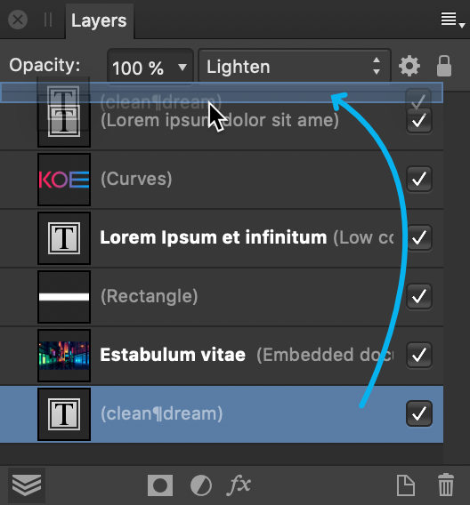

# Arrange/manage layers

Arrange and manage layer operations let you show/hide, reorder, duplicate, or lock layers.

*Reordering layers by dragging an entry in the Layers panel.*

Show or hide layers to include/exclude layers (and layer objects) in your document and any output. You can also hide/show a selection of layers in one operation, as well as all other layers apart from any currently selected layers.

Any layer can also be reordered in the layer stack to change layer object ordering, or duplicated to improve efficiency. Locking prevents a layer or layer objects from being moved, resized, flipped or rotated (but still remains editable).

**To hide or show a layer:**

- On the **Layers** panel, click **Toggle Visibility** on the layer entry.

> **Note:** Hidden layers will not print or export.

**To hide or show selected layers in one operation:**

1. On the **Layers** panel, select multiple layers using `Shift`-click or `Cmd`-click.
2. Click on the **Toggle Visibility** icon on any of the selected layers.

**To show all hidden layers:**

- On the **Layer** menu, select **Show All**.

> **Note:** If a hidden layer(s) is selected before Show All is applied, only that layer will be displayed, instead of all layers.

**To hide or show all other layers (except selected):**

- On the **Layers** panel, do one of the following:
  -  `Click`-click **Toggle Visibility**, and select **Hide Others** or **Show Others** from the pop-up menu. For multiple selected layers, any of the selected layers can be targeted.
  - `Click`-click a layer and select the same options from the pop-up menu.

**To reorder layers:**

Do one of the following:

- Drag a layer entry up/down the layer stack. When you see a blue line between two layers, drop the layer to place. If you pause during the drag procedure, you'll see a preview on the page for the current operation.
- When a layer is selected, click the **Move to Back**, **Back One**, **Forward One** or **Move to Front** button on the top toolbar. Using these buttons, child layers can only be reordered within their parent layer.

> **Note:** When you move a layer, the content of the layer moves with it.

**To duplicate a layer:**

1. In the **Layers** panel, select a layer.
2. In the **Edit** menu, select **Duplicate**.

The duplicate layer is added above the selected layer.

**To lock a layer (or layer object):**

1. On the **Layers** panel, select the layer(s) or object(s) to be locked.
2. Do one of the following:
  - Select **Lock/Unlock**.
  - From the **Layer** menu, select **Lock**.

Select **Lock/Unlock** again or use the **Layer** menu's **Unlock** item, to allow the layer contents or object to be transformed again.

> **Tip:** To quickly lock an individual layer or object, position the cursor to the left of its visibility button on the Layers panel and click the lock icon that appears.

> **Note:** Layers or objects which are locked show in the Layers panel with a lock symbol, , next to them. Selected locked layers appear with crosses around the bounding box.

**To unlock all layers (or layer objects):**

- From the **Layer** menu, select **Unlock All**.

> **Note:** If any locked layer(s) is selected before Unlock All is applied, only that layer will be unlocked, instead of all layers.

#### SEE ALSO:

- [Selecting and editing layers](04-selecting-and-editing-layers.md)
- [Create layers](02-creating-layers.md)
- [Using layer masks](12-layer-masking.md)
- [Using adjustment layers](13-using-adjustment-layers.md)
