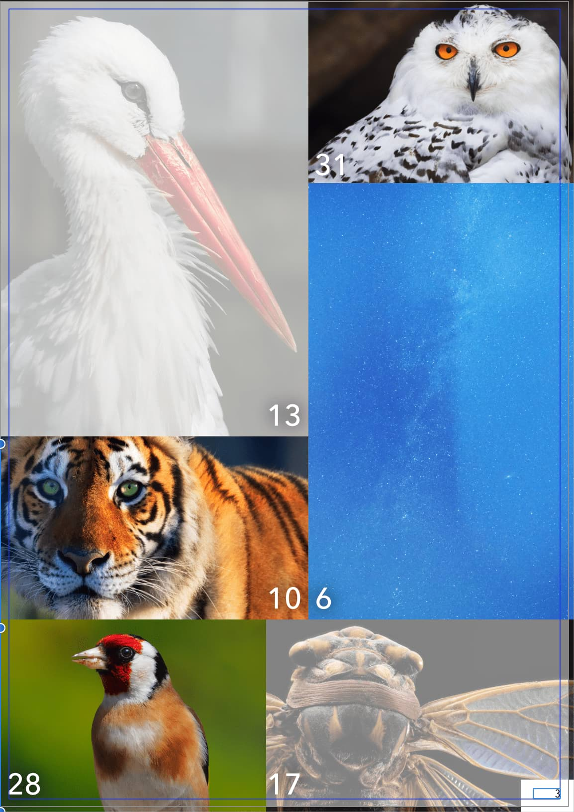

# Layer opacity

A layer's opacity determines how see-through a layer is and how much of the layer beneath is obscured or revealed. At 1% opacity, the layer is almost transparent, whereas at 100% the layer is completely opaque.

Numerical keys can be used to quickly set the opacity of selected layers.

> **Note:** Different levels of opacity can also be applied at different points along a fill or transparency path, or to strokes and object fills.

**To change the opacity of a layer:**

1. From the **Layers** panel, select one or more layers.
2. Use the **Opacity** control to set an opacity value.

> **Note:** To quickly select an opacity value, drag left or right over the panel's **Opacity** label.

**To use opacity quick keys:**

1. Select a single layer or multiple layers.
2. Press a numerical key, or two numerical keys in quick succession, to set the opacity. For example:
  - Press **4** for 40% opacity.
  - Press **0** for 100% opacity.
  - Press **4** and **5** for 45% opacity.
  - Press **0** and **7** for 7% opacity.

#### SEE ALSO:

- [About layers](01-about-layers.md)
- [Transparency](../07-color/13-transparency.md)
