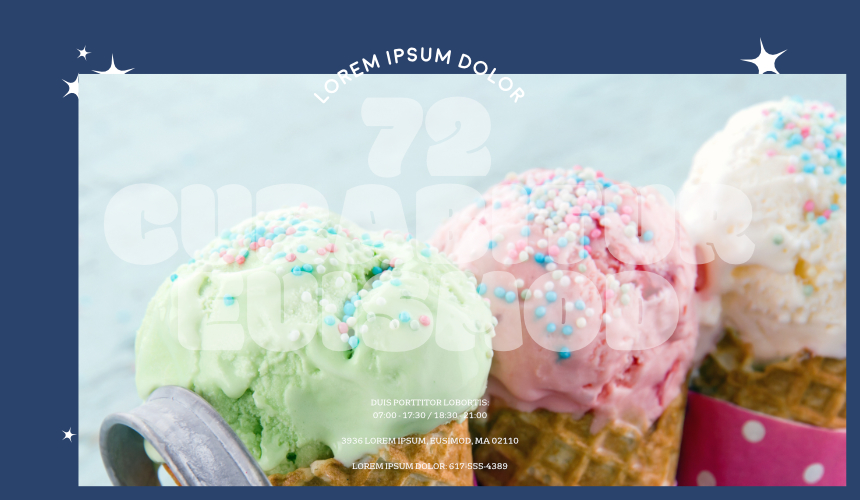
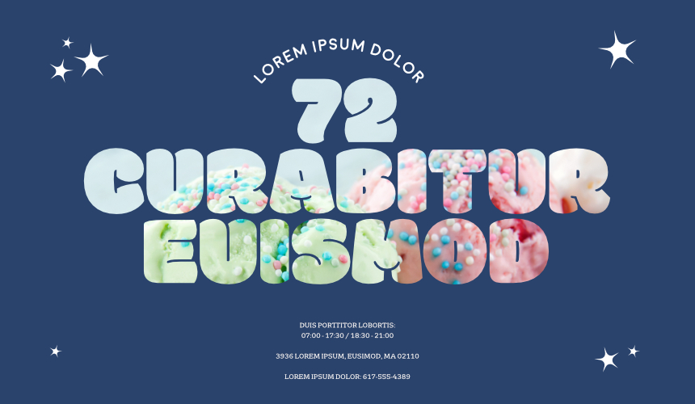
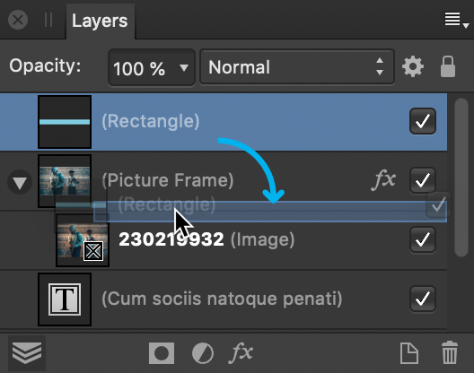

# Layer clipping

Clipping involves positioning one object inside another, creating a parent - child layer relationship. The path of the parent object becomes the new boundaries for the child object. Any areas of the child object which lie outside the parent object's path are masked (hidden).

*An image clipped inside artistic text to give it texture.*

*Layers panel showing the parent-child relationship of the above clipped image being created.*

## About clipping

Any object can act as a parent or child in clipping relationships. Therefore both vector objects and pixel layer content can be either clipped or clipping objects.

When scaling a parent object, child (clipped) objects scale to maintain the correct aspect ratio. Scaling a clipped object has no effect on the parent object. A clipped object can be edited independently from its parent, e.g. adjusting color, opacity, and/or blend mode.

> **Note:** Objects can be clipped on creation by drawing directly inside a selected object. This is controlled by **Insert inside the selection** object targeting. For more information, see the [Targeting objects](../09-object-control/10-targeting-objects.md) topic.

**To clip objects:**

1. On the page, position the object to be clipped so it overlaps the object which will perform the clipping.
2. On the **Layers** panel, drag the object to be clipped on top of the object which is to perform the clipping. A blue highlight appears to target the layer.

The clipped object is nested within the clipping object on the Layers panel, i.e. it has become a child of the clipping object.

**To select clipped objects:**

1. In the **Layers** panel, expand the clipping object's contents (if needed) by clicking the layer's arrow.
2. Click to select the clipped object.

The clipped object can now be moved and edited as needed.

> **Tip:** Alternatively, you can select clipped objects directly on the page using `Cmd`-click.

**To remove clipping from an object (unclip):**

- On the **Layers** panel, drag the clipped object to a new position outside its parent's entry on the layer stack.

**To resize an object without scaling its child layer content:**

- Select the parent object with the **Move Tool**, and then check **Lock Children** on the context toolbar. Resize the parent object to your chosen size.

> **Tip:** As you resize the parent, you can press the `Spacebar`  to temporarily override the current Lock Children state while the key remains pressed.

#### SEE ALSO:

- [Targeting objects](../09-object-control/10-targeting-objects.md)
- [Layers panel](../21-panels/14-layers-panel.md)
- [Layer blending](08-layer-blending.md)
