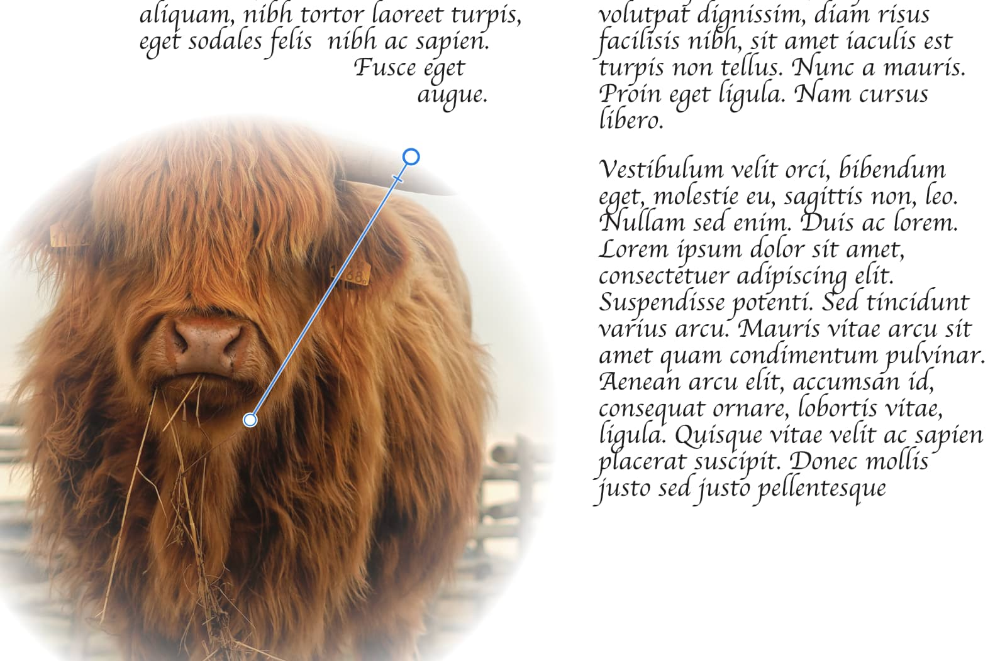

# Layer masking

A layer mask is used to reveal a portion of a layer while the rest of the layer remains hidden. This means that you can use a mask layer to 'delete' areas of a layer that you don't want.

*Layer mask with radial gradient (0-100% opacity) applied to picture frame*

## The non-destructive power of masking

Masks are applied as a separate layer, allowing them to be freely edited and moved. Mask layers affect any object below them within the same parent layer. They can also be [clipped](11-layer-clipping.md) to individual objects so that only that object is affected.

[Adjustment layers](13-using-adjustment-layers.md) also have mask layer properties. Areas of an adjustment layer can be revealed or hidden in the same way as with a mask layer.

Once a mask layer is created, you can apply different levels of grayscale or opacity to the mask layer—apply White (or 100% Opacity) to reveal; apply Black (or 0% Opacity) to conceal; apply intermediate grayscale levels for partial masking. Try drawing a gradient (with Gradient Tool) across a mask layer and assign different grayscale levels or opacity to end stops to experiment.

Mask layers can have [blend modes](08-layer-blending.md) assigned to them.

> **Note:**  **Layer FX** take no effect on mask layers.

> **Note:** You can take advantage of brush tools in Designer or Photo Persona for brush-based masking.

### Filling and clearing masks

In addition to using brushes to either reveal or conceal the effects of an adjustment, filter and/or color effects on a mask, the **Clear Mask** and **Fill Mask** options enable fast and easy approach to amend the edits.

**To Clear or Fill a mask:**

1. Select a mask layer.
2. Add an effect or an adjustment, as required.
3. On the **Layers** panel, **macOS:** `Ctrl`-click (Mac) / **Windows:** -click (Windows) the mask icon to access the option.

**To create an empty mask layer:**

1. On the **Layers** panel, select the layer you wish to mask.
2. **macOS:** Hold `Alt`  and, at the bottom of the panel, click **Mask Layer**.
3. **Windows:** Hold `Alt`  and, at the bottom of the panel, click the mask icon.

> **Note:** By default, a created mask layer is applied to the current layer, but it can be moved by dragging outside the current layer, applying the mask to all layers below. Alternatively, the mask can be moved onto an object, applying the mask just to that object.

**To add a vector mask:**

1. Draw a filled vector object, e.g., a line or shape, which is to be your mask.
2. Do one of the following:
  - On the **Layers** panel, drag the created object entry directly onto the thumbnail of a 'target' object.
  - `Click`-click the object and select **Mask to Below**, if the object to be masked is directly below the masking object.
  - On the **Layer** menu, select **Mask to Below**.

The thumbnail of the target object changes to indicate that a mask and crop have been applied.

The masking object is clipped to the target object using a "crop to top object" operation.

The masking object can be a group of objects which will remain as independent objects after masking; the group can be expanded/collapsed and its objects will remain editable.

> **Note:** Vector masks can be used layer to layer, layer to object, object to layer, or object to object (as above).

**To hide/show a collapsed child mask layer:**

- `Shift`-click on the mask thumbnail when collapsed to its parent layer.

The hidden mask will show a red line through its thumbnail.

**To delete a mask:**

1. In the **Layers** panel, select the mask's thumbnail.
2. Press the `Backspace` .

#### SEE ALSO:

- [Using adjustment layers](13-using-adjustment-layers.md)
- [Layer clipping](11-layer-clipping.md)
