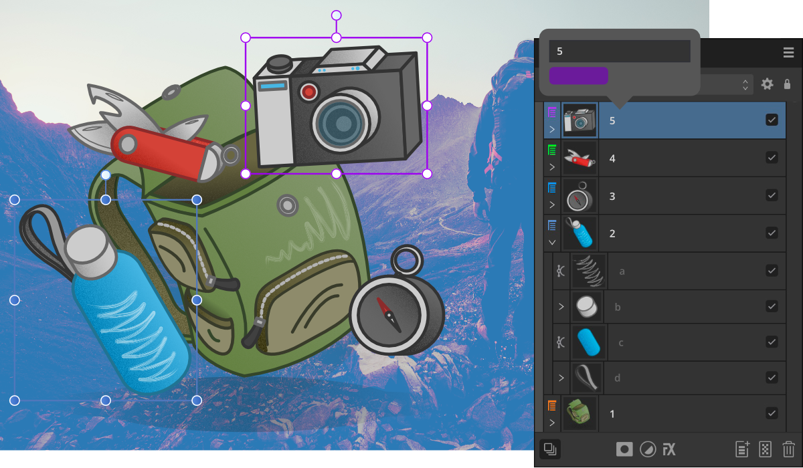

# Layer colors

Use layer colors to change the UI display color of all object's path, nodes and handles within a chosen layer.

*Different layer colors showing on the bounding boxes of objects (the panel's layer icon also shows the layer color).*

## About layer colors

Objects drawn outside of layers will adopt a default blue wireframe path, nodes and handles. For any layer you create, it will be assigned the same default blue color but you can assign a different color to the layer at any time. This means that any tool you use while drawing new objects or editing objects in that layer will adopt the current layer color.

> **Tip:** This isn't the object's fill or stroke but the path, node or handle color that shows only on object selection.

For reference, the layer color is used to color the layer type icon for the layer entry in the **Layers** panel.

Use layer colors to either help visually identify which layer you're working on or to help distinguish an object's path, nodes and handles from low color-contrast surroundings. For the latter, if you're drawing something blue (for example), the default layer color of blue would mean that your object's path, nodes or handles could be hard to see, so choosing a different layer color, e.g. orange, would improve UI visibility when you worked with objects on that layer.

> **Note:** Layer tagging differs from using layer colors as tagging involves visually identifying layers by color in the **Layers** panel to show those layers are related in some way.

**To assign a layer color to a specific layer:**

1. On the **Layers** panel, `Click`-click a chosen layer and select **Properties**.
2. Click the swatch and select a color from the pop-up menu.

Any object drawn in the layer will display paths, nodes and handles in that layer's layer color.

#### SEE ALSO:

- [Layers panel](../21-panels/14-layers-panel.md)
- [Tagging layers](05-tagging-layers.md)
