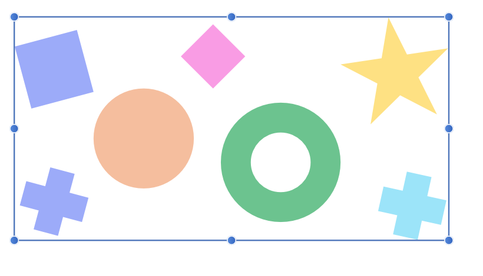

# Grouping objects

Objects can be grouped together to assist with design composition. One or more groups can also belong to a 'parent' group.

Grouped objects remain together so they can be easily selected, moved, copied, and edited as if they are a single object.

Groups, and nested groups, can be broken apart at a later date into their separate components or objects. Ungrouping can be activated on individual groups, or across multiple or nested groups using a single command.

Furthermore, a group can be converted to layer at a later date (if needed) to assist with design organization.

Resizing a group will maintain the aspect ratio by default, the opposite of resizing an individual object. Use the `Shift`  to size unconstrained.

> **Note:** Grouped objects display as nested Group layers on the **Layers** panel.

**macOS:**

> **Tip:** To select nested content directly from the document view, select the **Move Tool**, then hold the  and  s and click an object in the view. From the contextual menu that appears, select any content contained in the same group as (or deeper than) the object you clicked.

**Windows:**

> **Tip:** To select nested content directly from the document view, select the **Move Tool**, then hold the   and right-click an object in the view. From the contextual menu that appears, select any content contained in the same group as (or deeper than) the object you clicked.

**To create a group:**

1. Select multiple objects.
2. Do one of the following:
  - On the context toolbar, click **Group**.
  - From the **Layer** menu, select **Group**.

**To name a group:**

1. Do one of the following:
  - On the **Layers** panel, double-click the existing group.
  - With the group selected, from the **Layer** menu, select **Rename Layer**.
2. Type a new name.
3. Press `Return`.

You can enable **Ask for name when creating Layers and Groups** setting to be prompted to name them upon creation. This is found in the **Settings (or Preferences)>User Interface** section.

**To ungroup objects:**

1. Select the group.
2. Do one of the following:
  - On the context toolbar, click **Ungroup**.
  - From the **Layer** menu, select **Ungroup**.

> **Tip:**
>
> **macOS:** You can expand or collapse all nested layers in a group by pressing the `Alt`  and clicking the group layer's arrow.
>
> **Windows:** You can expand or collapse all nested layers in a group by pressing the `Alt`  and clicking the group layer's arrow.

**To release a grouped object:**

1. Select the object you wish to move out of the group.
2. Right click the object and from the menu, choose **Release**.

**To ungroup all grouped objects:**

1. Select grouped objects.
2. From the **Layer** menu, select **Ungroup All**.

> **Note:** All groups and nested groups are ungrouped, leaving all previously grouped objects as separate, single objects.

**To select objects (or groups) in a group:**

- Double-click on the object. If the object itself is in a group, the group will be selected first—double-clicking again will select the object.

**To promote a group to a layer:**

- From the **Layer** menu, select **Promote Group to Layer**.

> **Preferences — Settings (or Preferences):** Related behaviors can be adjusted from [the app's settings](../25-settings-preferences/01-settings-preferences.md):
>
> - **Miscellaneous>Reset Object Styles**

#### SEE ALSO:

- [Targeting objects](10-targeting-objects.md)
- [Isolating objects](11-isolating-objects.md)
- [Layers panel](../21-panels/14-layers-panel.md)
- [Keyboard shortcuts for object control](../24-keyboard-shortcuts/01-keyboard-shortcuts.md)
