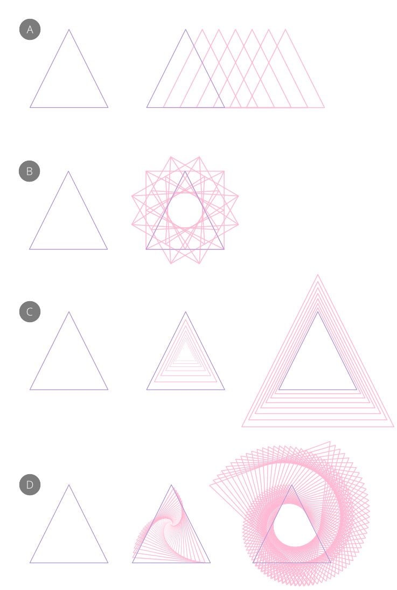
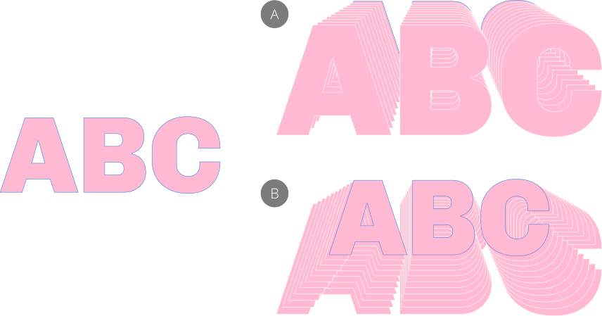
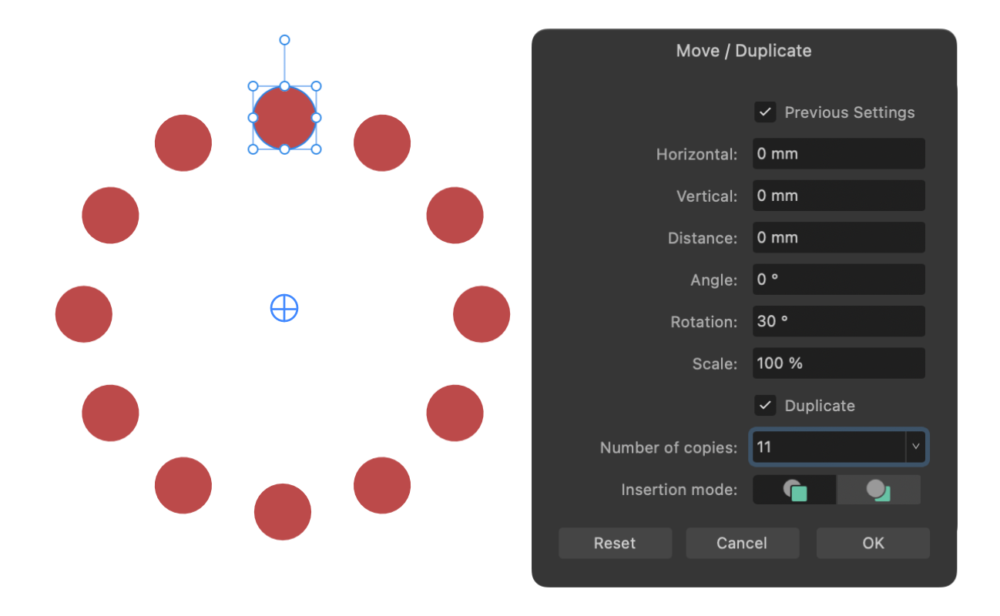
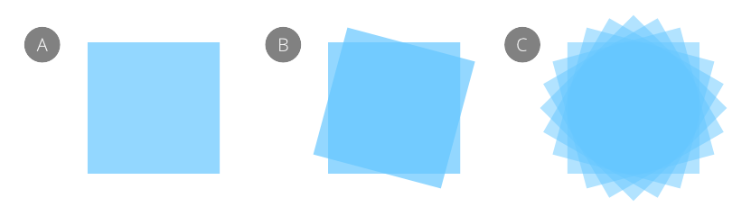

# Duplicating objects

Increase your efficiency by duplicating objects or groups.

Affinity lets you make copies of your original object using several methods.

- Creating a single duplicate using a command.
- Creating many offset duplicates by using Move data entry.
- Creating many offset duplicates by using power duplicate.

**To duplicate:**

Do one of the following:

- On the page, drag a selected object with the `Cmd`  pressed. While dragging, release the key to move the object instead, or press the key while moving to duplicate rather than move.
- On the **Layers** panel, `Click`-click a layer, group or object and select **Duplicate**.
- On the **Layers** panel, press the `Alt`  down and drag the layer you would like to duplicate into its position.
- With an object selected, select **Edit>Duplicate**.

## Duplicate using Move data entry

As well as moving, rotating and sizing an individual object precisely, Move data entry lets you create any number of copies of an object in one operation which, when combined with move, rotate and scale operations, leads to some striking object transformations.

Move data entry has the following characteristics:

- You can duplicate curves and text as well as shapes
- It is controlled via a dialog
- Your chosen transformation is previewed on the page
- You can edit the properties of the object being transformed (affecting its its previewed duplicates) as well as its transform origin while the dialog remains open
- The duplicate(s) can be placed in front of or behind the original object
- The previous settings can optionally be used
- Scaling is cumulative, e.g. 80% scaling is applied to each duplicate in turn

*(A) Linear offset (Horizontal: 6mm; Number of copies: 6),  
 (B) Rotating (Rotation: 30°; Number of copies: 12),  
(C) Scaling (Scale: 80% and 110%; Number of copies: 6),  
(D) Rotating and Scaling (Rotation: -4°; Scale: 93% and 101%, Number of copies: 50)*

You can achieve very different duplication results if you experiment with the **Insertion mode** option on the dialog.

*Effects of Insertion mode when set to add duplicates in front of (A) or behind (B) the original item*

> **Tip:** Try repositioning the object's transform origin on the page before using Move data entry—this lets you rotate duplicated objects around the origin to create ringed designs.
>
> 

**To duplicate (by Move data entry):**

1. With the **Move Tool** active, select one or more objects or groups.
2. Press the `Return`  to display a **Move / Duplicate** dialog.  
Enter new settings that will offset the duplicate(s) from its original position, with optional **Angle**, **Rotation** and **Scale** settings. The **Distance** setting is the measurement between duplicate object midpoints.

  
3. Check **Duplicate** and set the **Number of copies** you want.
4. (Optional) Choose an **Insertion mode** to add duplicate objects either in front of ( **Insert new items in front**) or behind ( **Insert new items behind**) the original object.
5. Click **OK**.

Click **Reset** to clear previously applied settings and remove the duplicates.

Pressing the `Esc`  will cancel the operation; the entered settings will still be remembered.

> **Note:** If you swap to another tool while the dialog is open, the dialog and any object previews will disappear.

## Power duplicate

If you duplicate an object and then transform the duplicate, you can immediately duplicate this transformed object. If you do, the newly created object will adopt the transform of the duplicate and will be also transformed again using the same settings. In other words, the transform is applied accumulatively to subsequent duplicates.

> **Tip:** Once duplicated, you can modify the duplicate to create design variations.

*(A) original object, (B) original object duplicated and rotated by 15°, (C) transformed duplicate duplicated numerous times.*

**To power duplicate:**

1. Select one or more objects or groups.
2. From the **Edit** menu, select **Duplicate**.
3. Move the duplicated object or group.
4. From the **Edit** menu, select **Duplicate**. A duplicate is created and the transform is automatically applied to the duplicate.
5. Repeat step 4 to create more duplicates with the transform accumulatively applied.

#### SEE ALSO:

- [Arrange/manage layers](../08-layers/06-arrange-manage-layers.md)
- [Keyboard shortcuts for object control](../24-keyboard-shortcuts/01-keyboard-shortcuts.md)
