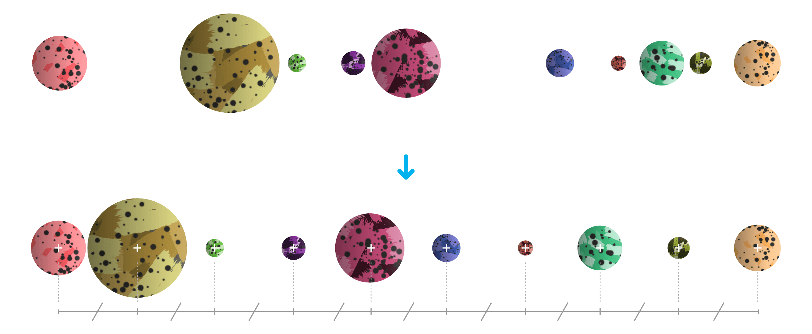
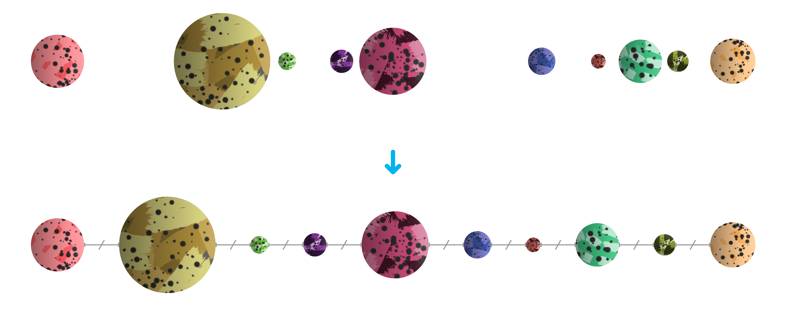
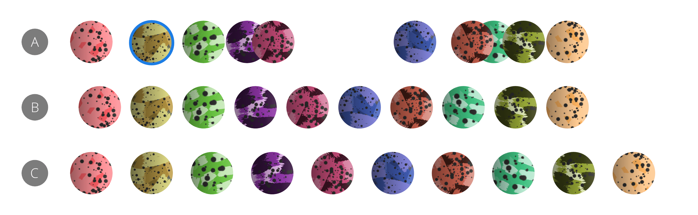

# Distributing/spacing objects

Objects can be distributed or spaced evenly within object selection bounds using alignment commands.

## Distributing

The distribution of objects involves setting an equal distance between object *centers*.

*Objects before and after distribution.*

## Spacing

The spacing of objects ensures there is an equal distance between object *edges*.

*Objects before and after spacing.*

### Spacing using key objects

**macOS:**

Instead of spacing being calculated between selection bounds, you can control spacing in relation to any targeted key object in the current object selection. This targeting is done using an `Alt`-click on the target object. By keeping this modifier active after targeting, you can set the overall spacing based on the spacing between the key object and the *rightmost* object in the selection. Without the modifier applied, the spacing is based on the spacing used between the key object and the *leftmost* object.

**Windows:**

Instead of spacing being calculated between selection bounds, you can control spacing in relation to any targeted key object in the current object selection. This targeting is done using an `Alt`-click on the target object. By then holding the `Cmd`  after targeting, you can set the overall spacing based on the spacing between the key object and the *rightmost* object in the selection. Without holding this key, the spacing is based on the spacing used between the key object and the *leftmost* object.

*A targeted key object (A) used to set spacing horizontally from the rightmost object (B) or the leftmost object (C).*

**To distribute or space objects (by menu):**

1. Select multiple objects.
2. From the **Layer** menu's **Alignment** submenu, select a Space or Distribute option.

**To space objects (by Toolbar):**

1. Select multiple objects.
2. On the Toolbar, click **Alignment**, click **Space Horizontally** or **Space Vertically** from the pop-up panel, and then click **Apply**.

> **Note:** With **Auto Distribute** selected (default), the objects are spaced evenly within the selection bounds. If this option is off, a specified distance between objects can be set in an input box adjacent to the option.

> **Note:** Make use of advanced distribute options in-panel by customizing the Toolbar (**View>Customize Toolbar**).

**To target a key object to space in relation to:**

1. Select multiple objects.
2. With the `Alt`  pressed, click the target object. A selected key object possesses a strong outline.

**To space objects using a key object:**

1. Ensure a key object is targeted as above.
2. To space in relation to the leftmost object: select **Space Horizontally** or **Space Vertically** from the Toolbar's **Alignment** menu.
3. **macOS:** To space in relation to the rightmost object: with the `Alt`  pressed, select **Space Horizontally** or **Space Vertically** from the Toolbar's **Alignment** menu.
4. **Windows:** To space in relation to the rightmost object: with the `Cmd`  pressed, select **Space Horizontally** or **Space Vertically** from the Toolbar's **Alignment** menu.

#### SEE ALSO:

- [Aligning objects](05-aligning-objects.md)
