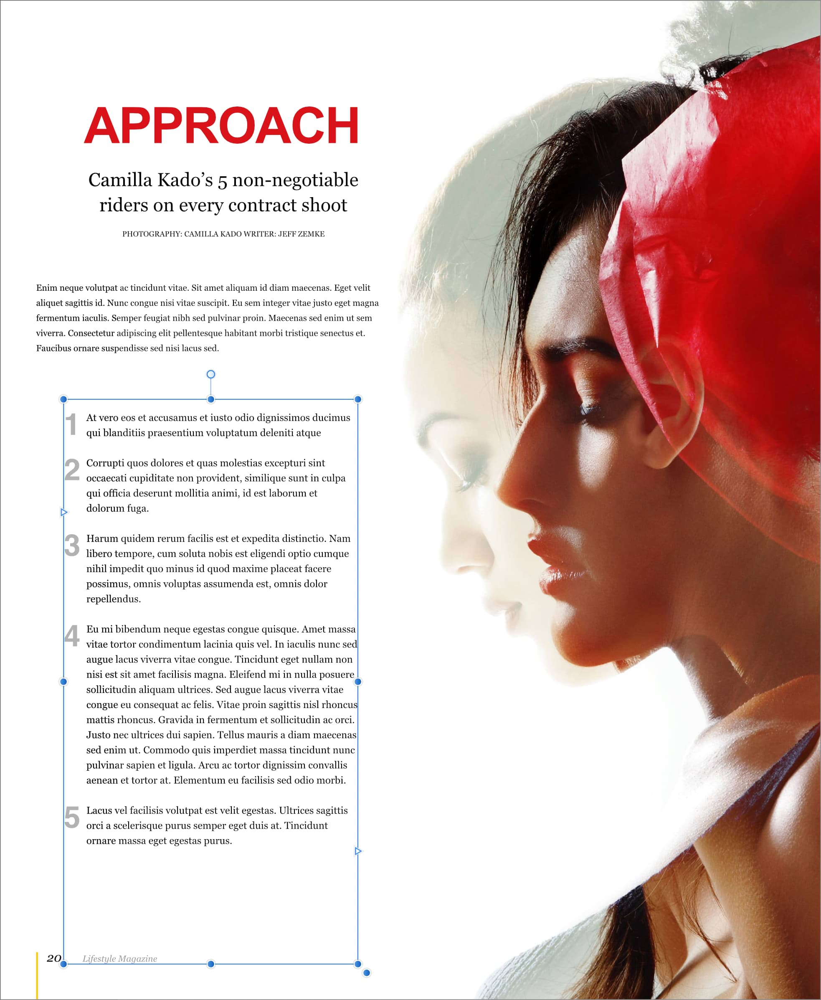
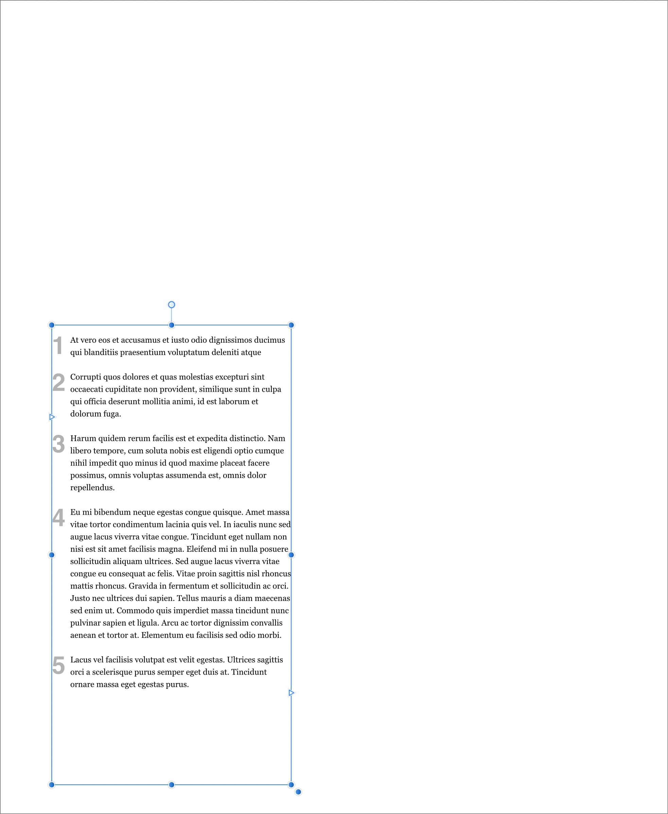

# Isolating objects

Isolation mode temporarily hides all layers apart from the selected layer or layer group. This allows you to focus on editing a selection without any distraction.

> **Note:** The process of isolating objects is also known as soloing objects.

*Isolation mode activated for a text frame in a page layout.*

Isolating is extremely useful if you want to focus on editing the content of a text frame without the distraction of adjacent imagery.

**To activate isolation mode:**

- On the **Layers** panel, hold down the `Alt`  and click on the thumbnail of a layer, group or object.

To exit isolation mode, press the `Esc` , click another layer (from outside the isolated content, if the content is a group), or click away from the selection in the document view.

> **Tip:** Zoom to selection can be extremely useful before working in isolation mode. Double-click on the thumbnail of a layer, group or object on the **Layers** panel to zoom to display the entire isolated selection.

## Isolation mode and groups

When a group is isolated, you can perform the following operations without exiting isolation mode or affecting its focus:

- Select and manipulate any of the group's items in context.
- Create new objects within the group.

**To select some of an isolated group's items:**

- Do one of the following:
  - On the **Layers** panel:
    1. Expand the group by clicking its arrow.
    2. Select one or more items inside the group.
  - In the document view:
    1. Select the group.
    2. Select an item in the group by double-clicking it.
    3. (Optional) Hold the `Shift` , then click other group items to add them to the selection.

**To create new objects in an isolated group:**

- Do one of the following:
  - Select an object in the group.
  - From the Toolbar, select **Insert inside the selection**.
- Use a tool to create new objects.

#### SEE ALSO:

- [Ordering objects](09-ordering-objects.md)
- [Arrange/Manage layers](../08-layers/06-arrange-manage-layers.md)
- [Zooming](../04-get-started/09-zooming.md)
