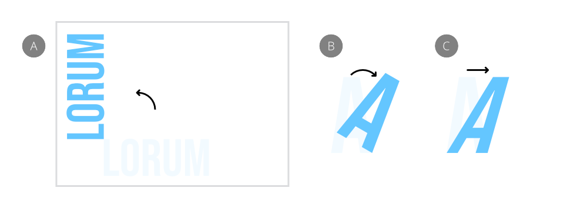

# Rotating and shearing objects

Objects can be rotated and sheared directly on the page using the **Move Tool**. For page layout, this is especially useful for transforming text titles.

*(A) Rotated title, (B) Rotated title letter, (C) Sheared title letter.*

Positioning the cursor over particular areas of an object, multiple selection, or group and then dragging will allow you to rotate or shear. Feedback is provided by the following cursors.

   

Rotation is also possible about a custom transform origin positioned on your page.

**To rotate objects:**

1. With the **Move Tool**, select one or more objects.
2. Do one of the following:
  - Drag the object's rotation handle.
  - Position the cursor close to one of the object's corner handles and drag on the page when the cursor changes.

> **Note:** You can rotate with more precision using the transform options on the Toolbar or **Transform** panel.

**To rotate objects to same:**

1. Select multiple objects, ensuring the object previously rotated is selected *first*. To do this, use `Shift`-click to target it first or a marquee selection that encompasses it first.
2.  On the Toolbar, click **Alignment**, then set the **Make Same** option, choosing **Rotation**.
3. Click **Apply**.

**To rotate objects to a targeted rotated key object:**

1. Select multiple objects.
2. With the `Alt`  pressed, click the target rotated object. The selected key object will possess a strong outline.
3.  On the Toolbar, click **Alignment**, then set the **Make Same** option, choosing **Rotation**.

**To undo the rotation:**

- Double-click at any corner handle when you see the rotation cursor.

**To move the transform origin:**

1. Select one or more objects.
2. Select the **Move Tool**, then click **Enable Transform Origin** on the context toolbar. The origin shows centrally within the object or selection.
3. Drag the origin to a new position in the selected object, another object, or anywhere on the page.

Once you've moved the origin, you can rotate your object(s) about it as described above. If using the **Transform** panel, rotation is about this custom origin unless you choose to override this and use the panel's Anchor point selector instead.

> **Note:** You can snap the origin to the bounding box, center, key points, or the geometry of other objects (or even the same object).
>
> **macOS:**
>
> To retain its relative positioning and snapping, you can move an object by its custom transform origin; `Click`-click *after* you start dragging the origin.

**To reset the transform origin back to its original position:**

- Double-click the transform origin.

**To shear objects:**

1. With the **Move Tool**, select one or more objects.
2. Position the cursor close to one of the object or selection's side handles and drag on the page.

> **Note:** You can shear objects with more precision using the **Transform** panel; this can optionally be about a custom transform origin.

**To undo the shear:**

- Double-click at any edge handle when you see the shear cursor.

> **Note — Modifier keys:** When using the Move Tool, the following modifier keys can be used to aid rotating and shearing:
>
> - The `Shift`  constrains rotation to 15° increments.
> - The `Cmd`  shears the opposite edge in the opposite direction by the same value.
> - **macOS:** When rotating from an object or selection's corner handle, the `Ctrl`  temporarily repositions the transform origin to the opposite corner.
> - **Windows:** When rotating from an object or selection's corner handle, holding the right mouse button temporarily repositions the transform origin to the opposite corner.

#### SEE ALSO:

- [Transforming objects](13-transforming-objects.md)
- [Transform panel](../21-panels/34-transform-panel.md)
- [Keyboard shortcuts for transforming operations](../24-keyboard-shortcuts/01-keyboard-shortcuts.md)
