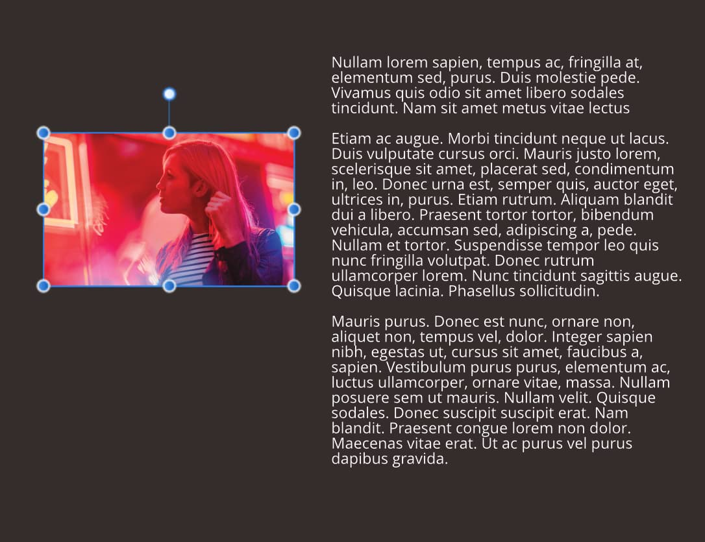
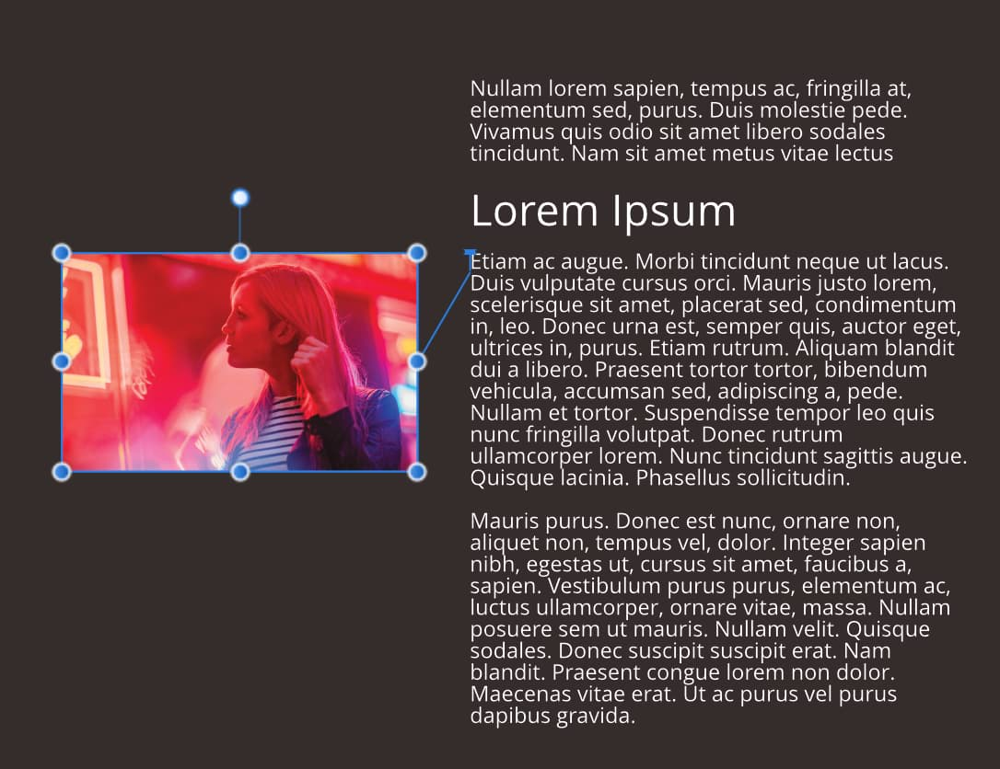
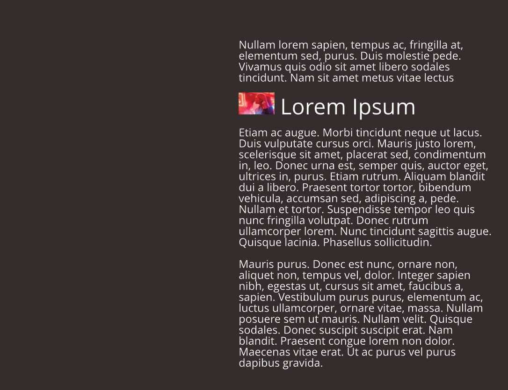

# Pinning objects

If you're working with text frames, it’s likely that you might add shapes, images, tables or other text frames in support of your main publication text (either artistic or frame text). These objects can be either *floated* in relation to a pinned position in your text (or other page element) or be simply placed *inline* in your text. In either instance, objects can then move with the text as you add further text content or move the text frame itself.

*Floating an image that is pinned to text. The image moves as frame text reflows.*

*Inserting an image inline into heading text.*

## About pinning

Pinning is possible by using two different options:

- **Float With Text**—the object is positioned horizontally and vertically relative to a pin that is automatically inserted into the nearest text to it. This option is ideal for pictures, tables and pulled quotes that need to flow with the text.
- **Inline In Text**—the object is placed as (and behaves like) a character in the text and is aligned in relation to the text that surrounds it. It flows with the text as before.

Floating objects can be pinned to anywhere in your publication text, but the floated object can be positioned in relation to indented text, column, frame, page margin, page edge, or most typically the pin in a text frame.

Frame text can [wrap](../10-text/07-text-frames/07-text-wrapping.md) around floating pinned objects that overlap the text frame. Conversely, inline anchored objects do not allow text wrapping.

For text frames, when the frame text reflows with new content, the pin (and therefore pinned object) moves with the text.

Basic pinning is possible via the Toolbar but for full control and fine positioning of pinned objects, you can switch on the **Pinning** panel.

> **Note:** Icons in the **Layers** panel indicate whether the pinned object is floating or inline .

**To switch on the Pinning panel:**

- From the **Window** menu, select **Text>Pinning**.

**To create a floating object pinned to text:**

1. Select and position your unpinned object on the page.
2. Do one of the following:
  - From the Toolbar, enable **Float With Text**.
  - From the **Pinning** panel, select **Float With Text**.

 By default, the object is pinned to any artistic or frame text nearest to it as indicated by a *pin*. You can reposition the object by dragging to anywhere on the page and the linkage will be maintained. Equally, you can fine-tune the position of the pin by dragging it to a new location, e.g. to the start of a paragraph where the image is referenced or to a completely new text frame.

**To adjust the floating object's position:**

- From the **Pinning** panel, modify settings to fit your requirements:
  - Use **Horizontal/Vertical align** options to position the object.
  - Set the above alignment in relation to an **Of** page element.
  - For absolute positioning, fine-tune the **Offset** values.

**To insert an object inline in text:**

1. Select your unpinned object on the page.
2. Do one of the following:
  - From the Toolbar, enable **Inline In Text**.
  - From the **Pinning** panel, select **Inline In Text**.

**To adjust the inline object's position:**

- From the **Pinning** panel, modify settings to fit your requirements:
  - Use **Scale to** and **Scale** options to position the object in relation to text metrics.
  - Position the object vertically by placing on the baseline or descender **Base position**, optionally setting a 'nudging' incremental **Offset**.

**To unpin a floating or inline object:**

Do one of the following:

- From the Toolbar, disable **Float With Text** or **Inline In Text**.
-  From the **Pinning** panel, select **Unpin**.

#### SEE ALSO:

- [Pinning panel](../21-panels/19-pinning-panel.md)
- [Toolbar](../02-user-interface/02-toolbar.md)
- [Text wrapping](../10-text/07-text-frames/07-text-wrapping.md)
