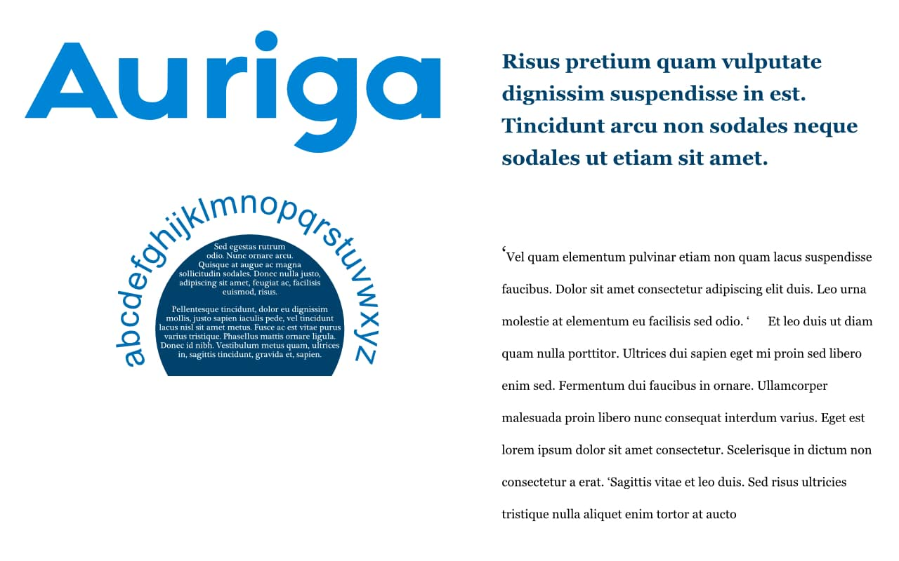

# Working with text

There are several varieties of text available in Affinity Publisher, i.e. Artistic Text, Frame Text, Path Text and Shape Text, to give you absolute flexibility when working with typography.

Text objects contain both character and paragraph elements, making it easy to modify standard text attributes such as font, size, format, and alignment. All text types have quick access settings on the context toolbar and supporting panels and dialogs for more extensive, advanced options.

When performing text editing, Publisher supports all standard text selection and formatting techniques and shortcuts.

The unique features of artistic text, frame text and path text are discussed in the [Artistic text](02-artistic-text.md), [Frame text](03-frame-text.md), [Text on a path](04-text-on-a-path.md) and [Shape text](05-shape-text.md) topics.

> **Note:** If you're opening Affinity documents or vector images created on a different computer to the one that you are using, the original fonts used may be missing from your computer. If so, you'll get a **Missing Fonts** warning indicating which fonts are missing. The font will be substituted for a replacement system font.
>
> When text using the missing font is selected in your publication, its font name will be prefixed with a '?' on the context toolbar and on the **Character** panel.
>
> You can source the original fonts yourself or use **Window>Font Manager** to substitute for a preferred font.
>
> **macOS:**
>
> When opening a document which uses a *downloadable* font (not installed locally in macOS by default), you'll get a prompt to download it—simply click **Download** to install to macOS. Affinity Publisher will then use the installed font as it would with any other font.

> **Tip:** If you're designing before full copy has been written, you can use placeholder (filler) text within your text frames to help you progress with your project. Filler text can be inserted from the **Text** menu.

> **Preferences — Settings (or Preferences):** Related behaviors can be adjusted from [the app's settings](../25-settings-preferences/01-settings-preferences.md):
>
> - **General>Insert filler text as text**

**To select text objects for formatting:**

- With the **Move Tool** selected, do one of the following:
  - Click a text object to make formatting changes to all the text within the text object.
  - Double-click a text object to make formatting changes to sections of text within the text object.
- With either of the text tools selected, click a text object to make formatting changes to sections of text within the text object.

**To locate missing fonts:**

Do one of the following:

- Step through instances one at a time:
  1. Select **Window>Font Manager**.
  2. Select the missing font.
  3. Click **Locate** as necessary. Searching loops back to the start of your document when the end is reached.
- View an interactive list of all instances:
  1. From the **Find and Replace** panel's **Find** field:
    1. Delete any existing text in the field.
    2.  Select **Reset Format**.
    3.  Select **Format**.
  2. In the **Choose Format** dialog, next to **Font family**:
    1. Select **Missing Fonts** from the second pop-up menu.
    2. Select a font from the first pop-up.
    3. Click **OK**.
  3. On the **Find and Replace** panel, click **Find**.
  4. Select a search result to view the corresponding location.

> **Preferences — Settings (or Preferences):** Related behaviors can be adjusted from [the app's settings](../25-settings-preferences/01-settings-preferences.md):
>
> - **Miscellaneous>Reset Fonts**
> - **User Interface>Show Text in points**
> - **User Interface>Always use white background for Font dropdown**

#### SEE ALSO:

- [Importing text](07-text-frames/03-importing-text.md)
- [Artistic text](02-artistic-text.md)
- [Frame text](03-frame-text.md)
- [Path text](04-text-on-a-path.md)
- [Shape text](05-shape-text.md)
- [Text marks](11-checking-text/01-text-marks.md)
- [Character formatting](09-character-level/01-character-formatting.md)
- [Paragraph formatting](08-paragraph-level/01-paragraph-formatting.md)
- [Style Picker Tool](../20-tools/01-layout-tools/12-style-picker-tool.md)
- [Artistic Text Tool](../20-tools/02-text-tools/03-artistic-text-tool.md)
- [Frame Text Tool](../20-tools/02-text-tools/01-frame-text-tool.md)
- [Glyph Browser panel](../21-panels/10-glyph-browser-panel.md)
- [Font Manager](06-editing/05-font-manager.md)
