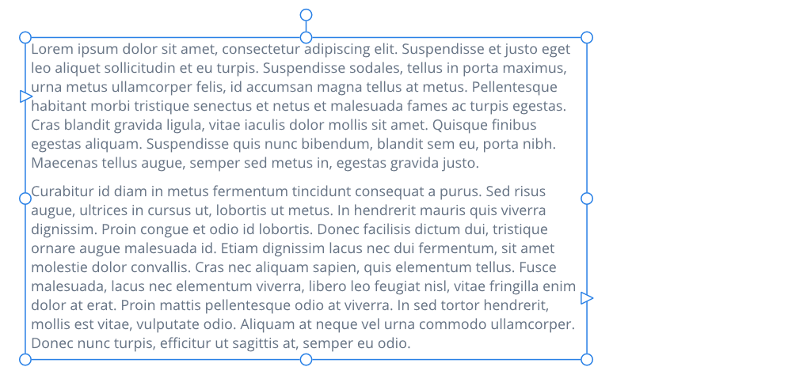

# Frame text

Frame text is perfect for presenting paragraphs with a formalized structure and layout. If you want to present text in columns, frame text is the ideal solution.

Using the **Frame Text Tool**, frame text can be created within rectangular (or square) frames or within any curve or closed shape. The text frames you create can be moved or resized using the Frame Text Tool.

By clicking in the drawn frame and then typing, you're able to fill the frame with frame text. If excess text overflows the bottom of the frame, you can resolve this by:

- Making the text frame larger
- Reducing the text's font size
- Adding an additional text frame, linked to the overflowing text frame, to contain the overflowing text.

The tool's context toolbar lets you choose frame text properties and some basic frame setup details (e.g., number of columns). For more advanced frame setup, you can use the **Text Frame** panel.

> **Tip:** To make use of temporary placeholder text while working on your design, from the **Text** menu, select **Insert Filler Text**.

> **Tip:** You can apply opacity to the whole text frame via the **Layers** panel, or just to the frame fill and stroke with the **Transparency Tool** or the **Text Frame** panel. Each color within the frame has its own opacity.

Icons around the text frame indicate whether the frame is filled, linked, and whether text within the frame is overflowing or hidden.

| Icon | Description |
| --- | --- |
|  | The frame is unlinked. |
|  | The frame is linked. |
|  | The frame is linked to a frame that has overflowing text. |
|  | There is hidden overflowing text in the frame. |
|  | The overflowing text in the frame is visible. |
|  | The text in the deselected text frame is overflowing. |

**To create frame text:**

From the **Tools** panel, select the **Frame Text Tool**:

1. Drag on the page. This sets the initial size of the text frame.
2. (Optional) Set up your columns and gutter width from the context toolbar.
3. Do one of the following:
  - Type your text.
  - Paste (`Cmd`V) previously copied text.
  - For importing and placing text, from the **File** menu, select **Place**. In the pop-up dialog, navigate to and select a file, and click **Open**.

> **Note:** For text imported from external apps, use Paste without Format (**Edit** menu) for 'clean' unformatted text.

> **Note:** The  **Text Frame** option on the context toolbar accesses the [Text Frame](../21-panels/32-text-frame-panel.md) panel.

**To create a text frame from curves/shapes:**

1. Select a previously drawn curve or shape.
2. From the **Tools** panel, select the **Frame Text Tool**.
3. Position the cursor close to the curve or within the shape. The cursor will change to indicate that shaped frame text will be created.
4. Click to convert the curve or shape to a shaped text frame.
5. Type your text.

> **Tip:** Even though the shape is now converted to a text frame, you can still reshape the frame using the **Node Tool** at any time.

> **Tip:** Alternatively, select a previously drawn line, curve or shape and then, from the **Layer** menu, select **Convert to Text Frame**.

**To convert frame text to artistic text:**

With the frame text selected:

- Select **Layer>Convert to Art Text**.

The artistic text may flow differently than the original frame text due to inherent differences between the two object types. Formatting applied to text ranges, such as horizontal alignment, is retained after conversion but may not be discernible in your design, e.g. an artistic text object is only as wide as its longest line of text.

> **Note — Modifier keys:** When using the Frame Text Tool, the following modifier keys can be used:
>
> - The `Shift`  constrains frame's proportions at the time of creation (to a square) or when resizing.
> - The `Cmd`  resizes the frame from its center.
> - **macOS:** The `Ctrl`  allows placed frame text to be rotated about its opposite handle.
> - **Windows:** Pressing the right mouse button lets you rotate placed frame text about its opposite handle.

#### SEE ALSO:

- [Working with text](01-working-with-text.md)
- [Text frame setup](07-text-frames/01-text-frame-setup.md)
- [Frame Text Tool](../20-tools/02-text-tools/01-frame-text-tool.md)
- [Text Frame panel](../21-panels/32-text-frame-panel.md)
- [Artistic text](02-artistic-text.md)
- [Fitting text to frames](07-text-frames/05-fitting-text-to-frames.md)
- [Flowing text through frames](07-text-frames/04-flowing-text-through-frames.md)
