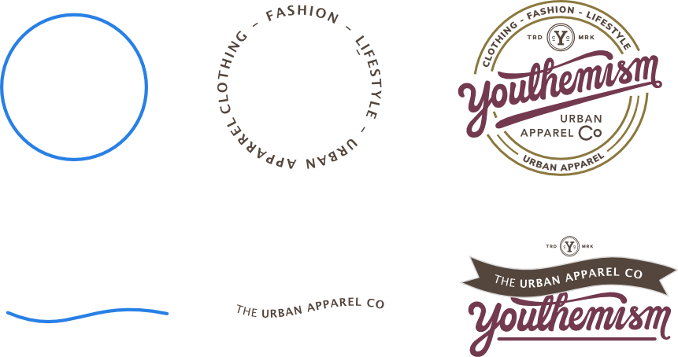
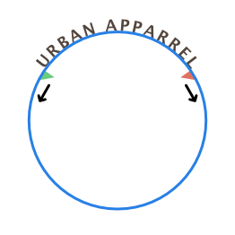
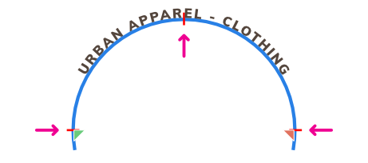
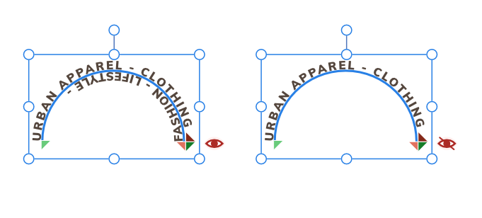
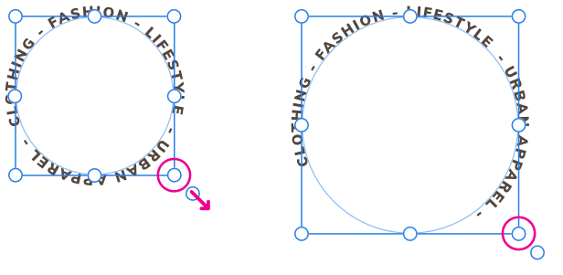
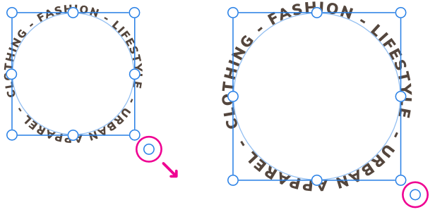

# Text on a path

Path text is a variation of Artistic text which follows a line, curve or outline of a shape.

*Before and after conversion to path text (and final design example).*

Applying text to a path allows you to explore a whole range of diverse typographical designs. The path can be created from any line, curve or shape drawn using any of the line or shape tools. These include, but are not limited to, the [Pen Tool](../20-tools/01-layout-tools/03-pen-tool.md) and [Ellipse Tool](../20-tools/03-shape-tools/02-ellipse-tool.md). The only criterion is that a line, curve or shape must exist on the page before path text can be implemented.

> **Warning:** When a line, curve or shape is converted to a path to accommodate text, the original object is discarded but its settings are applied to the text path and can be modified via the **Text Frame** panel. If you wish to retain the original object and edit it independently of the path text, duplicate it first.

## Modifying path text

Once the path has been created, you can adjust the start and end handles on the path to expand or restrict the portion on which text will flow. The start and end handles are indicated by light green and orange triangles, respectively.

If path text extends beyond the start and end handles, it will flow onto a second path (below) or wrap around to follow the path in the opposite direction. If this occurs, an additional pair of start and end handles (colored dark green and red, respectively) will become available so this new path can be adjusted separately. Both paths and pairs of handles work identically.

You can also control the distance between the text and the path (i.e., the Baseline) and the direction in which the text flows along the path. Each path section can have a different **Baseline** value.

## Reshaping the path object

You can reshape the path object at any point using the [Node Tool](../20-tools/01-layout-tools/02-node-tool.md). If your text path object originated from one of the shape tools, you can modify it as if it was still the original geometric shape. Text already present on the path will reflow along the changing path when the object is reshaped.

For more information on reshaping a path object, see the [Edit curves and shapes](../06-drawing-curves-and-shapes/03-edit-curves-and-shapes.md) and [Draw and edit shapes](../06-drawing-curves-and-shapes/05-draw-and-edit-shapes.md) topics.

## Path text and snapping

Along the path you'll encounter red perpendicular snapping lines as you drag path text handles. For example, on path text around an ellipse, you can snap to 90° intervals on its circumference, then use text alignment options to precisely position text centrally.

## Hiding overflowing path text

Any path text extending beyond the end handle of a secondary path will be displayed by default, but you can hide this, e.g. for editing, by clicking the strikethrough red eye icon.

**To create path text:**

1. Select a previously drawn line, curve or shape.
2. From the **Tools** panel, select the **Artistic Text Tool**.
3. Do one of the following:
  - For text running outside a shape or above a line: Click the cursor outside (or above) the object's outline. The cursor will change to indicate path text will be created.
  - For text running inside a shape or below a line (right to left): Click the cursor inside (or below) the object's outline.
4. On the context toolbar, set a **Font Size** (or click to use the default font size).
5. Do one of the following:
  - Type your text.
  - Paste previously copied text.
  - From the **File** menu, select **Place**. In the pop-up dialog, navigate to and select a file, and click **Open**.

The stroke/fill will still be editable using the **Text Frame** panel.

> **Tip:** Alternatively, select a previously drawn line, curve or shape and then, from the **Layer** menu, select **Convert to Text Path**.

**To modify the flow of path text:**

With the path text selected, do one of the following:

- Drag one or more path text handles.
- On the context toolbar, set **Baseline** to adjust distance of text baseline from path.
- On the context toolbar, click **Reverse Text Path**.

> **Note — Modifier keys:** When positioning path text handles, the following modifier keys can be used:
>
> - The `Shift`  constrains the distance between the start and end handles, moving the entire path, both handles and text simultaneously.
> - The `Alt`  ignores snapping points along the path.
> - The `Cmd`  moves start and end handles symmetrically.

## Resizing path object

When resizing a path object you can control whether:

- Text remains at its set size and reflows across the path.
- Text scales as the path is resized.

**To reflow text:**

With the path object selected, do one of the following:

- To resize height and width simultaneously, drag the object's corner handles.
- To resize height and width independently, drag the object's side handles. 

**To scale text:**

- With the path object selected, drag the object's scale handle (extends from the bottom-right corner of the selection). 

#### SEE ALSO:

- [Importing text](07-text-frames/03-importing-text.md)
- [Working with text](01-working-with-text.md)
- [Flowing text through frames](07-text-frames/04-flowing-text-through-frames.md)
- [Artistic Text Tool](../20-tools/02-text-tools/03-artistic-text-tool.md)
- [Filler text](07-text-frames/02-filler-text.md)
- [Duplicating](../09-object-control/04-duplicating-objects.md)
