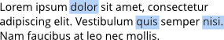

# Editing text

You can use any text tool to edit frame text, table text, or art text directly on the page. As well as selecting and entering text, you can set paragraph indents and tab stops, change text properties, apply text styles, and use Find and Replace.

**To select text on the page:**

Do one of the following:

| To select... | Action | Example |
| --- | --- | --- |
| a single word | double-click |  |
| multiple words | double-click with the `Cmd`  pressed |  |
| a line | triple-click |  |
| a text range | drag with cursor. Use Shift key to select text between two points. |  |
| a paragraph | quadruple-click |  |
| all paragraphs | quintuple-click |  |

**To move text:**

- With a single word, paragraph, or portion of text selected, drag and drop it where you would like to place it.

**To edit text on the page:**

1. Do one of the following:
  - Select any text tool, then click (or drag) in the text object. A standard insertion point appears at the click position.
  - Select a single word, paragraph or portion of text (see above).
2. Type to insert new text or overwrite selected text, respectively.

**To start a new paragraph:**

- Press the `Return` .

**To create a line break:**

- **macOS:** Press `Shift` + `Return` .
- **Windows:** Press `Shift`+`Return` .

**To flow text to the next column (Column Break), frame (Frame Break) or page (Page Break):**

- From the **Text** menu, select **Insert**, then **Breaks** and choose a break option from the submenu.

> **Tip:** To automatically set page breaks at certain points throughout your publication, for example, at the start of a new chapter, select the text style you wish to use in the **Text Styles** panel (for example, **heading1**) and set **Flow>Start on: Odd Page** in the style's **Paragraph** section.

#### SEE ALSO:

- [Working with text](../01-working-with-text.md)
- [Keyboard shortcuts for working with text](../../24-keyboard-shortcuts/01-keyboard-shortcuts.md)
