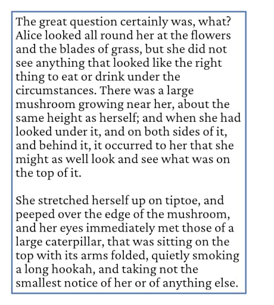
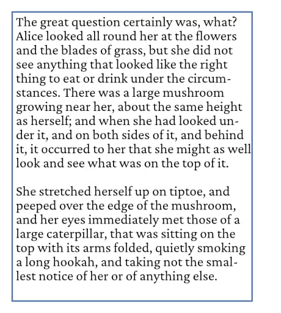

# Hyphenation

Hyphenation can be accomplished automatically by using auto-hyphenation. This feature recognizes and corrects lines which would otherwise be too ragged or use overly large word spacing, which results in a better fitting and neater frame text. You can also introduce your own hyphens manually at hyphenation points in your frame text.

## About hyphenation

As defined by the language-specific hyphenation dictionary, words have pre-defined hyphenation points at which hyphenation will occur. Each hyphenation point has a value weighting associated with it. For example, the hyphenation point in the middle of the word yellow (to produce the word "yel-low") has a score value of 1, i.e yel1low; for "acc-ommo-date" the values are acc2ommo5date. Setting a **Minimum Score** value to a larger number (e.g., 3) will hyphenate less often.

Affinity Publisher can also prevent splitting words that are too short, or leaving too few characters at front or back.

*Hyphenation zones* can be applied which affect how ragged or loose text can be. Hyphenation points will be ignored if they fall within these hyphenation zones. Thus setting a wider zone will hyphenate less often. The zones are measured back from the right indent of the frame text, ignoring alignment or justification.

There are several types of hyphenation zone that can be applied in different situations; they work in combination. You can prevent hyphenation in these situations by setting these zones to a very large number (e.g. 100cm), or you can set a smaller number so that hyphenation can still be used if the text would be very ragged or loose without it.

Hyphens can also be inserted into specific words irrespective of whether auto-hyphenation is enabled or not. Perhaps a word you are using breaks onto a new line at the wrong place—an inserted hyphenation point in the word will force the word to always break at that hyphenation point (the hyphen will display automatically).

Successful hyphenation relies on:

- Whether you have an appropriate hyphenation dictionary for the language installed.
- Whether you specify the language for the text properly in the Character panel in Hyphenation Language option.
- Whether you specify automatic hyphenation and a good set of hyphenation options in the Paragraph panel.

> **Note:** Hyphenation settings, scores and zones are paragraph attributes, while spelling/hyphenation language is a character attribute.

**To change hyphenation language:**

- On the **Character** panel, go to the **Language** section and choose from the **Hyphenation** pop-up menu.

By default, the currently set Spelling language is used for hyphenation.

**To enable/disable auto-hyphenation:**

- On the **Paragraph** panel, go to the **Hyphenation** section and enable/disable **Use auto-hyphenation**.

**To change auto-hyphenation settings:**

- **Minimum Score**—the amount of extra space at the end of each line that is considered acceptable. If the amount of extra space exceeds this value, then auto-hyphenation will try to split words to reduce the excess. Try incrementing values upwards from 1 to experiment.
- **Minimum word length**—the minimum number of characters that a word must have before it is considered valid to hyphenate the word at the end of a line.
- **Minimum prefix**—determines the minimum number of prefixed letters each part of a word must contain if the word is split by auto-hyphenation.
- **Minimum suffix**—determines the minimum number of suffixed letters each part of a word must contain if the word is split by auto-hyphenation.
- **Max consecutive hyphens**—prevents too many consecutive lines from ending with a hyphen.
- **Hyphenation zone**—defines an area from the right edge of frame text where hyphenation rules are ignored. This always applies.
- **Capital zone**—defines the amount of space allowed before hyphenation begins where words are in all capitals.
- **Paragraph end zone**—defines the amount of space allowed at the end of a paragraph before hyphenation begins.
- **Column end zone**—defines the amount of space allowed at the end of a column before hyphenation begins.

**To insert a soft or non-breaking hyphen:**

- From the **Text** menu, select **Insert**, then **Dashes and Hyphens** and choose **Soft Hyphen** or **Non-Breaking Hyphen**.

To remove a hyphen, select the hyphen and press the `Backspace` .

> **Note:** Auto-hyphenation has no effect on words that contain a soft hyphen. You can put a soft hyphen at the beginning of a word to prevent it being hyphenated altogether.

> **Note:** To prevent the affected range from breaking (for any reason other than a soft hyphen), use the **No break** checkbox in the **Character** panel's **Positioning and Transform** section.

#### SEE ALSO:

- [Installing hyphenation dictionaries](03-hyphenation/01-hyphenationinstalling.md)
- [Frame text](../03-frame-text.md)
