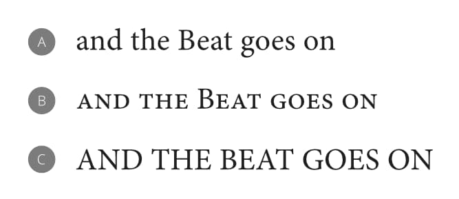
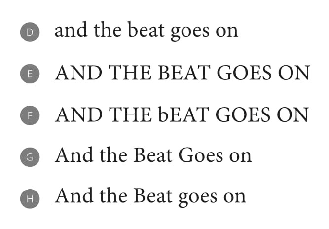

# Capitalization

Affinity Publisher can alter the capitalization of selected words to suit one of several use cases.

Capitalization transformations are available from the **Text>Capitalization** menu.

## Dynamic transformations

Items in the menu's first group are applied dynamically; letters are stored in your document with the capitalization used to type them and Affinity Publisher changes how they are displayed on the fly.

- **None**—removes whichever of the following two transformations is already applied to the selection.
- **Small Caps**—each letter is displayed using small-caps glyphs, if the applied OpenType font includes them; if unavailable, upper-case glyphs are scaled down to the appropriate height.
- **All Caps**—all letters are displayed as upper-case glyphs.

*An example sentence as typed (A) and with (B) Small Caps and (C) All Caps dynamic transformations applied.*

## Persistent transformations

Items in the second group make a lasting change to how the selected words are stored in your document:

- **Lower Case**—all letters in the selection are converted to lower-case glyphs.
- **Upper Case**—all letters in the selection are converted to upper-case glyphs.
- **Toggle Case**—upper-case letters in the selection are converted to their lower-case equivalent and vice versa.
- **Title Case**—each word's initial letter is converted to upper case unless the word is a title exception or any of its letters are upper case already. See below for precise details.
- **Sentence Case**—the initial letter of each word, except for the first word and proper nouns, is converted to lower case.

*An example sentence with (D) Lower Case, (E) Upper Case, (F) Toggle Case, (G) Title Case and (H) Sentence Case transformations applied.*

> **Note:** If the **Title Case** or **Sentence Case** transformation changes any of the selected words, the selection is modified to include only the words whose capitalization was affected.

## Title Exceptions

In Affinity Publisher's settings, select **Title Exceptions**. The list here contains short prepositions, conjunctions, articles, and any other words you do not want to be altered when the Title Case transformation is applied.

Use the pop-up menu to set different title exceptions for each of Affinity Publisher's supported languages. The list used when the Title Case transformation is applied depends on text's language setting, indicated by the **Spelling** setting in the **Character** panel's **Language** section.

## About the Title Case transformation

When the Title Case transformation is applied, words in your text selection are affected as follows (in order):

- A word that contains any upper-case letters is considered to be a proper noun, scientific or technical term, or an acronym. None of its letters' cases are changed1.
- A word that is not a title exception for the specified language has its first letter converted to upper case.
- A word that is a title exception and first in a sentence or paragraph2 has its first letter converted to upper case.
- A word that is a title exception and not first in a sentence or paragraph is made entirely lower case.

1 Words with upper-case letters past their first are unaffected on the first application of the Title Case transformation. Applying the transformation a second time makes their first letter upper case and all others lower case.

2 When your text selection contains multiple sentences, rules concerning first words apply to each word that appears after a line break, paragraph break or appropriate punctuation.

**To add a title exception:**

1. **macOS:** Select **Affinity Publisher>Settings** (or **>Preferences**).
2. **Windows:** Select **Edit>Settings**.
3. Select **Title Exceptions**.
4. From the pop-up menu, select the language to which the exception will apply.
5. In the box below, type the lower-case word you want to remain unchanged (except when it is the first word).
6. Click **Add**.

**To remove a title exception:**

1. **macOS:** Select **Affinity Publisher>Settings** (or **>Preferences**).
2. **Windows:** Select **Edit>Settings**.
3. Select **Title Exceptions**.
4. From the pop-up menu, select the language to which the exception applies.
5. In the list of exceptions, select the word you want to remove.
6. Click **Remove**.

#### SEE ALSO:

- [Working with text](../01-working-with-text.md)
- [Frame Text Tool](../../20-tools/02-text-tools/01-frame-text-tool.md)
- [Artistic Text Tool](../../20-tools/02-text-tools/03-artistic-text-tool.md)
- [Auto-Correct and Spell as you Type](../11-checking-text/03-auto-correct-check-spelling-while-typing.md)
