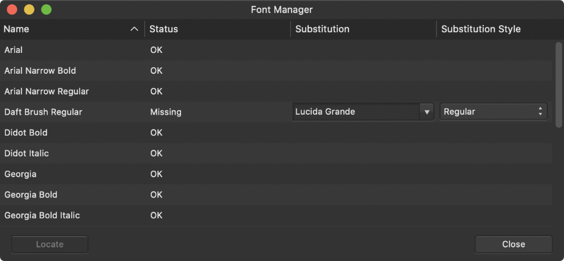

# Font Manager

Manage all your used fonts from one location using *Font Manager*. You can check if any unavailable fonts have been substituted for another font, swap for another font and also locate the text instance which uses the font.

*The Font Manager.*

On opening a document that uses fonts that are not installed on your computer, you'll get notified of this issue via a pop-up message. It's common practice to resolve this situation so the document will look as the original creator intended.

The Font Manager lists fonts used in text objects throughout your publication, along with their current status and substitution state (e.g., missing). You can either source the missing font yourself or use the Manager to use a substitute font instead.

The **Status** column can display several states:

- **OK**—The font is available on your computer and is currently applied to text in your document.
- **Missing**—The font is not available on your computer. For this reason, if you are copying a publication to take to a different computer, you should check that the fonts used are available on the new computer.
- **Unsupported characters used**—The text uses characters that are not supported by the font.

The column called **Substitution** shows which local fonts are being used as substitutes for missing fonts. Fonts will already have been chosen for you as replacement but you can pick your preferred font instead.

> **Note:** On the Text context toolbar, a substituted font on text is indicated by a '?' prefix on the font name, e.g. ?Roboto.

**To access the Font Manager:**

- From the **Window** menu, select **Font Manager**.

**To substitute a missing font for another:**

1. From the **Substitution** column, select a replacement font from the pop-up menu.
2. From the **Substitution Style** column, select the replacement font's attribute (such as bold or italic) from the pop-up menu.

**To locate text using a selected font:**

- Select the font entry and click **Locate**.

#### SEE ALSO:

- [Character formatting](../09-character-level/01-character-formatting.md)
