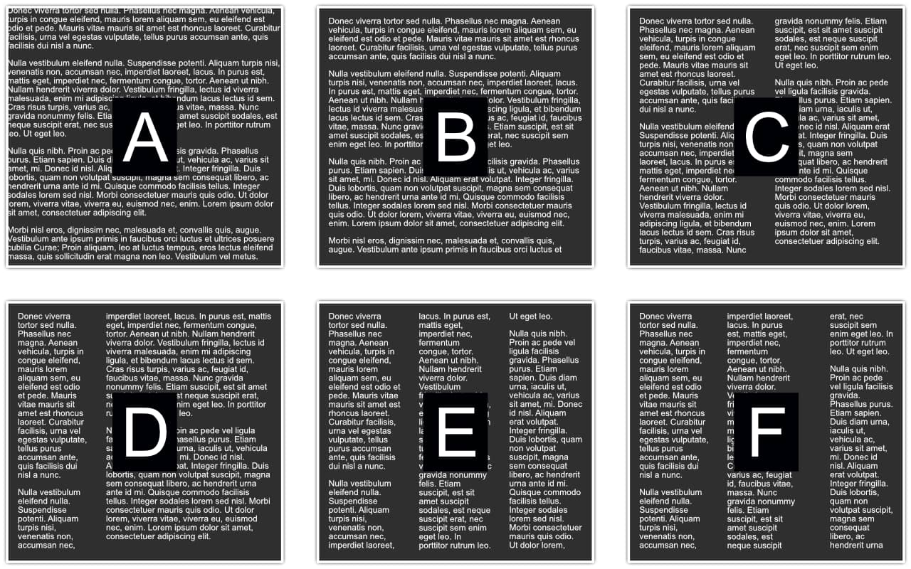

# Text frame setup

For more advanced text frame setup, you can use the **Text Frame** panel.

## About frame setups

Although the **Frame Text Tool**'s context toolbar lets you set the number of frame columns to use, you can also do this and much more in the **Text Frame** panel. Text frame stroke/fill color, insets, irregular column and gutter widths, column rules, as well as vertical alignment control and a baseline grid can all be set.

*Different Text frame setups: (A) with white/grayscale stroke/fill, (B) plus insets, (C) as two columns of equal width, (D) as two columns of different widths, (E) as three columns of equal width, (F) as three columns using different gutter values.*

Publisher will remember the last applied frame settings for new text frames. If you autoflow text to automatically generated text frames, those new frames will adopt the 'parent' text frame setup.

Note that each frame retains its own independent frame properties. As a result, you can edit any selected text frame to change its setup just for that frame.

You can copy and paste text frame setups from a source text frame to one or more selected target text frames and also save any text frame as an [asset](../../04-get-started/15-using-assets.md) in the **Assets** panel to a custom category, e.g. MyTextFrames.

**To change a selected text frame's setup:**

1. Do one of the following:
  -  On the **Frame Text Tool**'s context toolbar, select **Text Frame**.
  - From the **Window** menu, select **Text>Text Frame**.
2. From the panel, edit stroke/fill, adjust columns/gutters, add/remove column rules, alter vertical alignment and switch on baseline grid.

**To copy and paste a text frame setup:**

1. Select the source text frame.
2. From the **Edit** menu, select **Copy**.
3. Select the target text frame(s).
4. From the **Edit** menu, select **Paste Style**.

#### SEE ALSO:

- [Working with text](../01-working-with-text.md)
- [Frame Text Tool](../../20-tools/02-text-tools/01-frame-text-tool.md)
- [Text Frame panel](../../21-panels/32-text-frame-panel.md)
- [Assets](../../04-get-started/15-using-assets.md)
- [Assets panel](../../21-panels/02-assets-panel.md)
