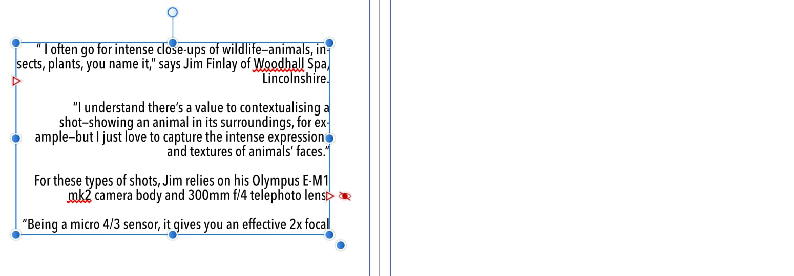
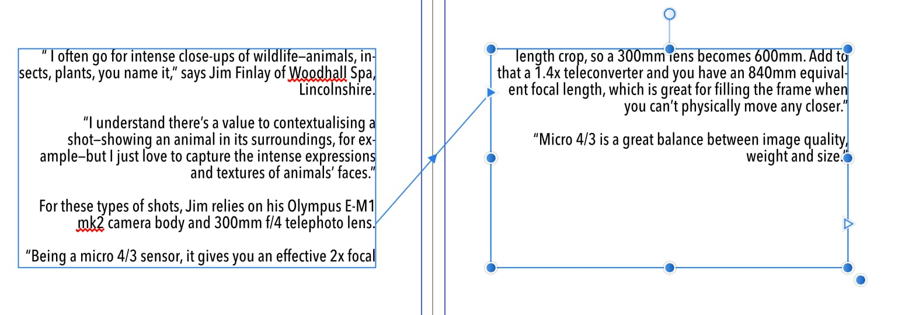
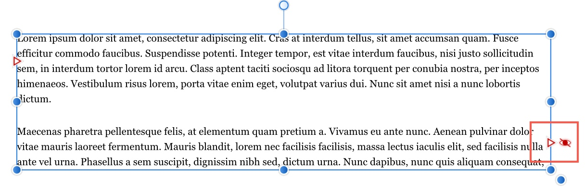

# Flowing text through frames

If you have more text than will fit into one text frame, you can use any of the following options to accommodate the text.

- Shrink the text to fit the frame.
- Manually create and link multiple frames.
- Trigger AutoFlow to automatically create new frames for you.

The AutoFlow feature lets you flow text through newly created text frames (of identical dimensions) on pages after the page containing your overflowing text frame.

If there's too much story text to fit in a frame sequence, Affinity Publisher stores it in an invisible overflow area. To indicate overflow, a Text Flow button (triangle icon) changes to red; an adjacent eye icon also appears which lets you show or hide the overflowing text.

By clicking the Text Flow button and pressing a modifier key, the AutoFlow feature will automatically flow text into new text frame in different ways.

AutoFlow is a "one-off" operation. If you add more text to a story while editing, or have reduced the size of a frame, you may find that an overflow condition crops up. In this case you can decide whether to initiate an autoflow again or use a text sizing option. If you reduce the amount of text in the story, empty frames will remain on the page.

> **Note:** AutoFlow can't be used to fill existing text frames.

**To autoflow text into a new single text frame:**

- Click the Flow button at the bottom-right edge of the overflowing text frame with the `Alt`  pressed.

The text frame is created on a new page with the same dimensions and properties as the original overlapping text frame. Note that the text frame may still have overflowing text.

**To autoflow text into multiple new text frames:**

- Click the Flow button at the bottom-right edge of the overflowing text frame with the `Shift`  pressed.

Text frames, of same dimensions and properties, are created on multiple new pages until text overflow no longer occurs.

#### SEE ALSO:

- [Frame text](../03-frame-text.md)
- [Fitting text to frames](05-fitting-text-to-frames.md)
- [Linking text frames](06-linking-text-frames.md)
