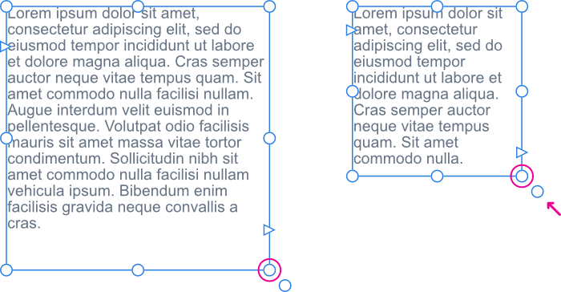

# Fitting text to frames

There are several methods available to fit text to frames: resizing the frame itself, changing the font size or adding additional [linked text frames](06-linking-text-frames.md).

## Resizing text frames

When resizing a frame you can control whether:

- Text remains at its set size and reflows through the frame.
- Text scales as the frame is resized.
- Any extra space at the bottom of the frame is to be removed after resize.

## Aligning text in text frames

Horizontal alignment is a paragraph attribute which can be altered via the Text context toolbar. Vertical alignment of text within a frame is a frame attribute. The latter is good for aligning text centrally with adjacent graphics.

**To resize a text frame:**

With the text frame selected, do one of the following:

- To resize height and width simultaneously, drag the frame's corner handles.
- To resize height and width independently, drag the frame's side handles.

  

The frame text will reflow within the newly sized frame; the font size will remain unchanged.

**To scale text:**

- With the text frame selected, drag the object's scale handle (this extends from the bottom-right corner of the frame). Any containing frame text will be resized in proportion to the new text frame dimensions.

  

> **Note:** After the text frame is resized, the scale handle will be colored blue to indicate frame text scaling. This is a useful reminder if you've inadvertently scaled text instead of reflowed it.

**To reset scaled frame text back to its original font size:**

- Double-click the blue scale handle.

The text frame will still retain its resized dimensions.

**To fit frame to frame text:**

- Double-click the edge handle at the bottom center of the text frame. If extra space exists between the last line of text and the frame's bottom edge, the space will be removed.

**To vertically align frame text:**

- From the **Text** menu, select an option from the **Vertical Alignment** submenu.

#### SEE ALSO:

- [Frame text](../03-frame-text.md)
- [Linking text frames](06-linking-text-frames.md)
- [Flowing text](04-flowing-text-through-frames.md)
