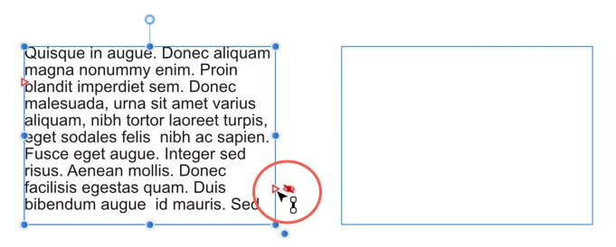
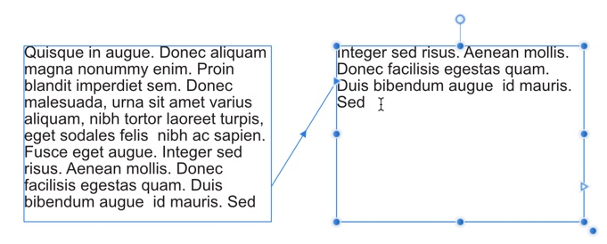
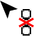

# Linking text frames

A powerful feature of Affinity Publisher is the ability to link text across multiple text frames, either on the same page or across different pages.

There are two basic ways to set up a linked sequence of frames:

- You can link a sequence of empty frames, then import the text.
- You can import the text into a single frame, then create and link additional frames into which the text automatically flows.

When a text frame is selected, the frame includes a triangular Text Flow button at the bottom right of the text frame (red or blue). Irrespective of whether the frame text is overflowing, you can click this to draw out another text frame linked to the originating text frame.

## About jump lines

Jump lines, also known as continuation lines, direct the reader of a publication to where frame text continues—usually on an earlier or a later publication page.

To help readers navigate between linked text frames, you can use the **Next Frame** and **Previous Frame** page number fields in 'Continued On' and 'Continued From' jump lines, respectively.

Jump lines automatically update if linked frames are moved to a different page or new pages are added.

**To link the selected frame to an existing unlinked frame:**

1. Click the frame's triangular Text Flow button when you see the cursor change ().
2. Click anywhere on the frame to be linked to.

A connecting line links the two text frames.

> **Tip:** If you click on a frame's Text Flow button, and then change your mind about linking or unlinking, press the `Esc`  to cancel.

> **Tip:** To link multiple existing frames quickly, hold the `Cmd` , click the first frame's Text Flow button and then click anywhere on other frames in the desired sequence. As long as you hold `Cmd` throughout, you won't need to click the Text Flow button on each additional frame.

**To link the selected frame to a newly drawn frame:**

- As above, but instead of clicking a 'target' frame, drag across the page (to create a frame sized to your requirements). This is ideal for quickly mapping out linked frames across different pages.

**To remove a text frame from the frame sequence:**

1. From the **Tools** panel, select the **Move Tool**.
2. Select the text frame, then press the `Backspace` .

The previous and next frames will maintain frame linkage.

> **Tip:** Body text remains with the "old" frames. For example, if you delete the second frame of a three-frame sequence, the body text remains in the first and third frames, which are now linked into a two-frame story.

**To unlink a text frame from the frame sequence:**

1. From the **Tools** panel, select the **Move Tool**.
2. Select the text frame to be unlinked, then click the 'previous' and/or 'next' Text Flow buttons (top left or bottom right, respectively).
3. Click within the frame when the unlink cursor () appears.

> **Tip:** When unlinking a frame in a populated frame sequence, all text after the unlink point will be placed in the previous frame, and will overflow that frame.

> **Tip:** You can navigate through linked text frames by using up/down arrow from text insertion point.

> **Tip:** To temporarily hide blue link lines, arrows and overflow indicators, switch off **Show Text Flow** on the **View** menu.

**To insert a jump line:**

1. Make an insertion point in the text frame where you want the jump line to appear.
2. Type the phrase for the jump line.
3. Position the insertion point where the page number will appear in the jump line.
4. On the **Fields** panel, in the **Continuation** section, double-click either **Previous Frame** or **Next Frame**.

#### SEE ALSO:

- [Frame text](../03-frame-text.md)
- [Fitting text to frames](05-fitting-text-to-frames.md)
- [Flowing text](04-flowing-text-through-frames.md)
