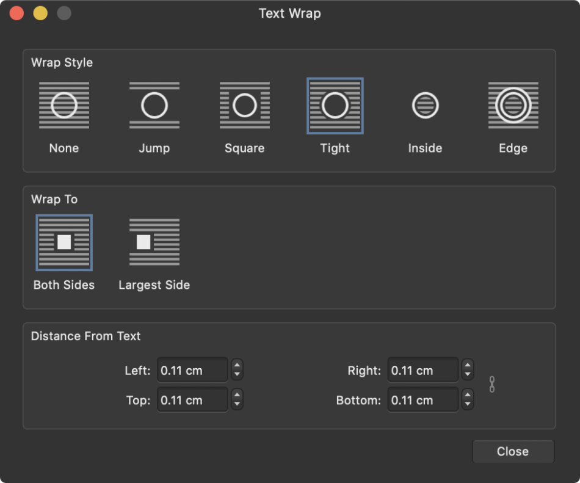

# Text wrapping

Text wrapping lets you control how frame text flows around objects such as placed images, picture frames, shapes and even other text frames.

The distance at which text wraps around an object's outline can be set independently for each side.

The wrap outline around an object can be edited to precisely define the extent of wrapping.

Text wrapping is applicable when objects are partially or fully overlapping frame text.

An object with a text wrap applied affects overlapping frame text whether the object is visible or hidden.

*The Text Wrap dialog.*

> **Tip:** If you want to prevent text wrapping around underlying objects on a specific text frame, you can check **Ignore Text Wrap** in the **Text Frame** panel.

**To wrap text:**

1. Select the object you want frame text to be wrapped around.
2. On the Toolbar, select **Show Text Wrap Settings**.
3. From the dialog, choose a **Wrap Style** from one of:
  - **None**—Text will not wrap around the object.
  - **Jump**—Text will appear above and below the object.
  - **Square**—Text will wrap around a rectangle which bounds the object.
  - **Tight**—Text will wrap tightly outside the object’s outline.
  - **Inside**—Text will wrap tightly inside the object’s outline.
  - **Edge**—Text will avoid the edges of the object.
4. For Square or Tight styles, choose to **Wrap to** either both sides or the widest portion of text.
5. Use the **Distance From Text** options to selectively set the buffer space between object edge and text.

**To edit the wrap outline:**

1. Select the object whose outline you want to edit.
2. On the Toolbar, select **Edit Wrap Outline**.
3. With the now active **Node Tool**, reshape the outline by dragging nodes (and control handle pairs) into your chosen position.

**To reset the wrap outline:**

- On the Toolbar, select **Reset Wrap Outline**.

#### SEE ALSO:

- [Node Tool](../../20-tools/01-layout-tools/02-node-tool.md)
- [Frame text](../03-frame-text.md)
- [Text Frame panel](../../21-panels/32-text-frame-panel.md)
- [Object defaults](../../09-object-control/22-object-defaults.md)
