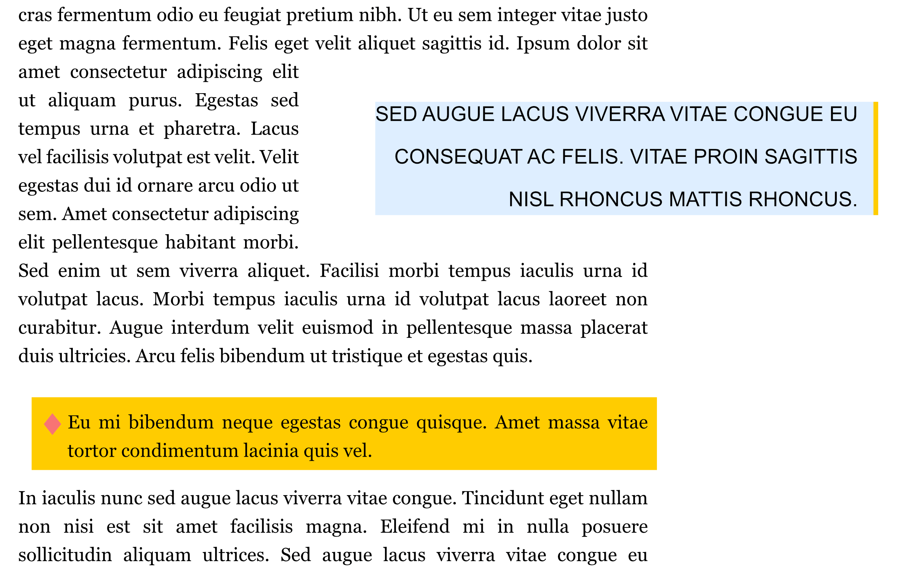
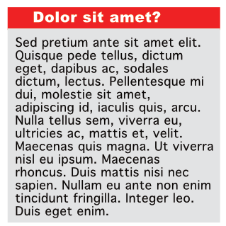
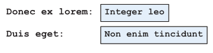
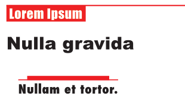

# Decorations

Paragraph decorations, created around your text styles, can be used to differentiate blocks of text using decorative styles that will always move relative to the text.

Paragraph decorations are applied at text style level. They can be created via the **Paragraph** panel and will remain unaffected by any edits applied to your text, saving you the trouble of having to reposition them each time your text is altered.

A decoration could take the form of a pull quote, note style, colored heading fill or colored underline. You can customize the position, indent, stroke/fill, and transparency of a decoration.

*Paragraph decorations on floating quote text and inline note text style.*

The opportunities for creating unique decorative styles are endless. All decorations you create will be available for future use from the **Paragraph** panel.

**To access decorations:**

1. From the **Paragraph** panel, scroll down to view the **Decorations** section.
2. A list of existing decoration styles will be available if applicable, as well as a range of settings for placing and customizing new and existing decorations.

**To create a new decoration:**

1. (Optional) Format and select a portion of text or click inside a paragraph.
2. On the **Paragraph** panel, click the plus icon next to the first menu in the **Decorations** section.
3. Adjust the settings within the section to your liking. See [Paragraph panel](../../../21-panels/18-paragraph-panel.md) for more information on the available settings.

**To edit a custom decoration:**

1. On the **Paragraph** panel, select a decoration from the first menu in the **Decorations** section.
2. Adjust the settings within the section to your liking. See [Paragraph panel](../../../21-panels/18-paragraph-panel.md) for more information on the available settings.

*Using decorations, the text can have an underline of a different color.*

*Decorations make text boxes really stand out through the use of shading and borders.*

*Decorations can be used to create highlighted areas for form fields.*

*Headers and footers can be easily emphasized using decorations.*

#### SEE ALSO:

- [Paragraph panel](../../../21-panels/18-paragraph-panel.md)
