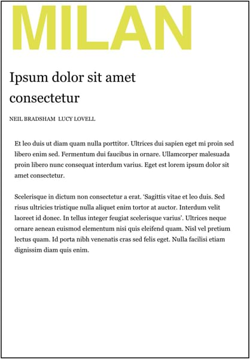
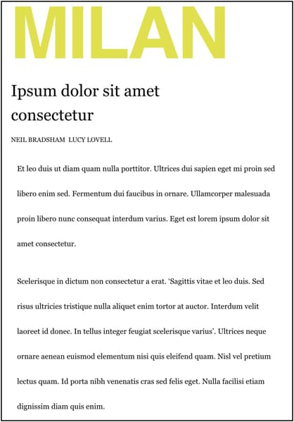
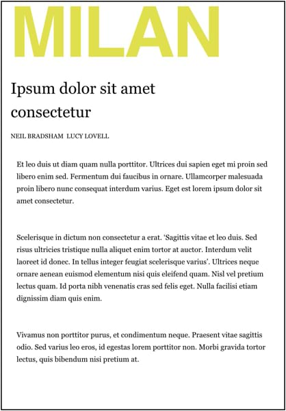
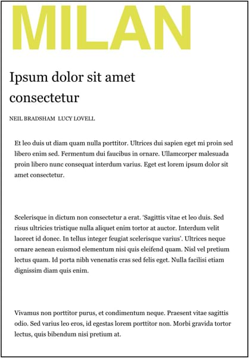

# Leading and inter-paragraph spacing

Paragraph spacing is influenced by two methods: Line spacing, which sets the vertical spacing between lines that make up the paragraph, and inter-paragraph spacing which sets the spacing (padding) between each consecutive paragraph. Using the latter avoids poor formatting techniques such as pressing the Enter key between paragraphs to create "padding".

## Leading

Leading determines the distance from one text baseline (the line on which a line of text appears to sit) to the next.

The main leading control is in the Paragraph panel, and on the context toolbar. Using this is recommended, because it can be applied to the entire paragraph and so keeps the paragraph consistent. Leading Override can be used when you have a handful of characters that need special handling, for example, because they use a different font with a size that looks visually different.

## Inter-paragraph spacing

Inter-paragraph spacing settings allow you to precisely determine the offset between a paragraph and its preceding and following paragraphs.

**To adjust text leading:**

- Do one of the following:
  - From the context toolbar, select or enter a value via the **Paragraph Leading** setting.
  - From the **Paragraph** panel, select or enter a value via the **Paragraph Leading** setting in the **Spacing** section.

> **Note:** The **Leading Override** setting can be used in cases where you have a handful of characters that need special handling, for example, because they use different fonts with sizes that look visually different.

**To adjust inter-paragraph spacing:**

- From the **Paragraph** panel, alter the **Space Before Paragraph** and **Space After Paragraph** settings in the **Spacing** section. You may also opt to tick the **Sum space before and after** and **Ignore space for same styles** checkboxes depending on how you would like your text spacing to appear in these circumstances.

> **Note:** The alignment options found in the **Text** menu's **Vertical Alignment** submenu can also be used to adjust spacing by text frame instead of by paragraph.

#### SEE ALSO:

- [Paragraph panel](../../21-panels/18-paragraph-panel.md)
- [Paragraph formatting](01-paragraph-formatting.md)
