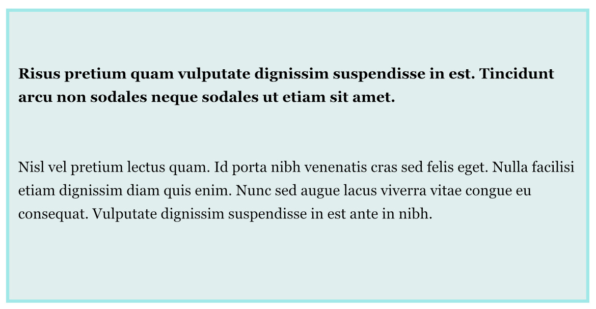
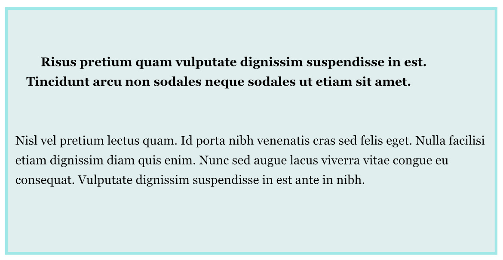
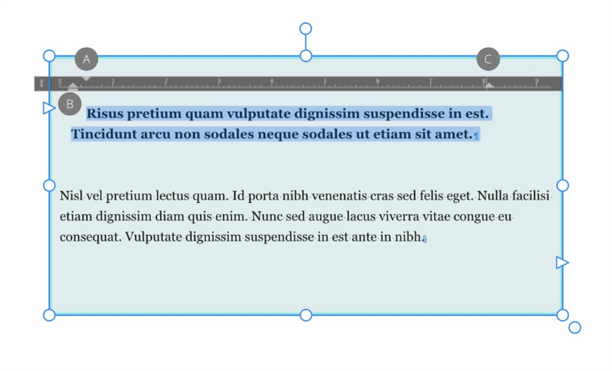

# Indents

Indents align text inward from the right and left sides of the frame. Using indents to align the first line of a paragraph offers improved text formatting compared with using tab stops or spaces.

When text is selected, markers displayed on the text ruler (activated via the **View** menu) indicate the left indent, first line indent, right indent, and last line outdent of the current paragraph. You can adjust the markers to set paragraph indents and outdents, or use the **Paragraph** panel.

- The First line indent (A) is in relation to the left indent.
- The Left indent (B) is set in relation to the object's left margin (or text frame edge if the margin is not set).
- The Right indent (C) is set in relation to the object's right margin (or text frame edge if the margin is not set).

**To activate the text ruler:**

Do one of the following:

-  From the context toolbar, ensure that **Frame Text Ruler** is switched on. The text ruler will appear when an insertion point is made in the text.
- From the **View** menu, ensure that **Show Text Ruler** is checked. The text ruler will appear when an insertion point is made in the text.

**To set indents:**

- Do one of the following:
  - Drag the appropriate ruler marker(s).
  - To precisely adjust indent settings using numerical values, open the **Paragraph** panel and adjust the indents from the **Spacing** section.

## Other indent options

To add an individual or one-off right indent tab, with an insertion point made in the text, from the **Text** menu, select **Insert>Tabs and Spaces>Right Indent Tab** (or press the `Shift`-tab keys). The right indent tab will ignore formatting set by the **Frame Text Ruler** and will set an indent on the right-hand edge of the text frame.

If you wish to create an indent from a chosen insertion point that affects all subsequent lines, with an insertion point made in the text, from the **Text** menu, select **Insert>Tabs and Spaces>Indent To Here** to set an indent from that point.

#### SEE ALSO:

- [Paragraph panel](../../21-panels/18-paragraph-panel.md)
- [Paragraph formatting](01-paragraph-formatting.md)
