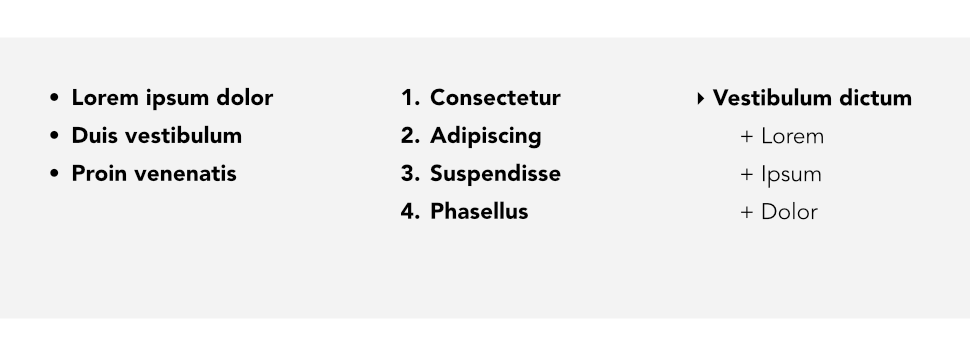

# Bullets and numbering

You can turn a series of paragraphs into bulleted, numbered or multi-level lists. Bullets are especially useful when listing items of interest in no specific order of preference, numbered lists for presenting step-by-step procedures (by number or letter), and multi-level lists for more intelligent hierarchical lists with prefixed numbers, symbols, or a mix of both, all with supporting optional text (see [Using multi-level lists](05-using-multi-level-lists.md)).

*A bulleted list, a numbered list, and a multi-level list.*

Affinity Publisher lets you create simple lists directly from the context toolbar, or by choosing from a preset bullet, number or multi-level list. If you want to go a step further you can create custom list styles by selecting your own glyphs, symbols, numbers and letter formats. You then have the option of replacing an existing preset with your own preset based on your own custom list style.

Lists can be applied to normal text (as local formatting) or to text styles equally.

**To create a simple bulleted or numbered list:**

- With text selected or an insertion point made, do one of the following:
  - Select **Bulleted List** or **Numbered List** from the context toolbar.
  - From the **Paragraph** panel, select a **Type** from the **Bullets and Numbering** section.
  - From the **Text** menu, select one of the **List** submenu options.
- The selected text will be converted to the bulleted or numbered list of your choice.

> **Note:** For a numbered list that continues after non-numbered lists or paragraphs are included in between, go to the **Paragraph** panel and choose **Below Current Level** from the **Restart numbering** menu.

**To create a custom list:**

- With text selected or an insertion point made:
  1. From the **Paragraph** panel, select a **Type** from the **Bullets and Numbering** section.
  2. Choose from additional symbols by clicking on the downward arrow in the **Text** field. You can enter characters and spacing into this field to customize the appearance of your list. Using the **More** button to the right of this field, you can select from additional glyphs and symbols.
  3. The **Tab stop** and alignment settings allow you to customize the position of your list text.
  4. The **Name** setting lets you name your new list format and set it as a global format which can be used across the document, while the **Style** setting allows you to associate your list formatting with an existing text style for future use.
- Your text will be automatically updated as you make changes via the panel.

> **Note:** You can create a text style for each bulleted or numbered list level, for example Bullet 1, Bullet 2, Numbered 1, Numbered 2.

> **Note:** To create colored bullets, apply a character style to the bulleted list via the **Paragraph** panel using the **Style** options from the **Bullets and Numbering** section. This allows you to set a character style complete with your chosen color and size that will then be applied to the bullet.

#### SEE ALSO:

- [Frame text](../03-frame-text.md)
- [Using multi-level lists](05-using-multi-level-lists.md)
- [Character formatting](../09-character-level/01-character-formatting.md)
- [Paragraph formatting](01-paragraph-formatting.md)
- [Frame Text Tool](../../20-tools/02-text-tools/01-frame-text-tool.md)
- [Glyph Browser panel](../../21-panels/10-glyph-browser-panel.md)
