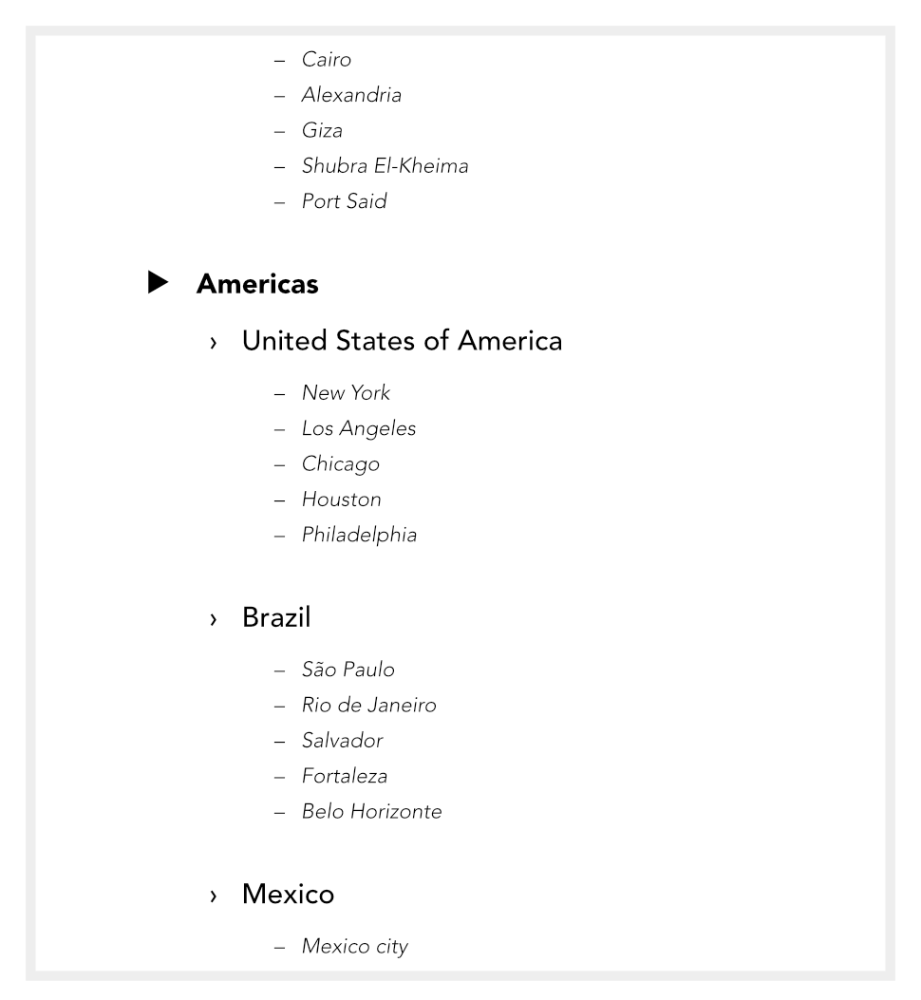

# Using multi-level lists

For multi-level lists, as opposed to [bulleted and numbered lists](04-bullets-and-numbering.md), you can set a different character (symbol, text or number) to display at each level of your list. Levels are normally considered to be subordinate to each other, where Level 1 (first level), Level 2 (second), Level 3 (third), etc. are of decreasing importance in the list. For example, the simple multi-level numbered passage of text opposite is arranged at three levels.

The flexibility of Affinity Publisher's multi-level bullet and numbering system means that you have full control over what gets displayed at each level. For this reason, no common numbering schema needs to exist between levels, i.e. the list could equally be prefixed with a different symbol, text prefix, or number combination at each level.

If you apply a multi-level preset to a range of text you'll get a list with the preset's Level 1 format applied by default. Unless you use text styles, you'll have to change to levels 2, 3, 4, etc. to set the correct level for your list entry.

**To change a paragraph's list level:**

- With text from a numbered list selected, do one of the following:
  - From the **Paragraph** panel, go to the **Bullets and Numbering** section and adjust the number in the **Level** setting.
  - From the **Text** menu, select **Increase Level** or **Decrease Level** from the **List** options.

**To create a multi-level list from presets:**

- From the **Text Styles** panel, select a multi-level text style (for example, **Numbered 1** or **Numbered 2**).

The multi-level text style presets offer some simple but commonly used schemes for paragraph list formatting. However, if you want to create your own lists or modify an existing list (your own or one based on a preset), this can be done via the options found in the menu to the right of the text style.

## Assigning bullets, numbers, and levels to styles

If you're working on long publications, you may be using pre-assigned text styles (Heading 1, Heading 2, indent, etc.) to format your publication rather than using the above local formatting. You can use such text styles along with list styles to number headings or paragraphs automatically without the need to repetitively format headings or paragraphs as lists. As an example, headings and paragraphs in technical and legal publications are typically prefixed by numbers for easy reference. The advantage of using a style-driven approach is that you can let the numbering take care of itself while you concentrate on applying styling to your publication.

Affinity Publisher lets you easily associate any bulleted, numbered or multi-level list style (either preset or custom list) to an existing text style.

**To save a list level as a text style:**

- With text selected or an insertion point made:
  1. From the **Paragraph** panel, set up your list level using the options in the [**Bullets and Numbering**](04-bullets-and-numbering.md) section.
  2. The **Style** setting allows you to associate your list formatting with an existing text style for future use.

**To assign a list to a text style:**

1. Right-click on the menu to the right of a chosen style in the **Text Styles** panel, and select **Edit style**.
2. Navigate to, then select the **Bullets and Numbering** option in the left-hand menu.
3. Choose a list **Type**.
4. Either pick a preset from the list or define your own list structure. It's good to associate each level in your multi-level list with a text style. Select from a range of settings to create your own bullet, number, or multi-level list format. For multi-level list presets, you can set the **Level** for the current style. Set **Restart numbering** to **Below Current Level**.
5. Change the **Level** to 2, 3, etc. to number the subheadings. To display the numbers in your text, enter something like "\1.\2" in the **Text** field. For automatic figure numbering for picture frames or tables, give your numbered list a name like "Figure" and tick the **Global** option, set **Restart numbering** to **Manual Only**, and set the text to something like "Figure \#". A number will be inserted at the beginning of the paragraph that increments automatically as other figures are added before it in the document.
6. When you are happy with your list, click **OK**. You can use this method to apply automatic multi-level numbering to built-in heading styles such as Heading 1, Heading 2, and Heading 3. Each heading style is linked to a Level, i.e. Heading 1 style to Level 1, Heading 2 to Level 2, etc. Headings 2 and 3 adopt the previous style's numbering. To make multi-level lists a little clearer, consider a preset containing different formats at three different levels.
7. For a selected heading style, choose the equivalent level, then build up the format for that level in the **Text Styles** panel (via the Bullets and Numbering options). Note that the numbering of one level (e.g., I) can be reused at a lower level (e.g., Level 2) to build up numbering formats from multiple levels, e.g. Section I/A, where I is from Level 1 and A is from Level 2.

> **Note:** If you plan to create your own multi-level paragraph styles, make use of the **Style** option beneath the **Level** setting when creating text styles. This sets the paragraph style that will be automatically applied to text if **Increase Level** or **Decrease Level** is applied from the **Text** menu; another advantage is that if you apply a multi-level style to text, the associated next level's style will be made available in the **Text Styles** panel.

> **Note:** The number ordering between frames depends on their z-order in the **Layers** panel, not their x/y position on the page.

#### SEE ALSO:

- [Frame text](../03-frame-text.md)
- [Bullets and numbering](04-bullets-and-numbering.md)
- [Character formatting](../09-character-level/01-character-formatting.md)
- [Paragraph formatting](01-paragraph-formatting.md)
- [Frame Text Tool](../../20-tools/02-text-tools/01-frame-text-tool.md)
- [Glyph Browser panel](../../21-panels/10-glyph-browser-panel.md)
