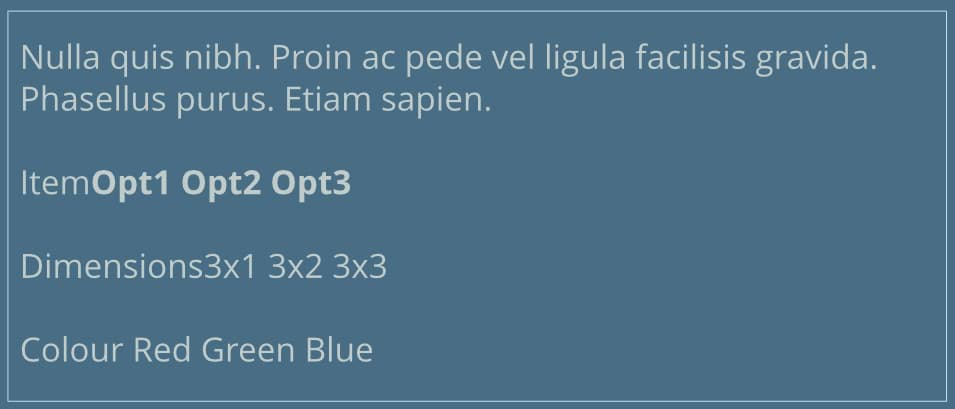
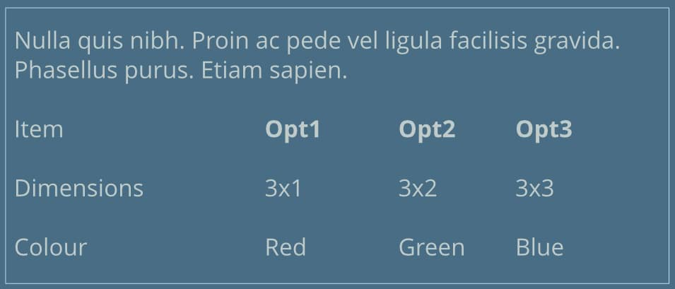
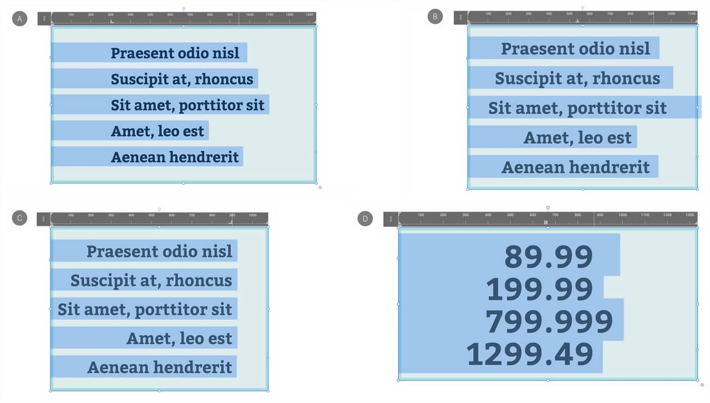

# Tabs

Tabs position text at specific horizontal locations, known as tab stops, in a text frame.

Several tab stop types are available:

-  Left
-  Center
-  Right
-  Decimal

The positions of tab stops are displayed on the text ruler and on the **Paragraph** panel's **Tab Stops** section.

The text ruler can be shown or hidden via the **View** menu.

*Tab stops for: left alignment (A), center alignment (B), right alignment (C) and decimal alignment (D).*

The insertion point or selection in a text frame determines which tab stops are shown on the text ruler and Text panel. If a selection encompasses multiple paragraphs, the first paragraph's tab stops are shown and, if modified, are applied to all paragraphs in the selection.

## Paragraph indentation level and tab stops

When the insertion point is at the start of a paragraph, the `Tab`  increases the paragraph's indentation level rather than typing a tab character. This is indicated by the first-line indent marker (aligned to the top of the text ruler), which can be dragged to fine-tune indentation.

If you would rather the `Tab`  always typed a tab character at the start of a paragraph, disable **Use tab to alter paragraph level instead of inserting a tab character** in Affinity Publisher's **Auto-Correct** settings. You can still drag the first-line indent marker to set paragraph indentation precisely.

**To show/hide the text ruler:**

Do one of the following:

-  On the **Frame Text Tool**'s context toolbar, select **Frame Text Ruler**.
- On the **View** menu, select **Show Text Ruler**.

When Show Text Ruler is turned on, the text ruler will appear above a text frame when an insertion point is made in the frame. Tab stops won't appear on the ruler until you add them.

**To set a tab stop using the text ruler:**

1. Put the insertion point in the paragraph in which you want to set tab stops, or make a selection that includes multiple paragraphs.
2. Click on the text ruler where you want to create a tab stop.
3. To edit the tab stop:
  - To amend the tab stop alignment type, double-click the tab stop until it changes to the type you want: Left, Center, Right, or Decimal.
  - To edit a tab stop's settings, `Click`-click on the tab stop.
  - To move a tab stop, drag it to a new ruler position.
  - To delete a tab stop, drag it off the ruler.

> **Note:** To create a tab stop whose position is measured relative to its text frame's right edge instead of the left, click at the top of the text ruler. This is useful when you need to resize text boxes from their left edges.

> **Note:** To change an existing stop so that it's positioned from the left or right of the ruler, either drag it to the ruler's bottom or top edge, respectively, or set **From Right** on the tab options as needed.

**To set a tab stop via the Paragraph panel:**

1. Select the paragraph(s) in which you want to set tab stops.
2. From the **Paragraph** panel, adjust the settings in the **Tab Stops** section, specifying the tab **Position**, **Alignment** and **Leader** where necessary.

#### SEE ALSO:

- [Paragraph panel](../../21-panels/18-paragraph-panel.md)
- [Paragraph formatting](01-paragraph-formatting.md)
