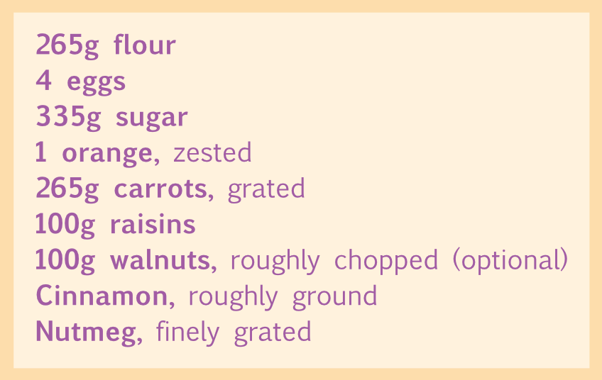

# Initial words

Unique formatting can be applied to the first few words of the paragraph. Affinity Publisher allows you to control initial word formatting, the maximum number of words affected, and at which character to stop formatting.

*Initial words enabled with **Max word count** set to **2** and **,** specified as an **End character**.*

**To set up initial words:**

- From the **Paragraph** panel's **Initial Words** section:
  - **Enabled**—tick this checkbox to enable initial word formatting to be used.
  - **Max word count**—specify the maximum number of words to which initial word formatting should be applied.
  - **End characters**—specify which characters can be used to automatically end the initial word formatting.
  - **Style**—select a style from the pop-up menu or click **New** to create a new style using the pop-up menu.

#### SEE ALSO:

- [Paragraph panel](../../21-panels/18-paragraph-panel.md)
- [Paragraph formatting](01-paragraph-formatting.md)
