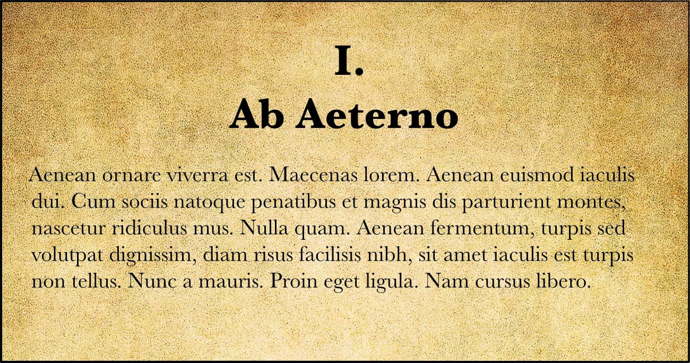
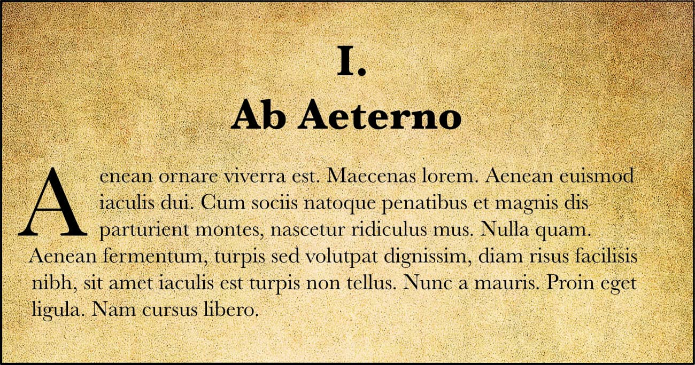

# Drop caps

Drop caps are enlarged initial letters or symbols that drop below the baseline of your first lines of text, which can be used to give your page more personality and grab readers' attention.

**To set up drop caps:**

- From the **Paragraph** panel's **Drop Caps** section:
  - **Enabled**—tick this checkbox to enable drop caps.
  - **Height in lines**—specify the height of the dropped capital in lines.
  - **Characters**—specify the number of characters to be dropped.
  - **Auto**—when ticked, overrides the **Character** setting and defaults to dropping a single character as well as any preceding alphanumeric characters (such as quotation marks).
  - **Distance to text**—specify how close the dropped capital and the rest of the text should be. This value can be negative to allow the text to be closer to the dropped capital.
  - **Align left edge**—tick this checkbox to ensure the dropped capital is aligned to the left-hand edge of the column.
  - **Scale for descenders**—tick this checkbox to ensure that the size of any dropped capital containing descenders is automatically adjusted so it matches the alignment of other dropped capitals.
  - **Style**—select a style from the pop-up menu or click **New** to create a new style using the pop-up menu.
  - **Enabled**—tick this checkbox to enable drop caps.

#### SEE ALSO:

- [Paragraph panel](../../21-panels/18-paragraph-panel.md)
- [Paragraph formatting](01-paragraph-formatting.md)
