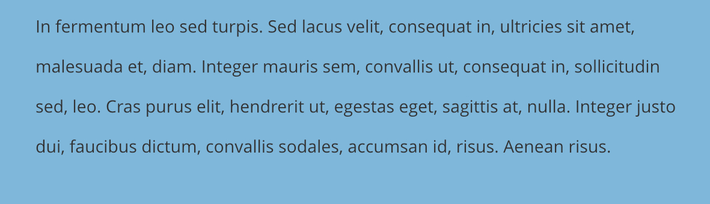
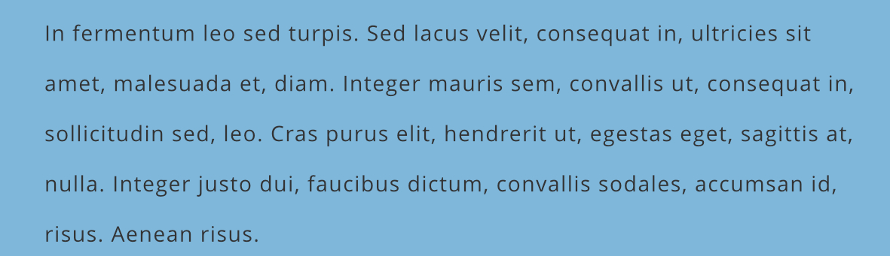

# Tracking and kerning

Publisher allows you to precisely adjust the spacing between characters using tracking or kerning.

## Tracking

The spacing between characters (tracking) in a paragraph of any alignment can have a subtle impact on the reader. Publisher allows you to experiment with the letter spacing in your text.

## Kerning

Kerning is normally applied where two large, adjacent characters look over- or under-spaced due to the shape of the characters, and is used to reduce or increase the space between the pair of characters.

By default, Publisher applies the kerning tables that the font designer has set for the font. This will often require manual kerning (especially in titles) to ensure that all characters appear evenly spaced.

Metrics-based kerning is supported which is based on tables in the font file.

**To adjust tracking:**

- With a range of text selected, do one of the following:
  - From the **Character** panel, choose a value from the  **Tracking** setting, using the up and down arrows, the pop-up menu, or by typing in a new value.
  - From the **Text** menu's **Spacing** submenu, select one of the spacing options.

**To adjust kerning:**

- With an insertion point made by clicking between two characters in your text, do one of the following:
  - From the **Character** panel, choose a value from the  **Kerning** setting, using the up and down arrows, the pop-up menu, or by typing in a new value. **Auto** will automatically kern characters by default. Positive values give expanded kerning, negative values give condensed kerning.
  - From the **Text** menu's **Spacing** submenu, select one of the spacing options.

> **Note:** Typically the advantages of kerning are most noticeable in larger text, so the most detailed attention is applied to kerning when creating display text such as headlines or text logos.

## Keyboard shortcuts

**The following keyboard shortcuts also allow you to adjust tracking or kerning:**

**macOS:**

- To loosen spacing in 10% increments, press `Alt` + `Right`.
- To tighten spacing in 10% decrements, press `Alt` + `Left`.
- To loosen spacing in 50% increments, press `Alt` + `Cmd` + `Right`.
- To tighten spacing in 50% decrements, press `Alt` + `Cmd` + `Left`.

**Windows:**

- To loosen spacing in 10% increments, `Alt`+`Right`.
- To tighten spacing in 10% decrements, `Alt`+`Left`.
- To loosen spacing in 50% increments, press `Alt`+`Shift`+`Right`.
- To tighten spacing in 50% decrements, press `Alt`+`Shift`+`Left`.

#### SEE ALSO:

- [Character formatting](01-character-formatting.md)
- [Paragraph formatting](../08-paragraph-level/01-paragraph-formatting.md)
- [Character panel](../../21-panels/04-character-panel.md)
- [Paragraph panel](../../21-panels/18-paragraph-panel.md)
- [Keyboard shortcuts for working with text](../../24-keyboard-shortcuts/01-keyboard-shortcuts.md)
