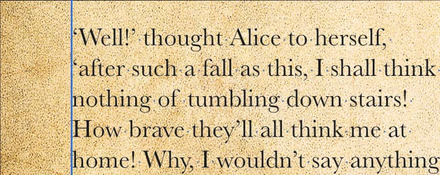
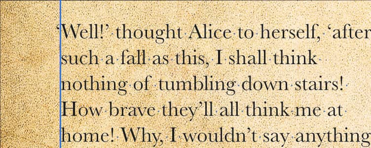

# Optical alignment

Optical alignment uses preset or custom rules for aligning characters at the start and end of paragraph text as well as at tab stops.

Optical alignment is typically used to introduce hanging punctuation where punctuation marks are outdented at the start and end of paragraph text.

As a result, the feature is best configured for a base paragraph style (e.g., Base), with the option of manual fine tuning via the Character panel as needed. This will *automatically* apply relevant optical alignment rules when characters such as “ and ‘ are typed at the start and end of paragraph text (at Left Indent or Right Indent) or at tab stops. This is without manual selection of the character itself.

Two types of optical alignment are possible: 'Manual' where a lookup table of rules is used and 'Font' where the font itself provides optical alignment control. The latter is applicable to fonts that have been designed with in-built optical alignment capabilities—this is emergent technology.

**To apply optical alignment:**

1. From the **Text Styles** panel, `Click`-click on a text style and choose **Edit [style name]**.
2. From the **Character>Optical Alignment** section, change **Type** to 'Manual'.
3. Click **OK**.

This invokes all the listed alignment rule presets, plus any added custom optical alignment rules.

> **Note:** Accurate optical alignment depends on the font used so it's worth checking the alignment if you've altered your font.

**To add a custom optical alignment rule:**

1. From the **Text Styles** panel, go to the **Character** section, then select **Optical Alignment** and change **Type** to Manual.
2. Click **Add**.
3. Edit the rule as follows:
  - **Left**—The percentage of the character to be outdented at paragraph's Left Indent or tab stop; 100% means the whole character's width will be outdented.
  - **Right**—The percentage of the character to be outdented at paragraph's Right Indent or tab stop.
  - **Characters**—The character to be optically aligned. The character you type in your paragraph that matches this character will be automatically aligned.

> **Note:** You can create optical alignment rules by using the **Character** panel instead. This lets you apply alignment to selected characters at the character level rather than to a text style.

#### SEE ALSO:

- [Working with text](../01-working-with-text.md)
- [Character panel](../../21-panels/04-character-panel.md)
- [Tabs](../08-paragraph-level/06-tabs.md)
- [Text styles](../10-text-styles/01-using-text-styles.md)
