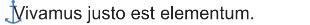
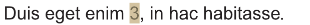
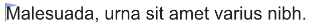
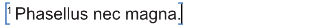
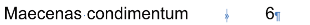

# Text marks

Text marks are non-printing characters that can be shown within your text to confirm the positions of:

- marks inserted into text for managing your publication's anchors (targets for hyperlinks), endnotes and index.
- fields, which look like regular text but whose content dynamically updates over time or as your publication is edited.
- special characters, specifically invisible characters that affect your document's text flow. For example, right tab characters, and line, column, frame and page breaks.
- spelling mistakes, as determined by a text object's **Spelling** setting in the **Language** section of the **Character** panel.

Text marks appear only in the document view, not in output of your document.

You might show special characters to identify why text is not flowing as expected. For example, page breaks and non-breaking spaces in a Microsoft Word document are preserved when the document is placed in Affinity. The characters may improve content's structure and readability in its original format, but produce undesirable text flow through your publication's text frames in Affinity.

> **Tip:** With placed documents, you may want to remove or replace multiple instances of a character. On the **Find and Replace** panel, clicking the magnifying glass icon on the **Find** option allows you to choose from a list of special characters

## Showing and hiding text marks

Visibility of each type of text mark can be toggled by selecting its corresponding menu command.

| Type of text mark | Example | Menu command |
| --- | --- | --- |
| Anchors |  | **Text>Interactive>Show Anchors** |
| Fields |  | **Text>Highlight Fields** |
| Index marks |  | **Text>Index>Show Index Marks** |
| Note marks |  | **Text>Notes>Show Note Marks** |
| Special characters1 |  | **Text>Show Special Characters** |
| Spelling mistakes |  | **Text>Spelling>Check Spelling While Typing** |

1 Special characters include but are not limited to the right tab stop and paragraph marker (as shown).

#### SEE ALSO:

-
- [Special characters and glyphs](../06-editing/02-special-characters-and-glyphs.md)
- [Hyperlinks](../../13-references/05-hyperlinks.md)
- [Fields](../../13-references/04-fields.md)
- [Index](../../13-references/03-index.md)
- [About notes](../../13-references/01-notes/01-about-notes.md)
- [Auto-Correct and Check Spelling While Typing](03-auto-correct-check-spelling-while-typing.md)
