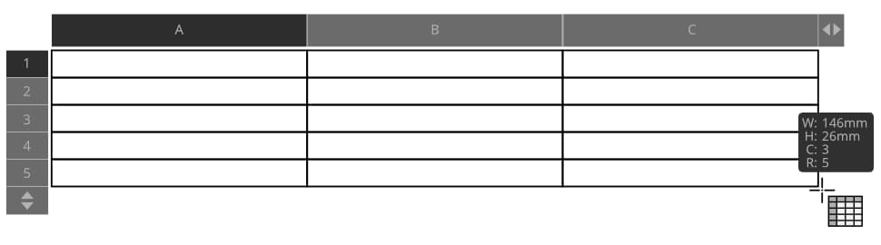

# Creating tables

Affinity Publisher lets you create and format tables using the **Table Tool**.

Tables can be created via the **Table Tool**, allowing you to organize and present information in rows and columns rather than in paragraph format. Table text can be typed in manually or pasted directly into the table, and has its own default formats distinct from artistic and frame text.

*Drawing a table.*

Snapping can be used to ensure table rows and columns are precisely aligned to other content on the page when creating a table as well as when extending or resizing table corners.

> **Note:** When resizing a table, you can use the arrows at the end of column and row headers to adjust the total row or column count for the table.

Microsoft Excel Workbook spreadsheets (XLSX) can be placed directly in Publisher as tables. The following are not currently supported:

- Formulae are imported as their calculated result value.
- Local formatting is imported, but global Table Styles currently are not.
- Overflowing cell content is handled differently, in that Excel allows content of an overflowing cell to draw on top of adjacent cell if the cells are empty.

**To create a table:**

1. Click the **Table Tool**.
2. Drag to set the size and position of the table.
3. (Optional) You can also create new rows or columns or delete existing rows or columns in the table by clicking on the arrows at the edges of the table and entering a number into the text box.

> **Note:** It is also possible to place Microsoft Excel spreadsheets as tables or copy and paste individual cell contents from Excel spreadsheets into existing tables. A selection of table cells should be made in advance of copying and pasting that matches the spreadsheet's column/row cells to be copied.

#### SEE ALSO:

- [Table Tool](../20-tools/02-text-tools/02-table-tool.md)
- [Editing tables](02-editing-tables.md)
- [Sorting tables](03-sorting-tables.md)
- [Table panel](../21-panels/28-table-panel.md)
- [Table Formats panel](../21-panels/29-table-formats-panel.md)
