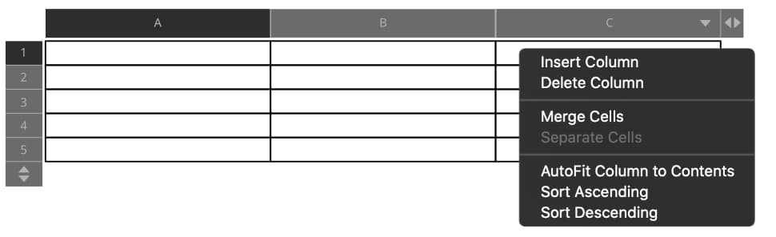

# Sorting tables

Tables can be sorted to rearrange the table text to suit your needs. This can be used, for example, to alphabetize list entries or arrange data in numerical order.

*Sorting options are accessed via the column or row's header arrows.*

**To sort table rows or columns:**

- Hover over an existing row or column and click on the arrow icon to display the following options:
  - **Sort Ascending**—sorts the table contents in ascending order.
  - **Sort Descending**—sorts the table contents in descending order.

#### SEE ALSO:

- [Table Tool](../20-tools/02-text-tools/02-table-tool.md)
- [Creating tables](01-creating-tables.md)
- [Editing tables](02-editing-tables.md)
- [Table panel](../21-panels/28-table-panel.md)
- [Table Formats panel](../21-panels/29-table-formats-panel.md)
