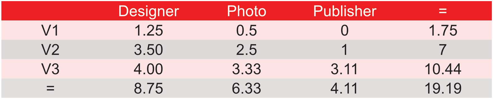
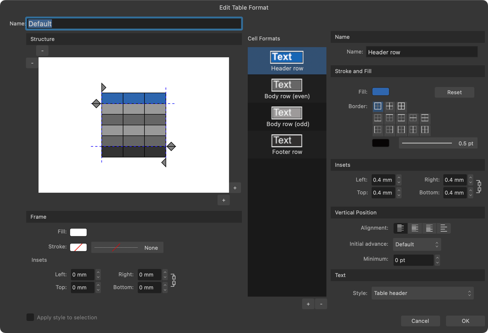
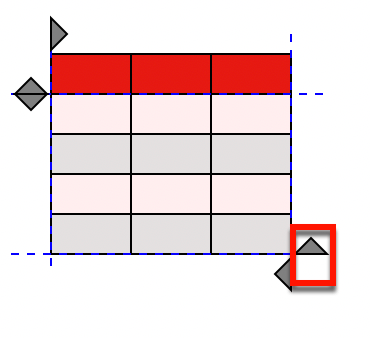
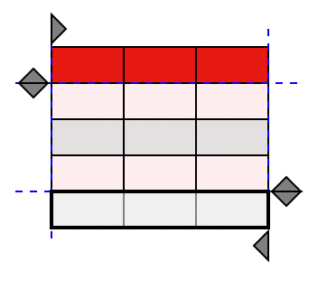
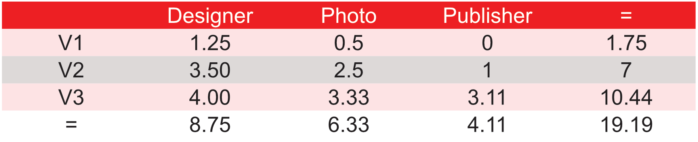
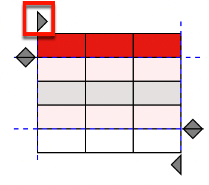
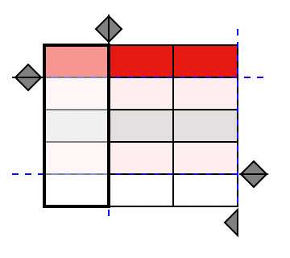
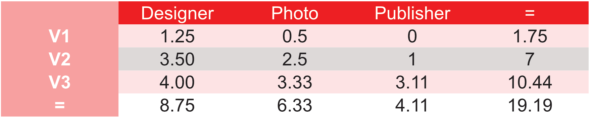
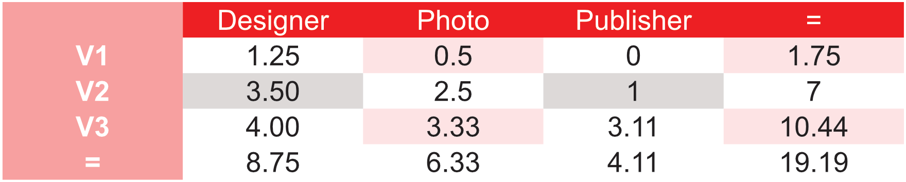

# Creating table formats

Using the **Table Formats** panel, you can create and store custom table formats for use throughout your document.

A table format works as a template, storing the underlying structure and formatting of a table but not its content. It can be applied to additional tables, ensuring design consistency.

Customizing table formats allows you to:

- Select table cell styles such as rows (odd/even), header rows, and rules for table modification.
- Add or remove styles to make the format more basic or more advanced.
- Set each style's cell properties such as fill, transparency, border, margins, and fonts.
- Independently format odd and even rows for alternating styles between rows.
- Automatically update the formatting of multiple tables.

If you're looking for design freedom, you can create your own table formats from scratch.

## Managing and applying table formats

The **Table Formats** panel is used to create table formats, from scratch or based on a table that has been directly formatted on the page.

You can import table formats from another Affinity document, and save the current document's table formats as the default for reuse across multiple new documents.

**To access the Table Formats panel:**

- On the **Window** menu, select **Table>Table Formats**.

**To create a new table format from scratch:**

- On the **Table Formats** panel, click the Panel Preferences menu and select **Create New Format**.

**To create a new table format from a table:**

1. Select the table.
2. On the **Table Formats** panel, click the Panel Preferences menu and select **Add Format from Selection**.

**To apply a table format:**

With a table selected on the page, do one of the following on the **Table Formats** panel:

- To combine with existing table formatting: click a table format.
- To replace existing table formatting: click a table format's options menu and select **Apply "[Table format name]" (Override Local)**.

**To save a set of table formats as the default for new documents:**

- On the **Table Formats** panel, click the Panel Preferences menu and select **Save Formats as Default**.

**To update a table format with settings from a table:**

1. Select the table.
2. On the **Table Formats** panel, select **Update From Selection** on the table format's options menu.

> **Note:** If multiple tables with different formatting are selected, the table format is updated using the one selected first.

**To import table formats:**

1. On the **Table Formats** panel, click the Panel Preferences menu and select **Import Formats**.
2. Navigate to and select the Affinity file from which to import table formats, then select **Open**.
3. A list of formats will appear, giving you the ability to select those you wish to import, rename incoming formats, or resolve any import conflicts.
4. When you are ready to import the selected format(s), select **OK**.

## Editing table and cell formats

Table formats can be edited at any time. After editing a table format, the appearance of each table to which it is applied is automatically updated.

Each table format contains at least one cell format. You can create and apply additional cell formats, e.g. to color a table's header row differently than its body rows, or to alternate the background color of odd and even body rows.

**To edit a table format:**

- On the **Table Formats** panel, click on a table format's options menu and do one of the following:
  - To edit the custom table format directly, select **Edit "[Table format name]"**.
  - To create and edit a copy of the custom table format, select **Edit copy of "[Table format name]"**.

The **Edit Table Format** dialog displays the header and row cells (the **Structure**) that make up the table format on the left, a list of available formats which can be applied to the table in the center, and formatting properties on the right.

Selecting table cells on the **Structure** will highlight the style being edited in the **Cell Formats** list.

**To resize the table structure:**

- On the **Structure**, click the small - and + buttons located at the top-left and bottom-right corners respectively to adjust the number of columns and rows.

**To create a new cell format:**

- From the **Cell Formats** pane, click the + button.

**To delete an existing cell format:**

From the **Cell Formats** pane:

1. Select the unwanted cell format.
2. Click the - button.

## Common table formatting

On the **Edit Table Format** dialog, the **Structure** contains row and column handles. These handles can be moved around to create header and footer areas, which determine the portions of the table considered to be non-repeating.

The cells outside of the header and footer areas will have their cell formatting repeated as the table grows.

> **Note:** The numbers of columns and rows on the structure is solely for defining the header, body and footer areas of tables. It does not limit the tables to which a table format can be applied.

**To add a table footer:**

1. On the **Structure**, click the footer row handle to move it up one row.

  
2. Create a new cell format from the **Cell Formats** pane. This style is to be created specifically for your footer cells.
3. Fill in the properties for the cell format using the options on the dialog.
4. Select the cell in the footer area.

  
5. Select the new cell format from the **Cell Formats** list. The cell properties of the footer can be edited to display a contrasting footer style.

  

**To add a row header:**

1. On the **Structure**, click the header row handle to move it down one row. This creates a header area.

  
2. Create a new cell format from the **Cell Formats** pane. This style is to be created specifically for your header cells.
3. Fill in the properties for the cell format using the options on the dialog.
4. Select the cell in the header area.

  
5. Select the new cell format from the **Cell Formats** list. The cell properties of the header can be edited to display a different header style.

  

**To add a repeating pattern:**

- On the **Structure**, select individual cells within the body area of the table, then apply different cell formats to alternating cells.

  

#### SEE ALSO:

- [Table Tool](../20-tools/02-text-tools/02-table-tool.md)
- [Editing tables](02-editing-tables.md)
- [Sorting tables](03-sorting-tables.md)
- [Table panel](../21-panels/28-table-panel.md)
- [Table Formats panel](../21-panels/29-table-formats-panel.md)
