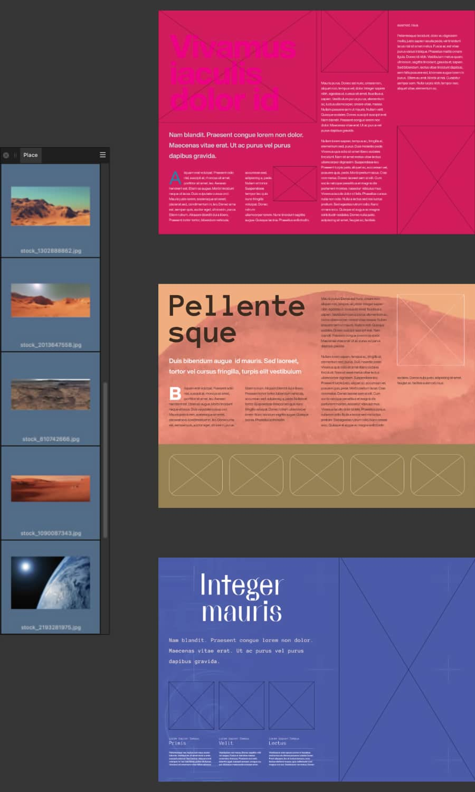
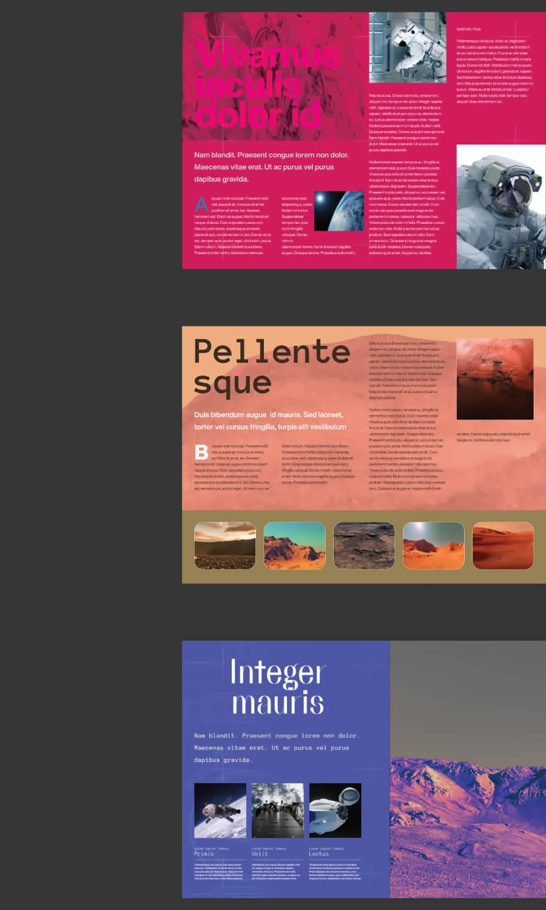

# Autoflowing images and documents

Autoflow allows you to place multiple images or documents with one click or drag. It can be used to quickly place:

- multiple images, framed or unframed.
- multiple pages from one or more multi-page documents.

*Pages before and after autoflowing images loaded onto the **Place** panel.*

You might use autoflow to place images in repeating page layouts—either a single layout or a sequence of different layouts—such as for a lookbook or similar image gallery.

If there are insufficient pages in your document to accommodate all items, autoflow adds more pages and, if you choose to place in picture frames, it clones the layout of picture frames from existing pages to the new pages the necessary number of times. The pages remain fully and independently editable after autoflow.

> **Note:** Autoflow is available for text documents but only when placed by clicking or dragging on a page, not by clicking on an existing text frame.

> **Warning:** Autoflow is not available on master pages or for documents that contain artboards, i.e. some Affinity Designer documents.

## Using autoflow

Autoflow is initiated by selecting two or more items on the **Place** panel and then interacting with the document view. The interaction you choose determines autoflow's behavior and results:

- If you drag or click outside of a picture frame:
  - One item is placed per page.
  - Items are placed on existing document pages, starting from where you dragged or clicked.
  - If the document's last page is reached and there are still items to place, additional pages are appended, one per item.
- If you click on a picture frame:
  - Affinity searches for empty picture frames, page by page, and from back to front on each page (bottom to top in the layer stack)1.
  - The search stops at the first spread that contains no empty picture frames or, if no such spread is found, at the end of the document.
  - One item is placed per picture frame.
  - If there aren't enough empty picture frames to place all the items, picture frames found during the search will be cloned onto new pages until all items have been placed.
  - New pages are inserted after the last page/spread on which an empty picture frame was found. In a document with facing pages, if this position is:
    - in the middle of the document, new pages are added as whole spreads.
    - at the end of the document, new pages are added as individual pages.
  - Each cloned page has the same master pages applied and picture frames as its corresponding source page but won't include other objects.

1 Picture frames on the starting page that are lower in the layer stack than the one clicked are ignored. To populate all empty picture frames on the starting page, ensure you click the one that is bottom-most in the layer stack.

**To place multiple pieces of content using autoflow:**

1. Do one of the following:
  - Select the **Place Tool**.
  - From the **File** menu, select **Place**.
2. On the pop-up dialog, navigate to and select the file(s) you wish to place, then click **Open**. (Hold the  or   to select adjacent or non-adjacent files, respectively.) The **Place** panel will appear, displaying the items you selected.

  > **Tip:** If the items you wish to autoflow are located in multiple folders, simply repeat steps 1 and 2 to add more items to the **Place** panel.
3. (Optional) If autoflowing pages from documents, on each document's entry on the panel, do one of the following:
  - From the pop-up menu, select the individual page/spread you wish to place.
  - Click the filename to reveal entries for all the document's pages.
4. To select items for autoflow, do one of the following:
  - Press +A to select all items.
  - Press  or  to select an adjacent or a non-adjacent subset, of items, respectively.
5. To autoflow the selected items, do one of the following:The items are placed according to autoflow's defined behaviors, then removed from the panel1.
  - Click to place each item at its default displayed size.
  - Drag on the page to set the position and maximum size of placed items.
  - Click on a picture frame to use as autoflow's starting point.
6. If the panel contains no more items, it will close automatically. Otherwise:
  - repeat from step 3 to place additional items.
  - press the `Esc`  to cancel further placement and close the panel.

**macOS:**

> **Note:** Alternatively, `Alt`-dragging multiple files from Finder onto a page in the document view will add them directly to the **Place** panel.

**Windows:**

> **Note:** Alternatively, `Alt`-dragging multiple files from Explorer onto a page in the document view will add them directly to the **Place** panel.

#### SEE ALSO:

- [Placing content](02-placing-content.md)
- [Placing images from the Web](04-placing-images-from-the-web.md)
- [Place Tool](../20-tools/01-layout-tools/06-place-tool.md)
- [Embedding vs linking](01-embedding-vs-linking.md)
- [Resource Manager](06-resource-manager.md)
- [Linked Services](07-linked-services.md)
- [Color management](../07-color/04-color-management.md)
