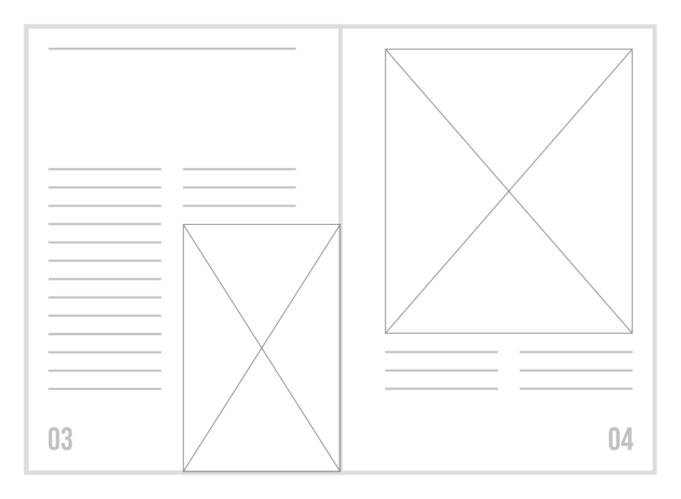
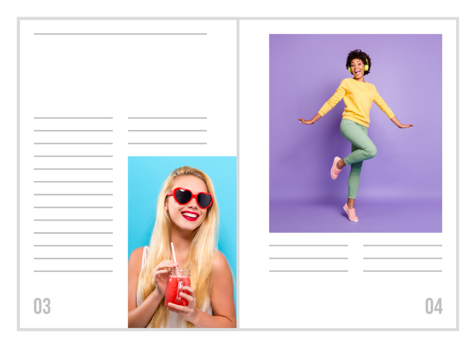
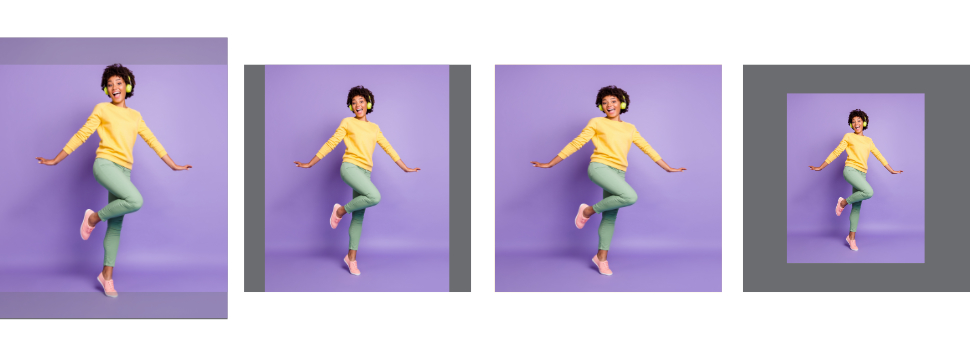

# Picture frames

Picture frames allow you to create a decorative space in your document, into which you can insert content.

## About picture frames

Once a picture frame has been added to your page, you can reposition it, size it, add borders, and change the shape and style of the picture frame.

You can place an embedded or linked file inside the frame. The file can be an Affinity-compatible image file, a PDF, an InDesign IDML document or an Affinity Photo 2, Affinity Designer 2 or Affinity Publisher 2 document.

The frame's contents can be scaled according to one of three automatic behaviors, or panned, scaled and rotated manually:

-  **Scale to Max Fit**—The image is automatically scaled to fill the entire frame without distorting it. Some of its contents may be cropped. This behavior is the default when content is placed in a picture frame.
-  **Scale to Min Fit**—The image is automatically scaled to be completely visible within the frame. There may be empty areas down the left and right or across the top and bottom of the frame.
-  **Stretch to Fit**—The image is automatically scaled to be completely visible and fill the entire picture frame. It may be noticeably distorted, depending on the relative proportions of it and the frame.
-  **None**—The frame's content is not scaled dynamically as the frame is resized. This behavior is selected automatically if you interact with the frame's overlaid rotation, scaling and position controls, or by double-clicking the frame and transforming the content directly.

*(From left to right) Examples of the **Scale to Max Fit**, **Scale to Min Fit**, **Stretch to Fit** and **None** behaviors.*

When an automatic scaling behavior is selected, its effect is maintained dynamically as you alter the picture frame's dimensions. When **None** is selected, the size, position and rotation of the frame's content becomes independent of the frame's dimensions, no further automatic scaling is applied, though changes can be made manually.

> **Tip:** Pictures frames whose scaling method is set to **None** display an extra control handle at their bottom-right corner. Dragging this handle scales the frame and its contents together.

## Picture frame (parent) and content (child) relationship

A picture frame, like any other object, can act as a parent clipping object for any number of child objects. In the case of picture frames, though, only one child object can be flagged as the framed ‘content’. This object is indicated in the **Layers** panel by a box containing a diagonal cross, overlaid on its layer thumbnail.

The object marked as content scales according to the picture frame's assigned scaling behavior, while others will scale like child objects and can have regular constraints applied to them. This allows you to, for example, set up a frame with adornments or a watermark.

To add an object as frame content, drag its layer onto the target frame's name in the **Layers** panel and drop when the frame's row is highlighted.

If a child object flagged as the frame's content already exists, it is replaced by the new object. This is equivalent to selecting the frame and choosing **Replace Image** on the context toolbar.

To add an object to a frame as a regular child object, drag its layer just below the target picture frame's row in the **Layers** panel and drop when a highlight line appears beneath the frame's layer name. You can add as many child objects as you wish in this way.

**To add a picture frame:**

1. Click the **Picture Frame Rectangle Tool** or the **Picture Frame Ellipse Tool**.
2. Do one of the following:
  - For precise *Data Entry*: `Cmd`-Click on the page (or press the `Return` ), then enter your frame dimensions into the dialog. Optionally, set an anchor point to position the frame in relation to the new anchor position, rather than the default or previously set anchor point. The last used settings will be remembered.
  - For sizing *'by eye'*: Drag on the page to set the size and position of the picture frame, using the `Shift`  to constrain the frame's proportions to a square or circle if needed.

**To insert content into a picture frame:**

Use the **Move Tool** to select the picture frame and then do one of the following:

- Click the **Place Tool**. Select a compatible file to place inside the picture frame from the dialog.
- On the context toolbar, click **Replace image**.
- Drag and drop an image from your operating system or the **Stock** panel onto the frame to place it.
- For a pixel selection copied to the clipboard, `Click`-click on the picture frame and select **Paste as Content**.

**To resize, position and rotate framed content:**

Select the picture frame and do one of the following:

-  Scale the placed content as required by clicking **Properties** on the context toolbar and choosing one of the automatic scaling behaviors or **None**.
- Drag the Scaling slider below the picture frame to zoom in/out. The scaling percentage on the slider is relative to the image's native dimensions.

  
- Reposition the content within the frame by dragging the arrowed pan control, displayed in the center of the frame when you hover over it. Adjust the Scaling slider if the image's edge has been exposed.

  
- Rotate the framed content by dragging left/right over the rotate icon (a circular arrow), displayed near the top-center of the frame when you hover over it. Adjust the Scaling slider if the image's edge has been exposed.

  

> **Tip:** Double-clicking the framed content will select it rather than the picture frame. This lets you resize the content using its bounding box's edge and corner handles; hold the `Cmd`  to resize around the content's center. You can then pan around within the frame by dragging.

**To resize a picture frame without scaling its content:**

Do one of the following before resize:

- Select the picture frame and then check **Lock Children** on the context toolbar.
- Select the picture frame, select **Properties** on the context toolbar, and then choose **None**, ensuring the anchor point is set correctly.

> **Tip:** To size a picture frame to common image aspect ratios, you can enter an expression in the **Transform** panel. For example, to size a frame to 3:2 aspect ratio, select it and then enter w/3*2 into the panel's **H** (Height) field, ensuring the adjacent Link symbol is disabled.

**To resize the picture frame to fit its contents:**

- Select the picture frame and then **Size Picture Frame to Content** on the context toolbar.

**To convert a shape or drawn path to a picture frame:**

- Select the shape and then **Layer>Convert to Picture Frame**.

> **Tip:** As well as standard shapes, you can also convert abstract shapes created from Boolean geometry operations to picture frames.

**To edit a frame's content in a secondary tab:**

- Use the **Move Tool** to select the image within the picture frame and then select **Edit Image** on the context toolbar.

> **Note:** Applies to linked images only.

#### SEE ALSO:

- [Picture Frame Rectangle Tool](../20-tools/01-layout-tools/04-picture-frame-rectangle-tool.md)
- [Picture Frame Ellipse Tool](../20-tools/01-layout-tools/05-picture-frame-ellipse-tool.md)
- [Place Tool](../20-tools/01-layout-tools/06-place-tool.md)
- [Embedding vs linking](01-embedding-vs-linking.md)
- [Color management](../07-color/04-color-management.md)
