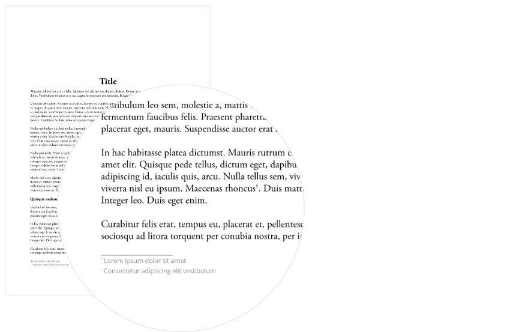
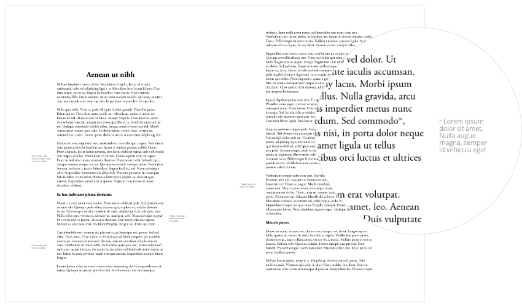
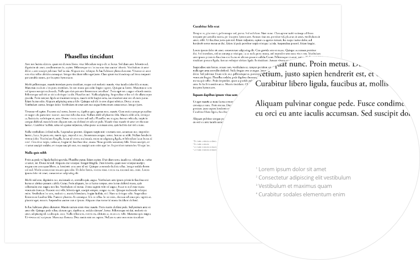

# About notes

There are three types of note in Affinity Publisher: footnotes, sidenotes and endnotes. Every note, regardless of its type, consists of two parts:

- A reference within your document's main text.
- A note body that provides a citation or an explanatory comment, which may be one or more lines long. A note's type determines the position of its body.

Footnotes, sidenotes and endnotes are inserted using the **Notes** panel, accessed via **Window>References>Notes**.

*Two footnote references and corresponding, single-line bodies at the bottom of their text frame.*

## About references

References are characters from a series of numbers, letters, or symbols. For example:

- 1, 2, 3, …
- I, II, III, IV, …
- a, b, c, …
- *, †, ‡, …

## About note bodies

A note body is normally prefixed with the same characters used in its corresponding reference, which establishes a connection to the related part of the main text. Each note type offers several **Note position** options for where note bodies are collated.

### Footnote bodies

Footnote bodies are positioned at the end of their referencing text frame. You can specify whether:

- they are anchored to the text frame's last line of story text or its bottom edge.
- they are inside or outside the text frame's bottom edge.
- their lines span the text frame's entire width or individual columns.

### Sidenote bodies

Sidenote bodies are positioned to the left or right of their referencing text frame. You can set them to:

- always be on a specific side of the text frame.
- alternate between left and right sides.
- be positioned relative to the spine (in documents with facing pages).
- be positioned on the side closest to their reference in story text.

*Sidenotes with their bodies positioned on alternating sides of their referencing story.*

### Factors affecting footnote/sidenote positions

A footnote/sidenote body's position may automatically change as a document's text is edited.

- If editing causes a reference to move to another text frame, the corresponding note body is moved there too.
- The quantity or length of footnote/sidenote bodies may cause some to be positioned on a later page than their references.
- You can allow footnote and sidenote bodies to be split between text frames if needed, and so these note bodies may continue onto a different page than their reference in story text.

### Endnote bodies

Endnote bodies are positioned after the end of all text in their story. They can be:

- anchored to the last line of story text.
- collated in a separate text frame on a page at the end of the story, section, document or book.

*Endnote bodies are normally at the end of their story. Affinity Publisher may insert additional pages if you reposition them in a separate text frame.*

When endnote bodies are moved to a separate text frame, Affinity Publisher will create an empty page at the required position, if one does not already exist, and create a text frame there. Additional empty pages may be inserted to maintain left/right-side arrangement of later pages.

Endnote bodies in a separate text frame are preceded by an 'Endnotes' heading, which can be customized via the Notes panel.

Only one text frame is automatically created to accommodate endnote bodies, regardless of their total length. If this results in overset text, you can edit the endnote bodies to fit the frame or use the frame's Text Flow button to create linked text frames on additional pages.

#### SEE ALSO:

- [Inserting notes](02-inserting-notes.md)
- [Styling notes](03-styling-notes.md)
- [Hyperlinking notes](04-hyperlinking-notes.md)
- [Notes panel](../../21-panels/16-notes-panel.md)
- [Adding sections](../../05-pages-spreads-and-sections/09-adding-sections.md)
