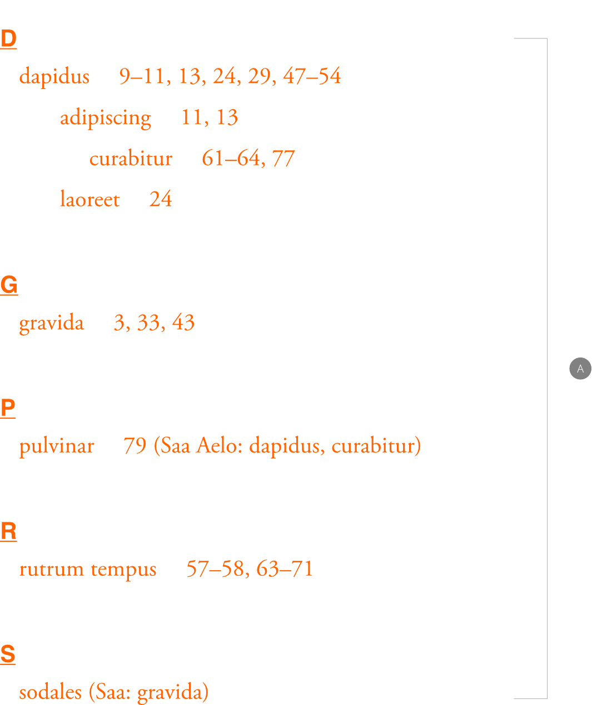
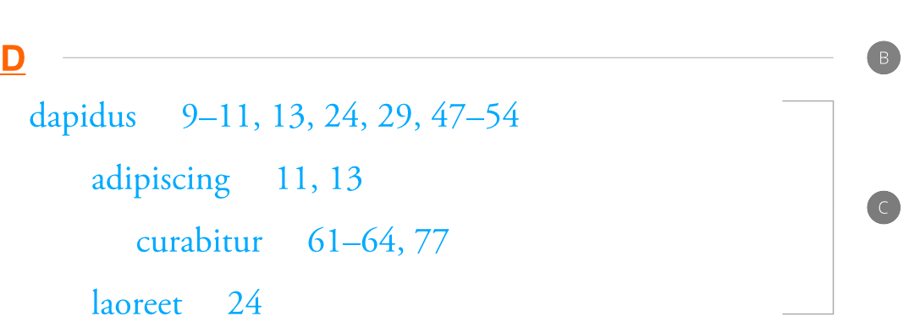
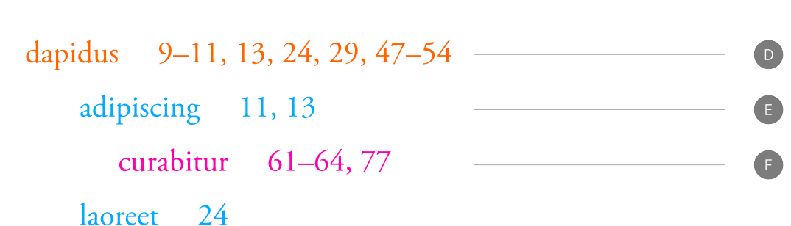
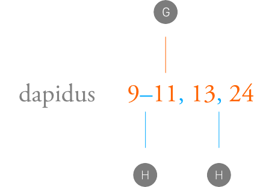
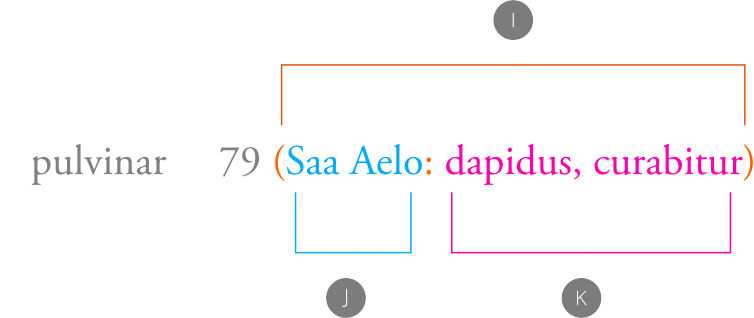

# Index

Affinity Publisher can create an index of keywords, called topics, from text used in your publication. The index lets you look up these key words and their referenced page numbers.

## About indexes

An index is a valuable reader aid in a longer publication, such as a report or manual. Affinity Publisher lets you create an index with main entries and subentries, based on index marks you insert throughout your publication. Your index is typically placed at the end of your publication and is made up of index entries and associated references.

When the index is generated, it will list all topics containing at least one reference in alphabetical order. For each topic, the index lists the page numbers of every page that references that topic. The index may also include cross-references which suggest to the reader to look at a related topic.

> **Note:** The index also displays additional instances of any indexed words so that these may be included for improved consistency.

## About text styles in indexing

When you insert an index, index-specific text styles are created and applied automatically; these styles can be customized via the **Text Styles** panel.

The *Index* and *Index Entry* paragraph styles are 'parent' styles which let you apply formatting to the whole index or just index entries, respectively. The Index Section Heading paragraph style affects the large letters and numbers by which entries are organized.

*An example index (A) styled entirely by the Index text style.*

*Example text ranges affected by the Index Section Heading (B) and Index Entry (C) text styles.*

A sequence of paragraph styles is created for however many levels of sub topic exist in the index, e.g. *Index Entry 1*, *Index Entry 2*, *Index Entry 3* and so on. This allows each level of nested index entry to have different formatting than *Index Entry* and other 'higher level' index entries. For example, you might choose to show entries for sub topics at a smaller font size than top-level topics.

*Example text ranges affected by numbered Index Entry text styles: Index Entry 1 (D), Index Entry 2 (E) and Index Entry 3 (F) paragraph styles, which modify any formatting already applied by the parent Index Entry text style.*

The *Index Entry Page Number* and *Index Entry Number Separator* character styles allow specific details in index entries—meaning text added to entries by the **Labels and Separators** options on the **Index** panel—to deviate from the *Index Entry* parent style. For example, you may wish for page numbers/ranges and punctuation between them to be differently colored than topic names, and from each other.

*Example text ranges in an index entry affected by the Index Entry Page Number (G) and Index Entry Number Separator (H) text styles.*

Further, the various components of cross-reference text in index entries can be customized using the *Index Cross-reference*, *Index Cross-reference Label* and *Index Cross-referenced Topic* character styles.

*Example text ranges in an index entry's cross-references affected by the Index Cross-reference (I), Index Cross-reference Label (J), and Index Cross-referenced Topic (K) text styles.*

> **Tip:** When inserting an index mark, any character style can be applied to it. The style is applied to the corresponding page number(s)—or page range, if applied to index marks across consecutive pages—on the index entry. This can be used to indicate the most important pages about a topic.

## Inserting an index

You can insert an index, insert index marks, update the index and show/hide index marks from the **Text** menu's **Index** section.

Alternatively, from the **Index** panel, you can insert an index, add, edit and delete topics and marks, update the index style, search for index entries, and update index content as you go.

**To generate an index:**

1. From the **Text** menu, click **Index** and then select **Insert Index**.
2. You can then add topics and markers to your index and adjust the formatting from within the **Index** panel.

**To generate an index via the Index panel:**

1. From the **Window** menu, select **References>Index**.
2. From the top of the **Index** panel, select **Insert Index**.
3. You can then add topics and markers to your index and adjust the formatting from within the panel.

## Adding index marks and topics

Index marks can be created and inserted into your publication text via the **Text** menu, or from the **Index** panel. The panel also lets you navigate your index marks and generate your index once you've finished adding index marks and topics.

## Sorting index topics

Normally, Affinity sorts index topics by their literal topic names. So, topic names that begin with *A* or *The*, for example, will appear in the index under *A* or *T*, respectively.

You can override the default sort order for any individual topic by providing alternative **Sort By** text. For example, if a topic's name is *The Great Wall of China*, you would type *Great Wall of China* in the topic's Sort By setting to have the topic appear under *G* in the index.

**To insert index marks:**

With an index inserted:

1. From the **Text** menu, click **Index** and then select **Insert Index Mark**.
2. The topic name will be pre-filled with the word or phrase at the insertion point. Existing topics that may be similar to the word at the insertion point will also be suggested. Type in the box to search through existing topics. You can select an existing topic from the suggestion list using either the cursor keys or the mouse.
3. If you are selecting a sub topic, both the **Topic** and the **Parent Topic** will be selected. If you are creating a new topic, you may specify either a new or existing **Parent Topic**.
4. To specify a character style to use for the page number when this index mark appears in the index, select a style from the **Style Override** menu.

**To insert index marks via the Index panel:**

With an index inserted:

1. With a word or phrase highlighted in the text, from the top of the **Index** panel, select **Insert Marker**.
2. The topic name will be pre-filled with the highlighted word or phrase at the insertion point. Existing topics that may be similar to the word at the insertion point will also be suggested. Type in the box to search through existing topics. You can select an existing topic from the suggestion list using either the cursor keys or the mouse.
3. If you are selecting a sub topic, both the **Topic** and the **Parent Topic** will be selected. If you are creating a new topic, you may specify either a new or existing **Parent Topic**.
4. To specify a character style to use for the page number when this index mark appears in the index, select a style from the **Style Override** menu.

**To add a topic:**

From the **Index** panel:

1. Select **Add Topic**.
2. From here, you can add a **Topic Name**, assign a **Parent Topic**, set the topic's **Sort By** text, and select a cross reference from the **See** option.

**To search for content related to index topics within your document:**

From the **Index** panel:

1. `Click`-click a topic name and select **Find in Document**.
2. All related words will be immediately listed in the panel. From here, you can select specific instances of the word to add to the index by ticking the check box to the right of each instance you would like to add, or select all instances of the word by ticking the **All** checkbox.
3. When you are happy with your selections, click **Done** to add the selected instance(s) of the word to your topic.

**To rename an index entry:**

From the **Index** panel:

- Click on an index topic, and click again to edit its name.

**To edit an index entry:**

From the **Index** panel:

1. `Click`-click on an index entry and select **Edit Topic**.
2. From here, you can edit the **Topic Name**, assign a **Parent Topic**, and set the topic's **Sort By** text.

**To add a sub topic:**

From the **Index** panel:

1. `Click`-click on an index entry and select **Add sub topic**.
2. From here, you can add a **Topic Name**, assign a **Parent Topic**, set the topic's **Sort By** text, and select a cross reference from the **See** option.

**To add an index cross reference:**

From the **Index** panel, do one of the following:

- When creating an index topic, you can add a **See** option from the **Add Index Topic** pop-up menu which can be used as a cross reference for your index entry.
- To add a cross reference to an existing index entry, `Click`-click on an index entry and select **Add cross reference**. From here, you can add a **See** option from the pop-up menu which can be used as a cross reference for your index entry.

**To locate an index entry in the document:**

From the **Index** panel:

1. `Click`-click on an index entry and select **Find in document**.
2. Instances in which the index entry or any of its sub topics appear in the document will be listed in the panel. From here, you can select an individual instance or opt to view all instances using the checkboxes. Clicking on any of the listed instances will take you directly to that instance in the document.

**To add leader lines between items and page numbers:**

1. Select a text frame that contains an index.
2. On the **Index** panel (**Window>References>Index**), delete all existing characters from the **Separator** field.
3. Click the downwards-pointing arrow on the field and insert a **Tab** character.
4. On the **Text Styles** panel, double-click the **Index Entry** style.
5. Select **Tab Stops** on the left of the **Edit Text Style** dialog.
6. To the right, click **Add New Tab Stop** and click the new tab stop's ‘**…**’ button.
7. Next to **Leader**, select the **Tab stop leader character**, **Tab stop leader underline**, or **Tab stop leader strikeout** setting.
8. (Optional) If you chose the leader character setting, type the glyph to repeat along the leader line in the **Character** field.
9. Click **OK**.

#### SEE ALSO:

- [Index panel](../21-panels/13-index-panel.md)
- [Text Styles panel](../21-panels/33-text-styles-panel.md)
