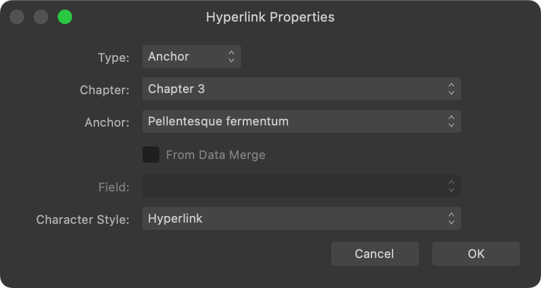

# Anchors

Anchors can be used as targets of hyperlinks. They can be inserted into frame, artistic and table text, and on objects such as picture frames.

## About anchors

If you want to create a hyperlink to a specific point in your publication's content, i.e. an object or a position in text, you can insert an anchor at that point in advance.

Anchors are automatically named but can be renamed at their time of creation or afterwards.

## Using hyperlinks and anchors in books

When working with books, a hyperlink's target can be set to an anchor in a different chapter.

On the **Anchors** panel, anchors in chapters other than the one you're editing are distinguished by a book icon.

> **Note:** Only anchors in chapters whose documents are or have been open during the current editing session are presented on the Hyperlink Properties dialog and the Anchors panel.

**To create an anchor:**

1. Select an object or create an insertion point in text where you wish to add the anchor.
2. Do one of the following:
  - On the **Anchors** panel, select **Add Anchor**.
  - On the **Text** menu, select **Interactive** and then select **Insert Anchor**.
3. Enter a **Name** for your anchor, specify whether it can be exported as a PDF bookmark, then click **OK**.

**To rename an anchor:**

On the **Anchors** panel:

1. Select the anchor.
2. Click the anchor's name.
3. Enter a new name and then press the  .

**To display anchors in your publication's text:**

- On the **Text** menu, click **Interactive** and then select **Show Anchors**. Anchor icons, which are non-printing, will appear in text where anchors have been placed.

**To remove an anchor:**

Do one of the following:

- On the **Anchors** panel, select the unwanted anchor and then select **Remove Anchor**.
- With anchors displayed in your publication's text, create an insertion point directly after the unwanted anchor and then press the `Backspace` .

#### SEE ALSO:

- [Anchors panel](../21-panels/01-anchors-panel.md)
- [Hyperlinks](05-hyperlinks.md)
- [PDF Bookmarks](07-pdf-bookmarks.md)
- [Adding sections](../05-pages-spreads-and-sections/09-adding-sections.md)
- [About books](09-books/01-about-books.md)
