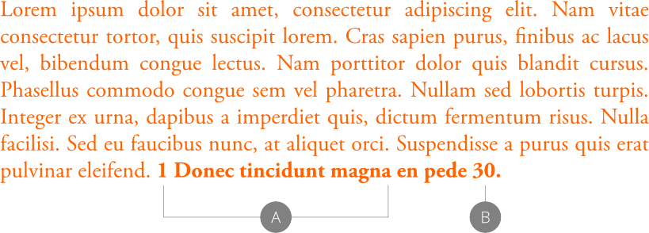
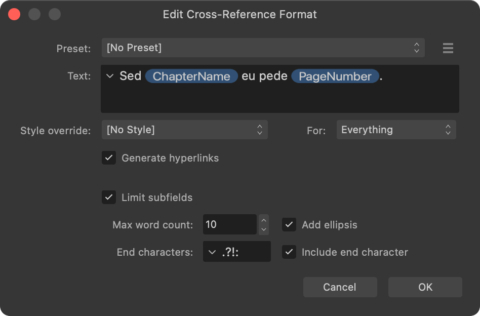

# About cross-references

A cross-reference refers the reader from one place in a publication's text to another place, such as a chapter, a note or a figure. For example, "*For more information, see Spring-Flowering Shrubs on page 32.*"

*A cross-reference that displays the numbered list item (A) and page number (B) of its target.*

Cross-references are inserted into document text and managed using the **Cross-References** panel.

Each cross-reference in document text is a field, which allows its value to be easily updated as your publication's content changes.

## Inserting cross-references

When you insert a cross-reference, the **Insert Cross-Reference** dialog is shown.

*The Insert Cross-Reference dialog.*

On the dialog:

- Set (or 'link to') a target, which can be an existing anchor, paragraph or index mark.
- Set the text to be displayed in your document, including subfields that describe the target or its position.
- Select a character style to apply to the cross-reference's text, overriding the formatting at its position in document text.

Topics linked below explain how to set a cross-reference's target, text and formatting.

## Editing existing cross-references

The options shown when editing cross-references differ depending on how many are selected on the **Cross-References** panel.

When one cross-reference is selected, you can edit any of its settings, i.e. the full range of target, text and formatting options that were available when inserting the cross-reference.

When multiple cross-references are selected, you can edit their text and formatting but not their targets. This allows you to easily ensure multiple cross-references have the same phrasing and appearance.

*Editing multiple cross-references.*

**To insert a cross-reference:**

1. Create an insertion point in text.
2. Do one of the following:
  -  On the **Cross-References** panel, select **Insert Cross-Reference**.
  - -click the text and select **Insert Cross-Reference**.
3. On the dialog that appears:
  - Select the required target's type from the **Link to** pop-up menu.
  - (Optional) Use the filter options to limit what is shown in the targets list.
  - Select the required target from the targets list.
  - Set the **Text** to display in document text.
  - (Optional) Select a character style and the parts of the cross-reference's text to apply it to, from the **Style override** and **For** pop-up menus, respectively
4. Select **OK**.

Options for setting a cross-reference's text and formatting are explained in topics linked below.

**To edit an existing cross-reference:**

On the **Cross-References** panel:

1. Select one or more cross-references.
2.  Select **Edit Cross-Reference**.
3. On the dialog that appears, set the target, text and formatting options as required.
4. Select **OK**.

> **Note:** Editing multiple cross-references simultaneously allows you to change their text and formatting but not their targets.

**To convert cross-references to regular text:**

- In document text, -click a cross-reference's text and select **Expand Field**.

The cross-reference is removed from the **Cross-References** panel. Its value remains in the document as regular text and can be edited directly.

A cross-reference is automatically converted to regular text when deleted via the **Cross-References** panel.

**To navigate to a cross-reference's target:**

On the **Cross-References** panel:

1. Select the cross-reference.
2.  Select **Go to Target**.

An insertion point is created at the target's position.

**To navigate to a cross-reference's field in document text:**

On the **Cross-References** panel:

1. Select the cross-reference's entry.
2.  Select **Go to Cross-Reference**.

The document view jumps to the cross-reference's field. The field is selected.

**To remove cross-references:**

On the **Cross-References** panel:

1. Select the unwanted cross-references. (-click to select more than one.)
2. Select **Remove Cross-References**.
3. Select **Yes** to convert the cross-reference's field to regular text.
4. (Optional) To remove the resulting text from your document, do one of the following:
  - If you selected one cross-reference, or if you selected multiple cross-references and their fields were in the same text object (including a sequence of linked text frames), the resulting text is automatically selected. Press the   to remove it.
  - If you selected multiple cross-references and their fields were in different text objects (excluding a sequence of linked text frames), you will need to inspect your document text and manually remove any unwanted text.

Alternatively, to remove a single cross-reference, -click its field in document text and then select **Cut** to remove it from document text and the **Cross-References** panel.

#### SEE ALSO:

- [Setting a cross-reference's target](02-setting-a-cross-reference-s-target.md)
- [Setting a cross-reference's text](03-setting-a-cross-reference-s-text.md)
- [Formatting cross-references](04-formatting-cross-references.md)
- [Updating cross-references](05-updating-cross-references.md)
- [Cross-References panel](../../21-panels/07-cross-references-panel.md)
- [About books](../09-books/01-about-books.md)
- [Anchors](../06-anchors.md)
- [Text styles](../../10-text/10-text-styles/01-using-text-styles.md)
- [Preflight](../../14-publishing-and-sharing/05-preflight.md)
