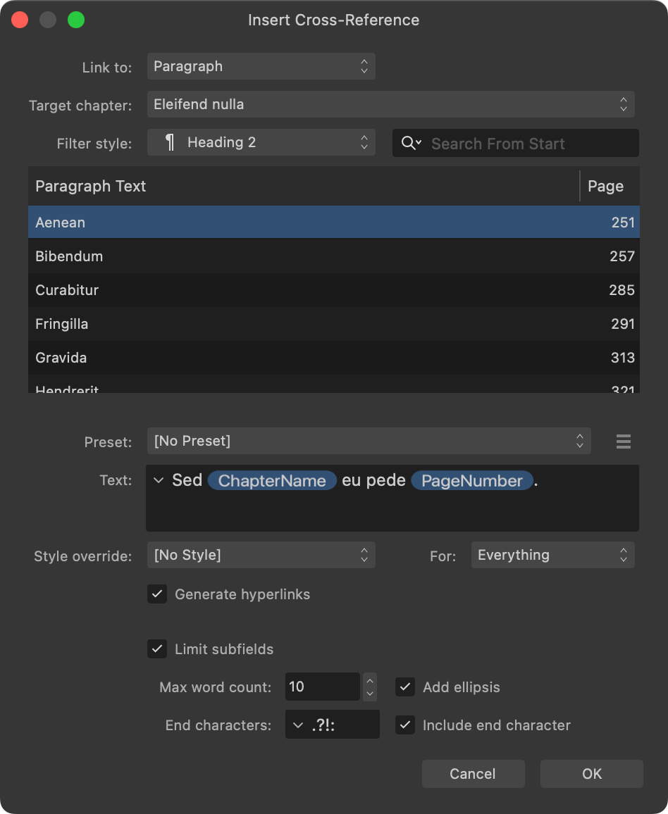

# Setting a cross-reference's text

A cross-reference's text is a phrase that describes where the reader can find related information. A publication's style guide may specify exact phrasing. In Affinity, the phrase can contain a mix of regular text and subfields that describe a cross-reference's target.

A cross-reference can contain multiple subfields. For example, the text "*For further information, see 'Deciduous vines' on page 226*" would use **Section Name** and **Page Number** subfields.

Subfields allow Affinity to keep cross-references up to date as a document's content changes, with little or no effort on your part.

*Text and other options on the Insert Cross-Reference dialog.*

When inserting or editing a cross-reference, the following options are available for setting the cross-reference's text:

- **Preset**—Select a preset to populate the **Text** option with previously saved content.
- **Preset Actions**—the following options are available:
  - **Language**—Select the language whose presets you wish to use or manage.
  - **Create Preset**—Creates a new preset from the current text and formatting settings.
  - **Save Preset**—Updates the selected preset with the current text and formatting settings.
  - **Rename Preset**—Changes the selected preset's name.
  - **Delete Preset**—Deletes the selected preset.
- **Text**—Enter the phrase you wish your cross-reference to display in document text. It can contain regular text and subfields.

> **Tip:** Selecting a preset replaces the current Text and formatting settings. If the settings are edited, *[modified]* is displayed after the selected preset's name as a reminder in case you wish to update it.

## Inserting subfields

The following subfields can be inserted into the text by clicking the downwards-pointing arrow (top left of the option) and then selecting from the menu:

- **Page Number**—Displays the publication page number that contains the cross-reference's target.
- **Section Name**—Displays the name of the document section that contains the cross-reference's target. (Nothing is displayed if the section is unnamed.)
- **Chapter Name**—Displays the current document's name as it appears on the **Books** panel. The document must be a chapter of an open book.
- **Object Description**—Displays the name of the cross-reference target's entry on the **Layers** panel.
- **Anchor Name**—Displays the name of the cross-reference's targeted anchor.
- **Above/Below**—Displays the cross-reference target's position in the document relative to the cross-reference.
- **Numbered Paragraph**—Displays the target paragraph's text. If the target is a numbered list item, its item number/letter is included.
- **Paragraph Body**—Displays the target paragraph's text. If the target is a numbered list item, its item number/letter is excluded.
- **List Number**—Displays the target's item number/letter, if the target is a numbered list item. (Otherwise, 0 is displayed.)
- **Note Number**—Displays the target's note reference, if the target is a note body. (Otherwise, 0 is displayed.)

Special characters including tab and various kinds of dash and space can also be inserted via the arrow.

> **Tip:** The text displayed by **Above/Below** subfields can be customized per language by selecting **Edit Strings** from the **Cross-References** panel's Preferences menu.

**To insert a subfield or special character into a cross-reference's text:**

When inserting or editing a cross-reference, in the **Text** option:

1. Create an insertion point at the required position.
2. Click the downwards-pointing arrow (at the left of the option).
3. Select the subfield or special character you wish to insert.

## Using presets

Any cross-reference's text and formatting can be preserved as a preset for reuse. Presets you create are available for use in all your documents.

Presets help to ensure cross-references are consistently phrased. For this reason, they are invaluable in publications that use different phrasings for different types of target, such as chapters, headings and figures.

**To create a preset:**

When inserting or editing a cross-reference:

1. Set the **Text** and formatting options as required.
2. From the **Preset Actions** option, select the **Language** for the preset, and then select **Create Preset**.
3. Enter a name for the preset.
4. Select **OK**.

**To use a preset:**

When inserting or editing a cross-reference:

1. From the **Preset Actions** option, select the **Language** of the required preset.
2. From the **Preset** option, select the preset.

The preset's settings will replace the existing values of the **Text** and formatting options.

**To update a preset:**

When inserting or editing a cross-reference:

1. From the **Preset Actions** option, select the **Language** of the preset.
2. From the **Preset** option, select a preset.
3. Adjust the **Text** and formatting options as required.
4. From the **Preset Actions** option, select **Save Preset**.

**To rename a preset:**

When inserting or editing a cross-reference:

1. From the **Preset Actions** option, select the **Language** of the preset.
2. From the **Preset** option, select the preset.
3. From the **Preset Actions** option, select **Rename Preset**.
4. Type the required name.
5. Select **OK**.

**To delete a preset:**

When inserting or editing a cross-reference:

1. From the **Preset Actions** option, select the **Language** of the preset.
2. From the **Preset** option, select the preset.
3. From the **Preset Actions** option, select **Delete Preset**.
4. Select **Yes** to confirm the action.

#### SEE ALSO:

- [About cross-references](01-about-cross-references.md)
- [Setting a cross-reference's target](02-setting-a-cross-reference-s-target.md)
- [Formatting cross-references](04-formatting-cross-references.md)
- [Updating cross-references](05-updating-cross-references.md)
- [Cross-References panel](../../21-panels/07-cross-references-panel.md)
- [About books](../09-books/01-about-books.md)
- [Anchors](../06-anchors.md)
- [Text styles](../../10-text/10-text-styles/01-using-text-styles.md)
- [Preflight](../../14-publishing-and-sharing/05-preflight.md)
