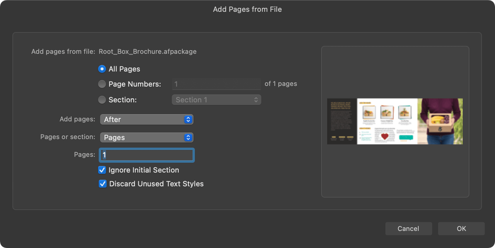
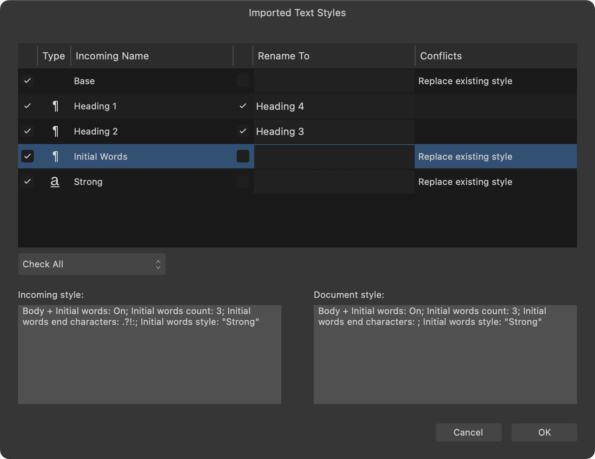

# Merge documents

In Affinity Publisher, you can add a section, selected pages, or all pages of another Affinity Publisher document to your current document.

You can choose the position at which merged pages are added to your current document. For example, this is useful to add a cover that has been produced as a separate document.

> **Note:** Merge documents when you want to use one document's pages and/or text styles in another document. For larger projects where you need to collate and manage the development of several documents and output them as a single publication, use the [Books](09-books/01-about-books.md) feature.

> **Note:** It is also possible to merge imported documents of different file types. For example, Affinity Designer (.afdesign), IDML and PDF files.

**To merge documents:**

1. Do one of the following:
  - From the **Document** menu, select **Add Pages from File**.
  - Right-click on a page from the **Pages** panel and select **Add Pages from File**. (Use this method to identify up front the position where you intend merged pages to be inserted.)
2. Browse to and select the file to merge into the current document, then click **Open**.
3. On the **Add Pages from File** dialog, choose whether to add **All Pages**, selected **Page Numbers** or a named **Section**. (Sections need to be created in advance in the incoming document.)
4. From **Add Pages**, select whether the merged pages/section will be added before or after a specific page/section in the current document, replace an existing section/pages, or be appended after the last page.
5. If the merged pages are to be inserted or replaced, use **Pages or section** and the complementary setting below it to identify the required position in the current document.
6. Check **Ignore Initial Section** to discard the first section 'marker' from the incoming document. All documents have a section marker on their first page. When the pages being merged include the first page and this option is checked, this section marker is not added to your current document. This does not affect the merging of pages from the section.
7. Uncheck **Discard Unused Text Styles** if you want to carry over unused text styles from the incoming document. By default, unused text styles won't be merged into your current document.
8. Click **OK**.

## Resolving conflicts

An additional **Imported Text Styles** dialog may be presented for you to manage any new or matching incoming text styles.

If master pages and text styles are identical between the two documents, then those of the current document are used (no duplicate master pages or text styles will be added).

If master pages differ, the incoming master pages are merged into the current document and will still be assigned to incoming pages as before.

If text styles with the same name have different settings, you can either overwrite the current document's text style or rename the incoming style.

If a text style is unique to the incoming document, it will be added to the current document.

> **Note:** If the incoming document contains new master pages, sections and index entries, these will be carried over into the current document as well.

#### SEE ALSO:

- [Add and remove pages](../05-pages-spreads-and-sections/02-add-and-remove-pages.md)
- [Creating and managing text styles](../10-text/10-text-styles/02-creating-and-managing-text-styles.md)
- [Adding sections](../05-pages-spreads-and-sections/09-adding-sections.md)
- [About books](09-books/01-about-books.md)
