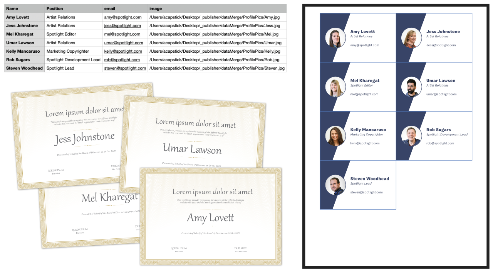
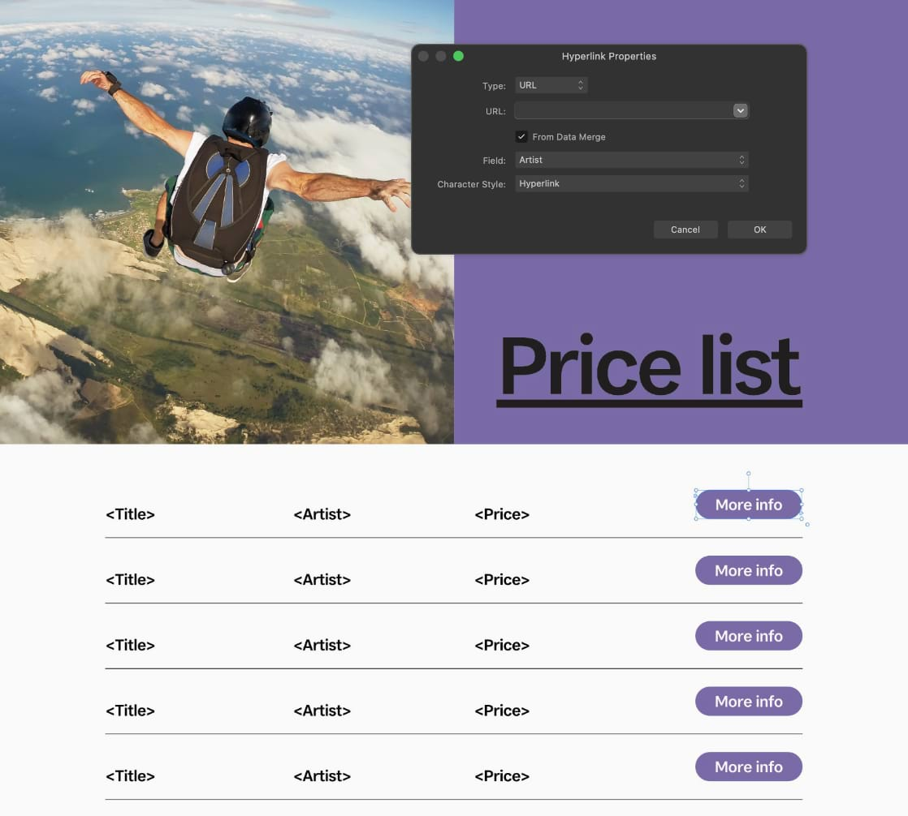

# Data merge

Data merge inserts text and image links from other programs into your publication pages.

*Awards and Business cards (N-up grid layout) merged from an external data source.*

## About data merge

Data merge means injecting data from a data source into documents such as personalized certificates, letters, envelopes, greeting cards, as well as mailing labels, badges, passes to more complex multi-page business cards, catalogs, photo albums or any deliverable where personalization is needed.

For example, you can publish ID passes that are personalized with passholder's names and that person's profile picture. You can also generate entry passes that contain unique QR codes from a field of a data merge source provided by your client. Passes can then be validated by scanning with suitable hardware or an app.

A **Data Merge Manager** is used to add the external data source, manage this resource and generate the merged document.

### Data source types

Data sources include text (plain/CSV/TSV), JSON and XLSX spreadsheet files (e.g. Microsoft Excel, Apple Numbers, LibreOffice). The text files could be an exported address book or contact lists. Your data records could also include image links (resource path names) which can be be associated with a picture frame in Publisher—on merging, the referenced images (e.g., profile or product photos) merge into picture frames sequentially.

### Key data merge steps

The key steps for successful data merging are:

- Creating a data source
- Design to a single spread or grid layout
- Adding the external data source
- Filtering the data records
- Inserting fields
- Merging and publishing

### Creating a data source

The data source exists outside of Affinity Publisher, typically exported from another app or website. Contact lists can be exported from google.com, outlook.com and other services.

The source needs to be available in advance of data merging and have a consistent logical structure that is finalized. Of course, it needs to be populated with data records.

You can add (or alter) data records to the external data source at any time (even after merging) but don't worry if some records don't contain data as these will be treated as blank fields once merged.

- For CSV and TSV files, the first line (row) of your data source is used as fields in Publisher; the row must contain explicit names to be fields. For example, a top row of "First name, Last name, email address" would offer the merge fields of *First name*, *Last name* and *email address* in Publisher. The CSV export format is more commonly used, but the TSV format avoids problems when processing data records containing punctuation.
- For JSON files, obtained from web/mobile services or database export, only a single top-level array of objects (and values in those objects) are supported; lower level arrays and objects are not supported.
- For image links, the resource path names can be absolute (like below), or relative to the data source's or saved document's file location.
  - MacOS: /Users/*username*/Desktop/ProfilePics/magazine_staff_pics_andy.jpg
  - Windows: C:\Users\*username*\Desktop\ProfilePics\magazine_staff_pics_andy.jpg

### Design to a single spread or grid layout

Several scenarios are possible:

- For personalized certificates, letters, envelopes and greeting cards: Create a single design on one spread with placed fields, e.g. for names and/or addresses. On merging, new pages will be generated until all the data records have been processed and exhausted.
- For business cards, mailing labels, badge and passes: Draw a grid layout using the Data Merge Layout Tool to create N-up tiled data records. For example, you could 'gang-up' business cards on a 5x2 row/column grid to minimize print costs. Merging is as for the previous scenario—new grid-based pages are generated with each page's grid 'cells' showing different record.
- For multi-page catalogs and photo albums: With multiple spreads of different design you can use either of the above scenarios. On merging, Publisher will generate the multiple spreads for as many times as needed until the data records are processed and presented.

### Adding the external data source

When you add an external data source to your document it will be embedded in your file. You'll then be able to view its fields. Once added, the source will be remembered the next time you open your document. If the original data source file has been modified, you can update the embed copy manually; this will not update automatically.

> **Note:** Data merge will generate preflight errors and warnings if the external data source has been modified.

### Filtering data records

Instead of merging all records you can filter by a specific range (e.g., 100-200). This lets you control which set of records are output. To filter from a specific record number to the last record in your the data source just enter a final value which far exceeds your final record number (e.g., 100-20000).

### Inserting fields

In order to merge information from your added data source(s) into your document, you need to insert text or image link fields into either a text object (e.g. a text frame) or a picture frame.

You can insert fields that contain metadata about the merged data source and records:

- **Source**—displays the data source's filename.
- **Merge Index**—displays a record's numerical order among only your choice of filtered records.
- **Unfiltered Index**—displays a record's numerical order among all of its data source's records.

For example, if your data source's filename includes the file's creation date, you might include the filename and an index in a generated letter's footer.

### Hyperlinking using a field's values as targets

When a field in a data source contains a web address (URL), an anchor, an email address, or a path to a file, a hyperlink added to text or an object in a data merge layout can use the field's value as its target.

*Adding a hyperlink in a data merge layout. In each cell, the hyperlink's target comes from a field in the corresponding record of the data source.*

After a data merge is performed, the resulting document will contain a hyperlink (on the Hyperlinks panel) for each of the data source's records.

### Merging and publishing

Once you've inserted all necessary placeholder fields, you are ready to merge the source data and your original publication to *a new Publisher document*. New pages are automatically created to allow for all data records to be processed and presented in your document.

**To add a data source:**

1. On the **Window** menu, choose **Data Merge Manager**.
2. Click **Add Data Merge Source**, then navigate and choose a data source file. Click **Open**.
3. Click **Close**.

The Data Merge Manager also lets you manually control delimiters and quote marks in the data source, as well as jump to the source's file location and update (or delete) a data source.

**To view the data source file in its folder location:**

1. In the **Data Merge Manager**, select the data source.
2. Click **Show**.

**To update a data source:**

1. In the **Data Merge Manager**, select the data source.
2. Click **Update**.

**To delete a data source:**

1. In the **Data Merge Manager**, select the data source.
2. Click **Delete Data Merge Source**.

Records on the page will be removed and replaced with placeholder fields.

**To filter records:**

1. In the Data Merge Manager's **Filter** section, select **Range** and then enter a range of records in the input box.

**To add a data merge layout:**

1. Select the **Data Merge Layout Tool**.
2. On the context toolbar, set the number of **Rows** and **Columns**.
3. Drag out a grid layout. This accommodates a different data record in each grid cell after merging.
4. Set the **Cell Width** and **Cell Height** to the dimensions of your intended deliverable (e.g., 85mm x 55mm for business cards).
5. With the Data Merge grid layout selected, in the first cell, create your design. Add a text object and insert data fields (either text and image links) to it; add supporting static imagery, text or other objects. The design will be replicated to all other grid cells.
6. Merge and publish as before.

**To insert text fields:**

1. Draw a text object, and make an insertion point.
2. On the **Fields** panel, a Data Merge section will appear for the added data source, displaying the source's field names. Double-click a chosen field to add the field to the text object.

The Data Merge Manager's **Preview** section lets you display the field's data itself (check **Preview with record**); you can also cycle through the data records using the navigation buttons.

**To insert image link fields:**

1. Draw a picture frame and keep it selected.
2. On the **Data Merge** section of the **Fields** panel, double-click a field that contains an image link. You can preview your records to reveal the image's path in the panel and the actual on-page images.

> **Note:**  The placeholder picture frame changes to a picture frame icon. On previewing or merging, the actual image will display.

**To insert QR codes using a data merge source:**

1. In the data merge layout's top-left cell, draw an object using the QR Code Tool.
2. On the context toolbar, click the value next to **Data**.
3. On the dialog that appears:
  1. Set **Type** to *Data Merge*.
  2. Set **Field** to the field of your data merge source that contains data from which to generate QR codes.
  3. Select **OK**.

**To hyperlink to targets in a data source's field:**

1. In the data merge layout's top-left cell, select the text or object you wish to be hyperlinked.
2. On the **Hyperlinks** panel (**Window>References>Hyperlinks**), select **Add Hyperlink**.
3. On the **Hyperlink Properties** dialog:
  1. Set **Type** to *URL*, *Email* or *File* as appropriate for the field's values.
  2. Check **From Data Merge**.
  3. Set **Field** to the field in your data source that contains the relevant targets.
  4. Select **OK**.

**To merge and publish:**

1. In the **Data Merge Manager**, select **Generate**.
2. On the **File** menu, select **Print** or **Export** (choose PDF).

The Data Merge Manager also lets you disable merging (uncheck **Merge Enabled**) to allow switching between multiple data sources. You can also control the number of pages generated on merging.

#### SEE ALSO:

- [Data Merge Layout Tool](../20-tools/01-layout-tools/07-data-merge-layout-tool.md)
- [Fields panel](../21-panels/08-fields-panel.md)
- [Preflight](../14-publishing-and-sharing/05-preflight.md)
