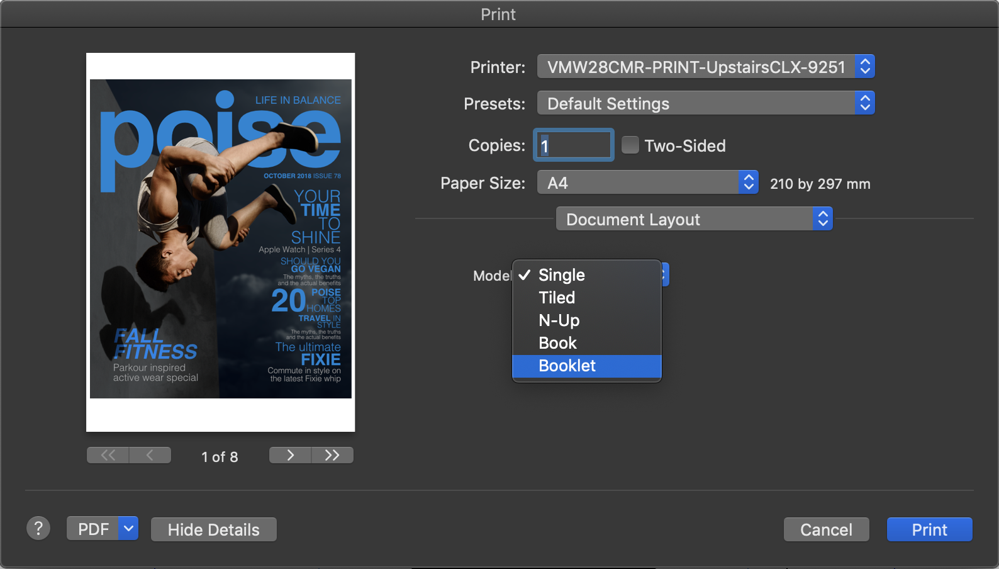
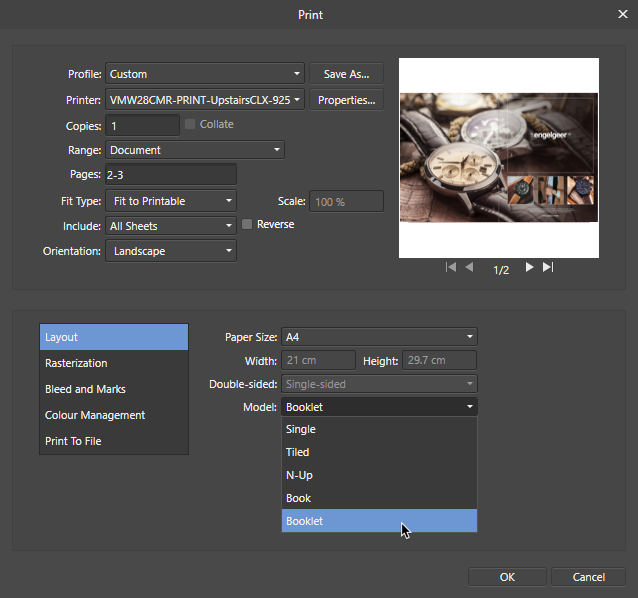

# Print

You can print specific or all pages of your publication, or choose various layouts such as tiled, N-Up (ganged) or booklet.

**macOS:**

*Print dialog set up showing layout options.*

**Windows:**

*Print dialog set up showing layout options.*

## About printing

The print feature lets you print out your document using different layouts.

- Single: your publication pages are printed per sheet.
- Tiled: your page can be printed to a large format (e.g., posters, banners, etc.).
- N-Up: 'gang' prints your page so multiple copies can be printed per sheet.
- Booklet: pages are imposed to allow folding and stapling (for newsletters, menus, etc.)

The final print of the page will include all currently visible objects. Layer visibility and exportability is controlled by the [Layers panel](../21-panels/14-layers-panel.md).

> **Tip:** The **Print** dialog will honor the project's current page setup. Therefore, it is important to check your page setup settings before proceeding to print.

When printing, you may be warned about overflowing text in your publication. To resolve, check your text frames for frame text that extends over the frame end.

## More about printing booklets

It's possible to automatically impose your booklet and print directly to your printer or generate a PDF output, which acts as a 'stepping stone' before being sent for physical printing.

Imposition means that your pages are flipped and reordered at print time so that when printed sheets are produced, they can be folded so pages come together in their correct order.

## Booklet setup tips

These simple tips will help you get great results:

- Setup a facing pages document, i.e. made up of two-page spreads.
- Ensure your document's page count is divisible by four. Add blank end page(s) if needed.
- Setup your book/booklet to the expected size of your document, i.e. if you want an A5 newsletter, set the page size to be A5. It's popular to impose this page size (as 2 pages/sheet) onto physical A4 sheets commonly loaded into desktop printers.

**To print single, multiple or all pages:**

1. From the **File** menu, select **Print**.
2. **macOS:** In the **Print Options** pop-up menu, select **Range and Scale**, then set your **Range** and **Pages** options. For the latter, you can use '1,3,5', '1-5', '1,3 4-6' or other combinations.
3. **Windows:** In the dialog, set your **Range** and **Pages** options. For the latter, you can use '1,3,5', '1-5', '1,3 4-6' or other combinations.
4. Click **Print**.

> **Warning:** If the document preview window in the Print dialog shows with a pink overlay, this means there is a mismatch between your Affinity document dimensions and the printer's currently set paper size.

**To print tiled or N-Up (ganged) output:**

1. From the **File** menu, select **Print**.
2. **macOS:** In the **Print Options** pop-up menu, select **Document Layout**.
3. **Windows:** From the dialog, select **Layout** from the lower-left Categories list.
4. From the **Model** pop-up menu, select 'Tiled' or 'N-Up'.
5. In the dialog, adjust settings as appropriate.
6. Click **Print**.

**To print as a booklet**

1. From the **File** menu, select **Print**.
2. **macOS:** From the dialog, set your **Paper Size**, e.g. A4.
3. **Windows:** From the dialog, select **Layout** from the lower-left Categories list, then set your **Paper Size**, e.g. A4.
4. **macOS:** In the **Print Options** pop-up menu, select **Document Layout**.
5. **Windows:** From the dialog, select **Layout** from the lower-left Categories list.
6. From the **Model** pop-up menu, select 'Booklet'. This instructs the print process to impose the pages.
7. **macOS:** In the **Print Options** pop-up menu, select **Layout**.
8. **macOS:** From the **Two-Sided** pop-up menu*, choose 'Short-Edge Binding'.
9. **Windows:** In the **Double-sided** pop-up menu*, select **Flip short side**.
10. Click **Print**.

* This step assumes you're using duplex printing. If this isn't available to you, you can skip these steps and print odd and even pages on opposite sides of your paper in consecutive print stages. Use 'Odd Only' and 'Even Only' options in the **Print Options** pop-up menu's 'Paper Handling' section.

**macOS:**

> **Note:** To share with other interested parties or take advantage of Adobe Acrobat editing features, you can save the imposed booklet to PDF instead of printing directly. On the **PDF** pop-up menu, choose 'Save as PDF'.

> **Tip:** For best results, ensure scaling is set to 100% in the **Range and Scale** pop-up menu.

> **Tip:** You can scale up the same method to create a page-imposed A4 booklet on A3 paper, instead of a page-imposed A5 booklet on A4 paper.

#### SEE ALSO:

- [Save](../04-get-started/12-save.md)
- [Export](02-export-as-graphic.md)
- [Setting bleed](06-pdf-publishing/02-setting-bleed.md)
- **macOS:** [Share](04-share.md)
- [Keyboard shortcuts for file/document management](../24-keyboard-shortcuts/01-keyboard-shortcuts.md)
- [About books](../13-references/09-books/01-about-books.md)
