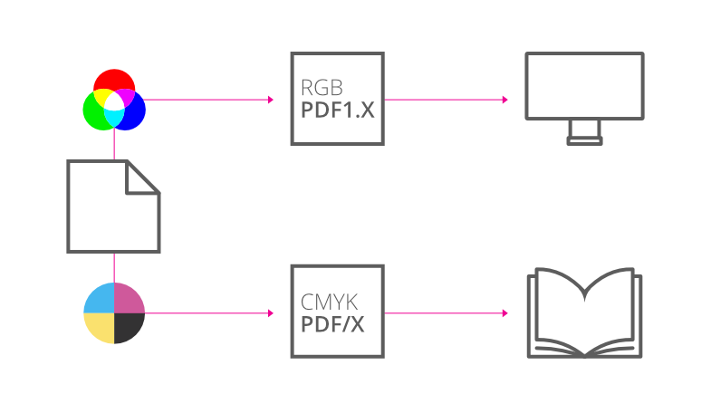

# Publishing PDF files

You can output your publication to PDF, Adobe's cross-platform WYSIWYG file format which is device and platform independent.

PDF files are perfect for web distribution and professional printing.

- **For web**—PDF files for web use (and other methods of digital distribution) are optimized for screen use, i.e. with downsampled images but without pre-press page marks, bleed, etc. Downsampling images leads to smaller documents for quicker loading.
- **For professional printing**—PDF files for professional printing are high-quality reproductions of your publication that are passed to a print partner (normally external to your company). You'll typically require a CMYK document, printer marks, bleed, >300dpi images, and PDF/X-1a, PDF/X-3 or PDF/X-4 compatibility (for CMYK output).  
   
 With PDF/X compatibility, all your publication's colors will be output in the CMYK color space, and fonts you've used will be embedded. A single PDF/X file will contain all the necessary information (fonts, images, graphics, and text) your print partner requires.

Optionally, a PDF can be protected with two passwords. One for opening the document and another that allows the reader to edit, copy from and print the document.

## Common publication practices

When publishing, you may be warned about overflowing text in your publication. To resolve, check your text frames for frame text that extends over the frame end.

All layers and hyperlinks created in Publisher export to PDF. Additionally, if you create a TOC or index and request hyperlinks on export, the TOC or index will be furnished with hyperlinks as appropriate.

> **Note:** In an exported PDF, hyperlinks to files do not work with some PDF readers. The hyperlinked files are included alongside the PDF, but the links will not work in Apple's Preview app, for example.

The **Soft Proof** adjustment is an adjustment layer dedicated to soft proofing CMYK PDF output in advance of export. You can use this to create an accurate preview of your publication prior to exporting it.

> **Note:** For better search engine indexing of the document, you can add document metadata such as Title, Subject and Keywords to your publication via the **Fields** panel (via the **Document Information** section). Your exported PDF will then adopt these details.

## Password-protected PDFs

When exporting a PDF, you can choose to give it either or both of two types of password: an open password and a permissions password. Exporting with a password encrypts the resulting PDF.

PDF password options are available when the **Compatibility** option is set to *PDF 2.0 (ISO 32000-2)*, *PDF 1.7 (Acrobat 8)* or *PDF 1.6 (Acrobat 7)*. All PDF presets provided with Affinity *except* those for PDF/X output use PDF 1.7 or 1.6 compatibility.

### About open passwords

The content of a PDF with an open password can be viewed only by providing the open password or, if one has *additionally* been set, the PDF's permissions password.

When a PDF has only an open password, there are no restrictions on what people can do with its content. The PDF can be printed or placed in an Affinity document, its content can be modified and selectively copied, and pages can be extracted to create new PDFs.

### About permissions passwords

Setting a permissions password limits what people can do with the PDF unless they are able to provide the permissions password.

Optionally, you can choose to allow specific actions to be performed without providing the permissions password. So, you might choose to allow people to freely open and print your PDF, but not modify or selectively copy its content.

> **Note:** Exporting a PDF with a permissions password *always* disallows page extraction, which could be used to extract content as is from your PDF. This is independent of the **Allow copying of content** setting, which determines whether smaller amounts of content, such as images and text, are copiable.

**To publish a PDF file:**

1. From the **File** menu, select **Export**.
2. On the dialog, select the **PDF** file format.
3. Choose a **Preset**. Refer to 'PDF export presets comparison' below for details of each preset's PDF version, color space, resolution and other settings.
4. Set a **Raster DPI** value to set the resolution for rasterization of effects.
5. Check **Preview export when complete** so that the exported PDF will be automatically launched in your currently assigned PDF viewer.
6. Select the area of the publication you would like to include in the export from the **Area** setting. If your document contains more than one page, you may choose from **All Spreads**, **All Pages**, **Current Spread**, and **Current Page**. Additionally, with an object selected, you may choose from **Selection Area** or **Selection Only**.
7. Enter the page number(s) you would like to include in the export into the **Pages** setting. You may only do this if you have selected **All Pages** or **All Spreads** from the **Area** setting.
8. **Include bleed**—when selected, any Bleed set in Document Setup will be included in the PDF output. Use in conjunction with PDF/X professional printing output.
9. For fine tuning, click **Advanced** then adjust the settings in the dialog. Refer to the [Export Settings](../03-export-settings.md) topic for descriptions of all settings.
10. Click **Export**.

**To require a password to open a PDF:**

On the **Export** dialog, with PDF selected:

1. Select **Require password to open**.
2. Click in the **Open password** box and type your required password.

**To limit printing, copying from and editing of a PDF:**

On the **Export** dialog, with PDF selected:

1. Select **Require password for modification and printing**.
2. Click in the **Permissions Password** box and type your required password.
3. Select **Allow document printing**, **Allow content modification** and **Enable copying of content** as required.

## PDF export presets comparison

| Digital and desktop printing presets | PDF (digital - small size) | PDF (digital - high quality) | PDF (for print) | PDF (for export) | PDF (flatten) |
| --- | --- | --- | --- | --- | --- |
| Rasterize | Unsupported properties | Everything |  |  |  |
| Downsample images | Yes | No |  |  |  |
| Above (DPI) | 90 | 375 | n/a |  |  |
| Resample | Bilinear |  |  |  |  |
| Resolution (DPI) | 72 | 300 | Document |  |  |
| Allow JPEG compression | Yes |  |  |  |  |
| Quality | 85 | 98 | 85 |  |  |
| Compatibility | PDF 1.7 (Acrobat 8) | PDF 1.6 (Acrobat 7) |  |  |  |
| Color Space | RGB | As document |  |  |  |
| Profile | sRGB IEC61966-2.1 | Use document profile |  |  |  |
| Embed profiles | No | Yes |  |  |  |
| Convert image color spaces | Yes | No |  |  |  |
| Honor spot colors | Yes |  |  |  |  |
| Overprint black | No 1 | Yes |  |  |  |
| Include hyperlinks | Yes | No | Yes |  |  |
| Include bookmarks | Yes | No | Yes |  |  |
| Include layers | Yes |  |  |  |  |
| Include invisible layers | No |  |  |  |  |
| Include bleed | No |  |  |  |  |
| Include printers marks | No |  |  |  |  |
| Embed fonts | All fonts | Uncommon fonts |  |  |  |
| Subset fonts | Yes |  |  |  |  |
| Allow advanced features | No | Yes | No |  |  |
| Tagged PDF | No |  |  |  |  |
| Require password to open | No |  |  |  |  |
| Open password | No |  |  |  |  |
| Require password for modification and printing | No |  |  |  |  |
| Permissions password | No |  |  |  |  |
| Allow document printing | No |  |  |  |  |
| Allow content modification | No |  |  |  |  |
| Enable copying of content | No |  |  |  |  |

1 This setting's value cannot be overridden from this preset.

| Professional printing presets | PDF    (press ready) | PDF/X-   1a:2003 | PDF/X-   3:2003 | PDF/X-4 |
| --- | --- | --- | --- | --- |
| Rasterize | Unsupported properties |  |  |  |
| Downsample images | Yes |  |  |  |
| Above (DPI) | 375 |  |  |  |
| Resample | Bilinear |  |  |  |
| Resolution (DPI) | 300 |  |  |  |
| Allow JPEG compression | Yes |  |  |  |
| Quality | 98 |  |  |  |
| Compatibility | PDF 1.7 (Acrobat 8) | PDF/X-1a:2003 | PDF/X-3:2003 | PDF/X-4 |
| Color Space | CMYK | As document |  |  |
| Profile | Use document profile |  |  |  |
| Embed profiles | Yes | Yes 1 |  |  |
| Convert image color spaces | No | Yes 1 | No |  |
| Honor spot colors | Yes |  |  |  |
| Overprint black | Yes |  |  |  |
| Include hyperlinks | No | No 1 |  |  |
| Include bookmarks | No |  |  |  |
| Include layers | No | No 1 |  |  |
| Include invisible layers | No | No 1 |  |  |
| Include bleed | Yes | No |  |  |
| Include printers marks | No |  |  |  |
| Embed fonts | All fonts |  |  |  |
| Subset fonts | Yes |  |  |  |
| Allow advanced features | Yes |  |  |  |
| Tagged PDF | No |  |  |  |
| Require password to open | No | n/a 2 |  |  |
| Open password | No | n/a |  |  |
| Require password for modification and printing | No | n/a 2 |  |  |
| Permissions password | No | n/a |  |  |
| Allow document printing | No | n/a |  |  |
| Allow content modification | No | n/a |  |  |
| Enable copying of content | No | n/a |  |  |

1 This setting's value cannot be overridden from this preset.

2 Password protection is not supported for PDF/X.

#### SEE ALSO:

- [Export Settings](../03-export-settings.md)
- [Setting bleed](02-setting-bleed.md)
- [Overprinting](../../07-color/10-overprinting.md)
- [Spot colors](../../07-color/09-spot-colors.md)
- [Soft Proof adjustment](../../18-adjustments/19-soft-proof-adjustment.md)
- [About books](../../13-references/09-books/01-about-books.md)
