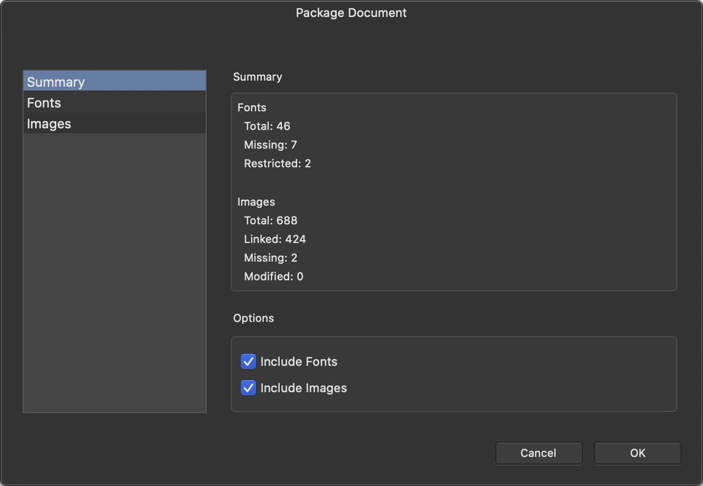

# Creating packages

Use the **File** menu's **Save As Package** command to open the **Package Document** dialog.

The dialog's **Summary** section reports the numbers of fonts and images used in your document and alerts you to potential problems.

The total number of images may be larger than the sum of linked, missing and modified images because it also includes any that are embedded within the document.

> **Warning:** Check your compliance with the licensing terms of all fonts and images used in a document before packaging and distributing them.

## Excluding items from a package

You can choose to exclude all fonts and/or all images when creating a package.

To exclude individual items, delete them from the destination folder after the package has been created.

## Diagnosing problematic statuses

The dialog provides separate counts of items that are missing, modified or restricted. Investigate these before you proceed with packaging.

- **Missing**—select **Fonts** or **Images** on the dialog's left side to precisely identify missing items. To focus your investigation, click the **Status** column heading to group items by status.
- **Restricted**—a font is considered restricted if any of the Restricted License Embedding, Preview and Print Embedding, or Bitmap Embedding Only attributes are set within it. Distribution of the font may require you to obtain a more permissive license or the recipient to have their own license for the font.
- **Modified**—an image has changed outside of Affinity Publisher and has not been updated within the document. Use the Resource Manager to update the document with the latest image data.

> **Warning:** For all fonts, regardless of whether they are listed as Restricted, check your licensing terms are compatible with your intentions for the package.

## If packaging fails

Affinity Publisher may inform you that it has failed to save the package, and that the package may be incomplete. One reason for this message is to remind you that some fonts or images are missing.

If you did not expect any fonts or images to be missing, try packaging the document again.

Always check that a package contains everything that is expected.

**To package a document:**

1. With the document open in Affinity Publisher, select **File>Save As Package**.
2. Set **Include Fonts** and **Include Images** as needed.
3. Select **OK**.
4. Browse to the folder in which you want to create the package.
5. Select **Package**.

> **Note:** If your chosen folder is not empty, Affinity Publisher will ask whether you want to continue (**Yes**), choose a different folder (**No**), or abandon the packaging process (**Cancel**).

#### SEE ALSO:

- [About packaging](01-about-packaging.md)
- [Opening packages](03-opening-packages.md)
- [Resaving modified packages](04-resaving-modified-packages.md)
- [Resource Manager](../../12-placing-external-content/06-resource-manager.md)
