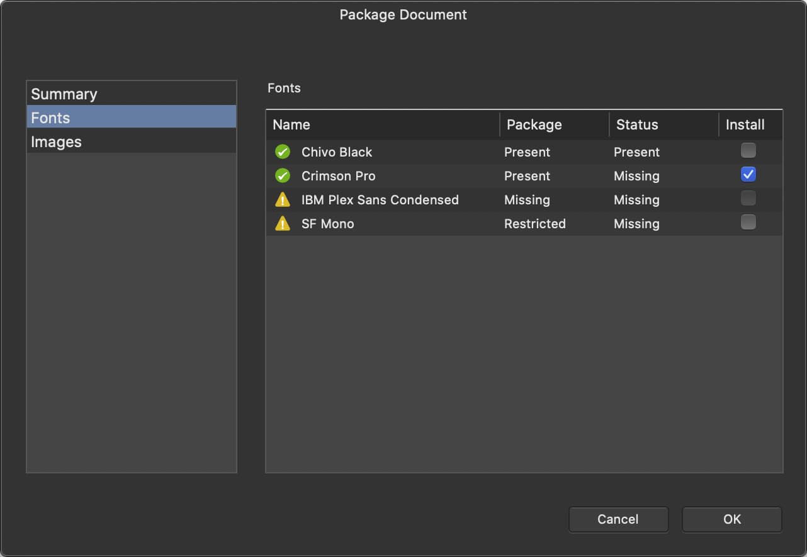

# Opening packages

When an .afpackage file is opened, Affinity Publisher displays the **Package Document** dialog to inform the recipient of the package's contents, including any font and image issues they may need to resolve.

## Dealing with font issues

When opening a package, the dialog's **Fonts** section displays additional columns.

- **Package**—indicates whether a corresponding font file is included in the package. If included, it may be listed as [Restricted](02-creating-packages.md#dialogStatuses).
- **Install**—when ticked, Affinity Publisher will temporarily load the included font file for its exclusive and temporary use.

Discuss font licensing with the package's provider/recipient accordingly.

> **Tip:** A prominent yellow warning sign is displayed next to any font that is restricted or not included in the package.

## Installing fonts

Fonts listed as Missing in the **Status** column are not installed on the current device.

If such a font is included in the package, tick the checkbox in its **Install** column to make it available only to Affinity Publisher and only for the current session. This enables the recipient to export and print the document as is.

If the document needs to be edited and fonts not installed on the current device are included in the package's Fonts folder, use your operating system's built-in mechanism or a third-party tool to install the fonts.

> **Warning:** Even if font files are provided in a package, it is your responsibility to investigate and adhere to their licensing terms before installing them on your device.

## Dealing with image issues

Consult the package's provider if an image is reported as Missing. They may have removed it from the package due to licensing restrictions that prevent it being shared.

You will not need to locate images listed as Present. When packaging, Affinity Publisher updates a document's links to these resources to use the files in the package's Images folder.

**To open a package:**

1. Select **File>Open** and choose the .afpackage file.
2. Review the summary of fonts and images.
3. (Optional) On the **Package Document** dialog, select **Fonts**. For any font that's listed as Missing, put a tick in its checkbox in the **Install** column.
4. Select **OK**.
5. (Optional) Select **File>Save As**. This creates an .afpub file to which you can save changes and which you are now editing.
6. (Optional) Select **Window>Resource Manager** and relink any images marked as Missing.

#### SEE ALSO:

- [About packaging](01-about-packaging.md)
- [Creating packages](02-creating-packages.md)
- [Resaving modified packages](04-resaving-modified-packages.md)
- [Resource Manager](../../12-placing-external-content/06-resource-manager.md)
